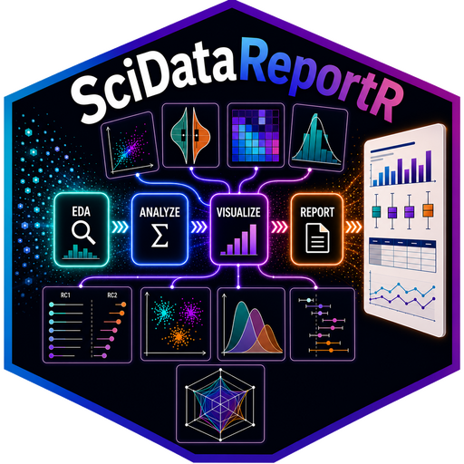

<!-- README.md is generated from README.Rmd. Please edit that file -->

# SciDataReportR 

<!-- badges: start -->

[](https://github.com/RDastgh1/SciDataReportR/actions/workflows/R-CMD-check.yaml)
[](https://github.com/RDastgh1/SciDataReportR/actions/workflows/pkgdown.yaml)
[](https://lifecycle.r-lib.org/articles/stages.html)
[](LICENSE.md)
[](https://github.com/RDastgh1/SciDataReportR/releases)
[](https://github.com/RDastgh1/SciDataReportR/issues)
<!-- badges: end -->

SciDataReportR is an R workflow infrastructure package for turning
labelled life science data frames into reproducible exploratory
analyses, statistical comparisons, dimensionality reduction workflows,
clustering/projection pipelines, scientific visualizations, and
report-ready outputs.

The package is designed for researchers working with practical,
researcher-native data structures: data frames, labelled variables,
codebooks, variable-type templates, cohorts, visits, outcomes,
covariates, and high-dimensional feature sets.

## Why SciDataReportR?

SciDataReportR helps life science researchers operationalize repeated
analysis patterns without rebuilding the same reporting and exploration
code for every study.

- Reduces repeated manual EDA, metadata cleanup, comparison tables,
  visual summaries, and report assembly.
- Keeps labels, variable types, codebooks, and data dictionaries close
  to the analysis.
- Supports high-dimensional scientific screening across outcomes,
  cohorts, covariates, and feature sets.
- Enables reusable transformations and projections for new cohorts.
- Follows practical R package conventions from the tidyverse, usethis,
  roxygen2, and pkgdown ecosystem.

## Installation

You can install the development version of SciDataReportR from
[GitHub](https://github.com/RDastgh1/SciDataReportR) with:

``` r
# install.packages("devtools")
devtools::install_github("RDastgh1/SciDataReportR")
```

## Scientific Workflows

SciDataReportR functions are intended to be used as workflow components
rather than alphabetical utilities.

| Workflow family | Representative functions |
|----|----|
| Data setup and metadata | `CreateProjectFolders()`, `CreateVariableTypesTemplate()`, `MakeDataDictionary()`, `FormattedDataDictionary()`, `UpdateDataDictionary()` |
| Codebook and harmonization | `AddToCodebook()`, `UpdateCodebook()`, `CombineCodebooks()`, `MergeCodebooks()`, `CodebookMergeApp()` |
| Cleaning and preprocessing | `ReplaceMissingCode()`, `ReplaceMissingLabels()`, `RevalueData()`, `ReValueFactors()`, `ConvertOrdinalToNumeric()`, `windsorize()`, `IQROutliers()` |
| Exploratory profiling | `PlotMissingData()`, `PlotContinuousDistributions()`, `PlotCategoricalDistributions()`, `PlotTimeDistribution()`, `PlotMiningMatrix()` |
| Statistical comparisons | `MakeTable1()`, `MakeComparisonTable()`, `MakeFacetCatComparisonTable()`, `PlotZScore()`, `Plot2GroupStats()` |
| Association and regression mining | `PlotAssociations()`, `PlotCorrelationsHeatmap()`, `PlotDirectionalHeatmaps()`, `UnivariateRegressionTable()`, `plotForestFromTable()` |
| Dimensionality reduction and projection | `CreatePCAObject()`, `plotPCA()`, `ExtractPCAComponentSummary()`, `ProjectPCA()`, `CreateZScoreObject()`, `ProjectZScore()` |
| Normative modeling | `CreateNormativeTScoreModel()`, `ApplyNormativeTScores()` |
| Clustering and cohort projection | `CreateSOMClusterModel()`, `ProjectSOMCluster()` |
| Longitudinal and temporal workflows | `Merge_ByClosestTime()`, `SummarizeTransitions()`, `PlotSwimmerTransitions()` |
| Reporting | `CreateSummaryTable()`, `CreateStatisticsTable()`, `use_EDATemplate()` |

## Visualization Gallery

Visualization is a cross-cutting SciDataReportR workflow layer.
Plot-producing functions also appear in their scientific workflow
families because scientists often discover methods through the figures
they need.

| Visualization need | Functions |
|----|----|
| Data quality | `PlotMissingData()`, `PlotContinuousDistributions()`, `PlotCategoricalDistributions()`, `IQROutliers()` |
| Group comparison | `PlotZScore()`, `Plot2GroupStats()`, `PlotPValueComparisons()`, `PlotSplitViolin()` |
| Association and correlation | `PlotCorrelationsHeatmap()`, `PlotPhiHeatmap()`, `PlotPointCorrelationsHeatmap()`, `PlotDirectionalHeatmaps()`, `PlotAssociations()`, `plotSigCorrelations()`, `plotSigAssociations()` |
| Regression and interaction | `PlotPartialRegressionScatter()`, `plotForestFromTable()`, `PlotInteractionEffectsContinuous()`, `PlotInteractionEffectsMatrix()`, `PlotCatInteractionEffectsMatrix()`, `PlotNumInteractionEffectsMatrix()` |
| Dimensionality reduction and clustering | `plotPCA()`, plots produced from `CreateSOMClusterModel()` workflows |
| Longitudinal and temporal | `PlotTimeDistribution()`, `PlotSwimmerTransitions()` |
| Specialized scientific plots | `PlotBlandAltman()`, `PlotSpiderChart()`, `PlotPathway_KT()` |

Planned visualization extensions include heatmaps, volcano plots for
two-group categorical contrasts, and volcano-style plots for continuous
predictors with beta values on the x-axis.

## Implemented Methods

SciDataReportR operationalizes practical scientific methods that
commonly sit between raw data cleaning and manuscript-ready reporting:

- Codebook, data dictionary, and labelled-variable workflows.
- Cohort comparison with covariates, effect sizes, pairwise contrasts,
  and report-ready tables.
- Multi-variable z-score comparisons with p-value and FDR signals.
- Correlation, association, regression, and interaction screening.
- PCA creation, summary, visualization, and projection.
- SOM clustering and projection to new data.
- Normative T-score creation and application.
- Longitudinal transition summaries and swimmer-style plotting.
- Scientific visualization outputs tied to reproducible workflows.

## Function Inputs and Workflow Dependencies

Some functions are designed to consume outputs from other SciDataReportR
functions. These relationships are part of the workflow infrastructure
and should be checked when composing analyses.

SciDataReportR now uses workflow-oriented canonical names for new code,
while older public names remain available as compatibility aliases. For
example, `CreatePCATable()` still works, but `CreatePCAObject()` better
describes the reusable PCA object returned by that workflow.

| Function | Primary input | Upstream SciDataReportR function | Output | Common downstream use |
|----|----|----|----|----|
| `add_r_and_stars()` | Correlation heatmap result list | `PlotCorrelationsHeatmap()` | Annotated `ggplot` | Add `geom_starcaption()` for report-ready star explanations |
| `geom_starcaption()` | No direct object; added with `+` | `PlotCorrelationsHeatmap()` or `add_r_and_stars()` | `labs()` caption layer | Explain `*`, `**`, and `***` thresholds on heatmaps |
| `ApplyNormativeTScores()` | New data and normative scoring object | `CreateNormativeTScoreModel()` | Applied normative T-scores | Score future cohorts with the same model |
| `ProjectZScore()` | New data and z-score parameters | `CreateZScoreObject()` | Projected standardized scores | Apply a prior standardization to new data |
| `ProjectPCA()` | New data and PCA object | `CreatePCAObject()` | Projected PCA scores | Compare new samples in an existing PCA space |
| `ProjectSOMCluster()` | New data and SOM cluster solution | `CreateSOMClusterModel()` | Projected SOM/cluster assignments | Apply an existing cluster solution to future cohorts |
| `ProjectRCI()` | New data and RCI object | `CreateRCIObject()` | Projected reliable change metrics | Apply an existing change model |

## Flagship Workflow Examples

``` r
library(SciDataReportR)

# Metadata-aware setup
variable_types <- CreateVariableTypesTemplate(SampleData)
data_dictionary <- MakeDataDictionary(SampleData)

# Cohort comparison workflow
comparison <- MakeComparisonTable(
  DataFrame = SampleData,
  CompVariable = "Diagnosis",
  Variables = c("age", "tau", "p_tau")
)

# Correlation heatmap workflow with downstream annotation
cor_res <- PlotCorrelationsHeatmap(
  Data = SampleData,
  xVars = c("age", "tau", "p_tau"),
  yVars = c("Ab_42", "C_Reactive_Protein")
)

annotated_plot <- add_r_and_stars(cor_res) + geom_starcaption()
```

## Data Structures and Conventions

SciDataReportR is built around practical life science data structures:

- Data frames or tibbles with one row per observation, sample,
  participant, or visit.
- Labelled variables where labels should remain visible in reports and
  plots.
- Variable-type templates that distinguish continuous, categorical,
  binary, ordinal, outcome, covariate, and feature variables.
- Codebooks and data dictionaries that document the meaning and
  structure of datasets.
- Fit/project workflows where a transformation or model learned from one
  cohort can be applied to a future cohort.

## Documentation

- Package website: <https://rdastgh1.github.io/SciDataReportR/>
- Reference index:
  <https://rdastgh1.github.io/SciDataReportR/reference/>
- Issues and feature requests:
  <https://github.com/RDastgh1/SciDataReportR/issues>
- R/Medicine 2024 slides:
  <https://rdastgh1.quarto.pub/rmedicine-2024-scidatareportr>

## Roadmap

Near-term priorities:

- Expand workflow-oriented vignettes for data setup, codebook
  harmonization, EDA/reporting, comparisons, visualizations,
  PCA/projection, SOM projection, normative T-scores, and longitudinal
  transitions.
- Improve function-level documentation with input object requirements,
  return structures, and downstream use.
- Add a richer visualization gallery with representative outputs.
- Strengthen release notes, CI, pkgdown organization, and
  contributor-facing documentation.

Future directions:

- Heatmap workflows for high-dimensional scientific data.
- Volcano plot workflows for categorical two-group differences.
- Volcano-style workflows for continuous predictors with beta values on
  the x-axis.
- Workflow templates for cohort comparison, biomarker discovery,
  longitudinal follow-up, normative scoring, and cluster projection.
- Structured analysis/report cards that summarize inputs, methods,
  parameters, and outputs.
- Optional AI-native report summaries and machine-readable workflow
  metadata.

## Citation, License, and Contributing

SciDataReportR is released under the MIT license. Please cite the
package and link to the project website when using it in scientific
reports, presentations, or manuscripts.

Contributions, bug reports, and workflow ideas are welcome through
[GitHub issues](https://github.com/RDastgh1/SciDataReportR/issues).
