# Evaluating candidate biomarkers

## Overview

This vignette uses the bundled `SampleData` to illustrate a realistic
candidate-biomarker workflow: separating participants with `Impaired`
versus `Control` diagnosis. It is a teaching dataset, not a validated
diagnostic study. The examples show apparent performance in this dataset
and should not be used as clinical cutoffs or estimates expected to
transport unchanged to another cohort.

Performance is multidimensional. AUC describes discrimination, Brier
score describes probability accuracy, calibration asks whether predicted
and observed risk agree, and delta AUC asks whether a biomarker adds
information beyond the baseline covariate model.

## Load packages

## Load and revalue the bundled data

> **Note**
>
> The data file being used is `SampleData` from SciDataReportR.
>
> The codebook being used is `SampleVariableTypes` from SciDataReportR.

`Diagnosis` has two observed levels here: `Control` and `Impaired`.
Every binary example below explicitly treats `Impaired` as the positive
outcome, so the scientific interpretation cannot silently flip with
factor order.

## Amyloid beta 42 as a candidate biomarker

Amyloid beta 42 is a useful first candidate in this teaching dataset. We
adjust for age because age can itself discriminate diagnostic groups and
may account for part of the biomarker-outcome association.

    # A tibble: 3 × 29
      Model     Status Note    AUC AUC_Lower AUC_Upper Brier Brier_Lower Brier_Upper
      <chr>     <chr>  <chr> <dbl>     <dbl>     <dbl> <dbl>       <dbl>       <dbl>
    1 Biomarker ok     ""    0.796     0.729     0.863 0.156       0.132       0.184
    2 Covariat… ok     ""    0.524     0.440     0.608 0.207       0.184       0.230
    3 Adjusted  ok     ""    0.798     0.730     0.865 0.156       0.132       0.184
    # ℹ 20 more variables: CalibrationIntercept <dbl>, CalibrationSlope <dbl>,
    #   ObservedExpectedRatio <dbl>, R2 <dbl>, AdjustedR2 <dbl>, R2_Lower <dbl>,
    #   R2_Upper <dbl>, RMSE <dbl>, RMSE_Lower <dbl>, RMSE_Upper <dbl>, MAE <dbl>,
    #   MAE_Lower <dbl>, MAE_Upper <dbl>, DeltaAUC_vs_Covariates <dbl>,
    #   DeltaR2_vs_Covariates <dbl>, N <int>, NPositive <int>, NNegative <int>,
    #   NMissing <int>, Prevalence <dbl>

Read the three rows together: `Biomarker` is amyloid beta 42 alone,
`Covariates` is the age-only baseline, and `Adjusted` combines both. The
AUC and Brier score describe different aspects of performance. A
coefficient or AUC that looks promising does not alone establish
clinical value.

    # A tibble: 3 × 27
      Source  Model Threshold ThresholdScale Direction Sensitivity Sensitivity_Lower
      <chr>   <chr>     <dbl> <chr>          <chr>           <dbl>             <dbl>
    1 Model … Biom…     0.341 Predicted pro… >=              0.742             0.620
    2 Model … Cova…     0.291 Predicted pro… >=              0.621             0.493
    3 Model … Adju…     0.414 Predicted pro… >=              0.667             0.540
    # ℹ 20 more variables: Sensitivity_Upper <dbl>, Specificity <dbl>,
    #   Specificity_Lower <dbl>, Specificity_Upper <dbl>, PPV <dbl>,
    #   PPV_Lower <dbl>, PPV_Upper <dbl>, NPV <dbl>, NPV_Lower <dbl>,
    #   NPV_Upper <dbl>, LRPositive <dbl>, LRPositive_Lower <dbl>,
    #   LRPositive_Upper <dbl>, LRNegative <dbl>, LRNegative_Lower <dbl>,
    #   LRNegative_Upper <dbl>, TP <int>, FP <int>, TN <int>, FN <int>

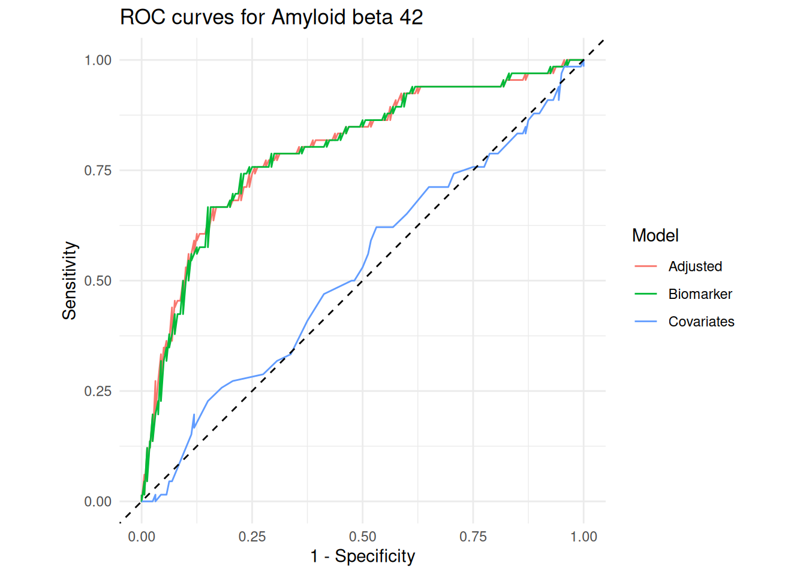

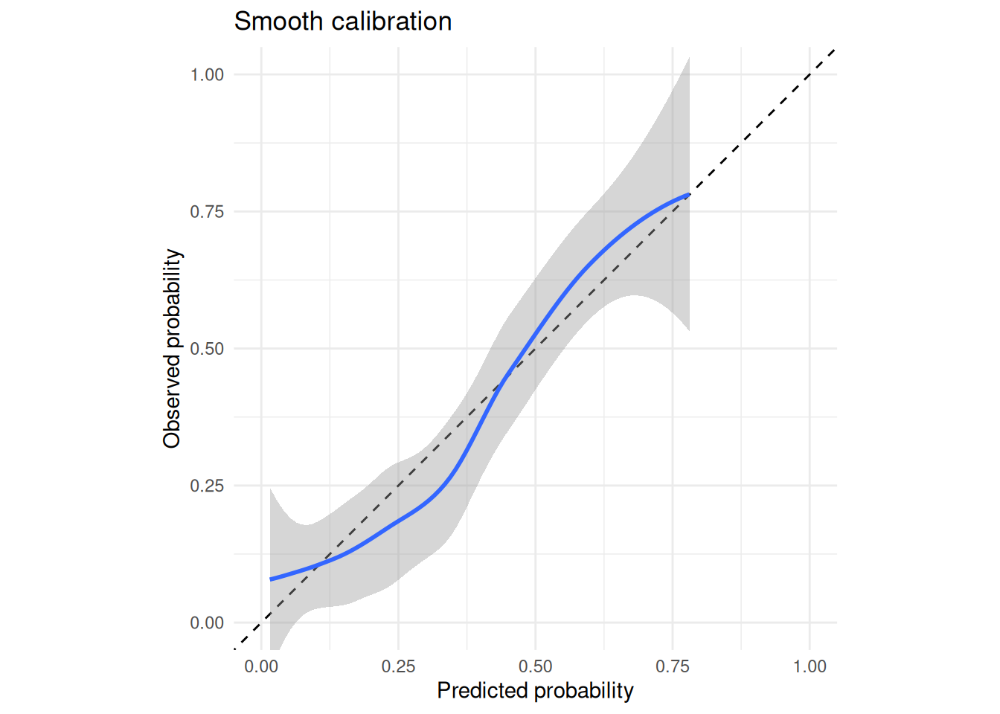

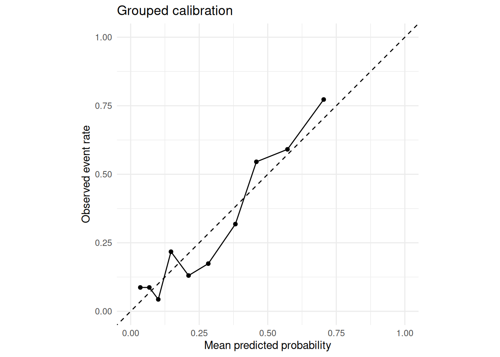

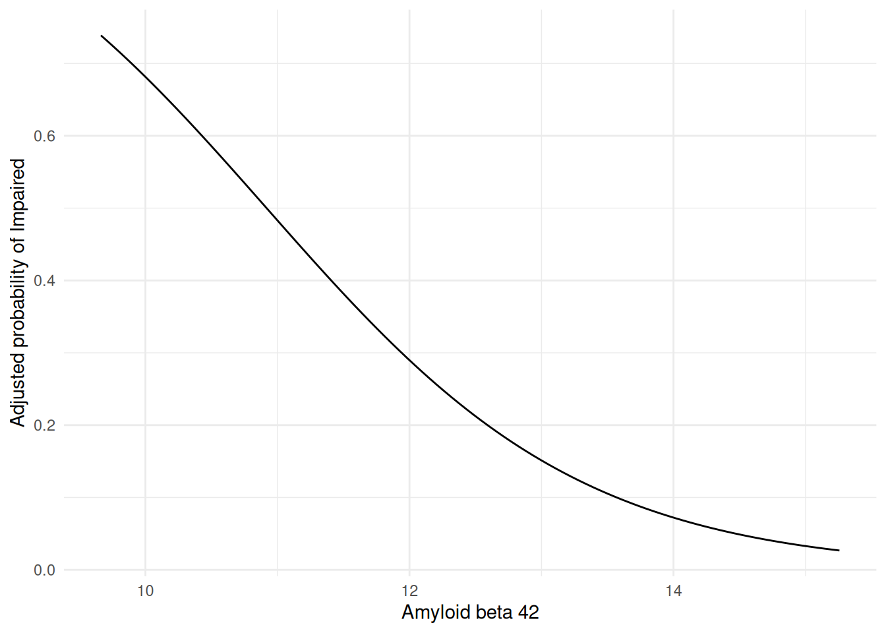

The raw threshold is expressed in amyloid beta 42 units;
model-probability thresholds are on a different scale. Sensitivity and
specificity depend on the selected threshold. PPV and NPV also depend on
the prevalence in this dataset, so they should not be assumed to apply
to another setting. The probability curve uses marginal standardization:
each participant retains their observed age while amyloid beta 42 is
varied, then predicted probabilities are averaged.

## Compare several candidate proteins

In practice, the question is often comparative: does amyloid beta 42
outperform tau, phosphorylated tau, serum amyloid P, or a weak
comparator such as AXL?

    # A tibble: 5 × 40
      Outcome   OutcomeLabel OutcomeType PositiveLevel Biomarker      BiomarkerLabel
      <chr>     <chr>        <chr>       <chr>         <chr>          <chr>
    1 Diagnosis Diagnosis    binary      Impaired      Ab_42          Amyloid beta …
    2 Diagnosis Diagnosis    binary      Impaired      tau            Tau protein
    3 Diagnosis Diagnosis    binary      Impaired      p_tau          Phosphorylate…
    4 Diagnosis Diagnosis    binary      Impaired      Serum_Amyloid… Serum amyloid…
    5 Diagnosis Diagnosis    binary      Impaired      AXL            AXL receptor …
    # ℹ 34 more variables: BiomarkerType <chr>, N <int>, NPositive <int>,
    #   NNegative <int>, NMissing <int>, Prevalence <dbl>, AUC <dbl>,
    #   AUC_Lower <dbl>, AUC_Upper <dbl>, CovariateAUC <dbl>, AdjustedAUC <dbl>,
    #   AdjustedAUC_Lower <dbl>, AdjustedAUC_Upper <dbl>, DeltaAUC <dbl>,
    #   Brier <dbl>, Brier_Lower <dbl>, Brier_Upper <dbl>,
    #   CalibrationIntercept <dbl>, CalibrationSlope <dbl>,
    #   ObservedExpectedRatio <dbl>, R2 <dbl>, R2_Lower <dbl>, R2_Upper <dbl>, …

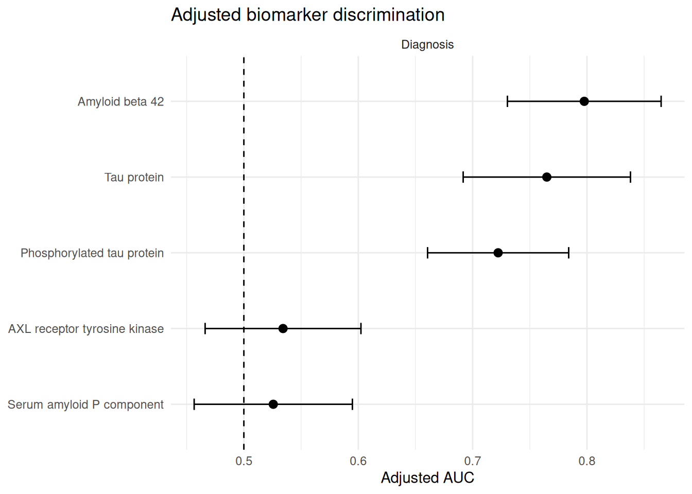

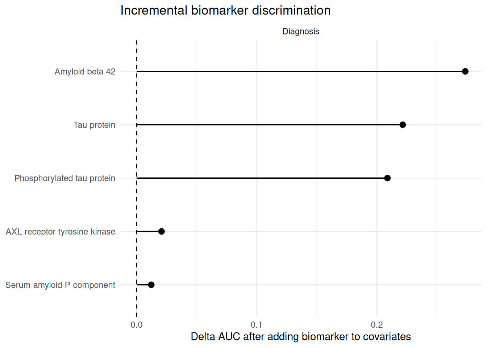

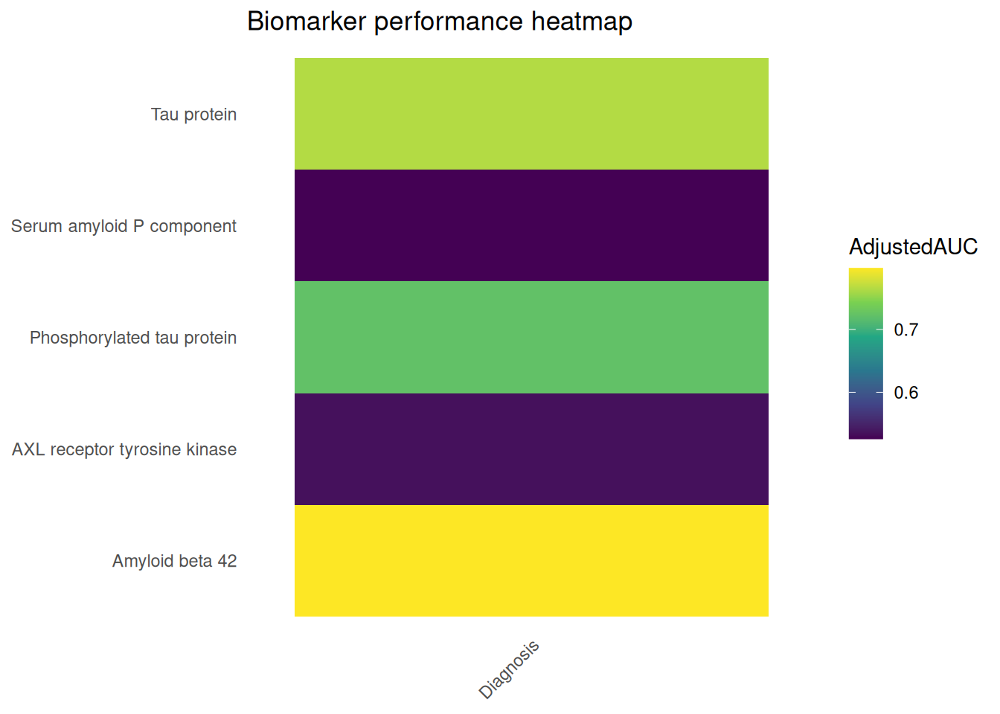

These screen-level plots provide a compact ranking. Each row has its own
`N` because analyses use the complete observations available for that
biomarker, outcome, and age. Compare AUC confidence intervals and
missingness before over-interpreting small differences.

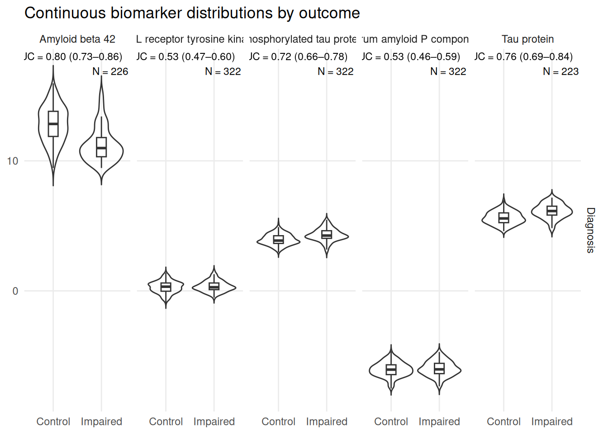

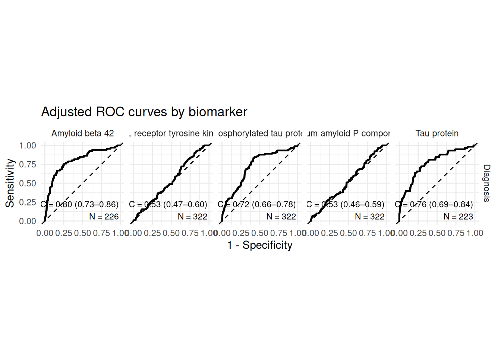

The distribution panels are visual QC: they show the raw biomarker
values in each diagnostic group and annotate the adjusted AUC,
confidence interval, and pair-specific N. The ROC facets show adjusted
discrimination for the same candidate set. Neither plot turns a screen
into external validation.

## Multicategory categorical predictor: genotype

`Genotype` is a multicategory categorical predictor. It is evaluated
through the fitted model and predicted probabilities at each genotype
level. A single raw diagnostic cutoff would not make scientific sense,
so it is intentionally absent.

    NULL

    # A tibble: 3 × 29
      Model     Status Note    AUC AUC_Lower AUC_Upper Brier Brier_Lower Brier_Upper
      <chr>     <chr>  <chr> <dbl>     <dbl>     <dbl> <dbl>       <dbl>       <dbl>
    1 Biomarker ok     ""    0.635     0.572     0.699 0.188       0.167       0.212
    2 Covariat… ok     ""    0.514     0.442     0.585 0.201       0.181       0.223
    3 Adjusted  ok     ""    0.638     0.566     0.709 0.188       0.166       0.211
    # ℹ 20 more variables: CalibrationIntercept <dbl>, CalibrationSlope <dbl>,
    #   ObservedExpectedRatio <dbl>, R2 <dbl>, AdjustedR2 <dbl>, R2_Lower <dbl>,
    #   R2_Upper <dbl>, RMSE <dbl>, RMSE_Lower <dbl>, RMSE_Upper <dbl>, MAE <dbl>,
    #   MAE_Lower <dbl>, MAE_Upper <dbl>, DeltaAUC_vs_Covariates <dbl>,
    #   DeltaR2_vs_Covariates <dbl>, N <int>, NPositive <int>, NNegative <int>,
    #   NMissing <int>, Prevalence <dbl>

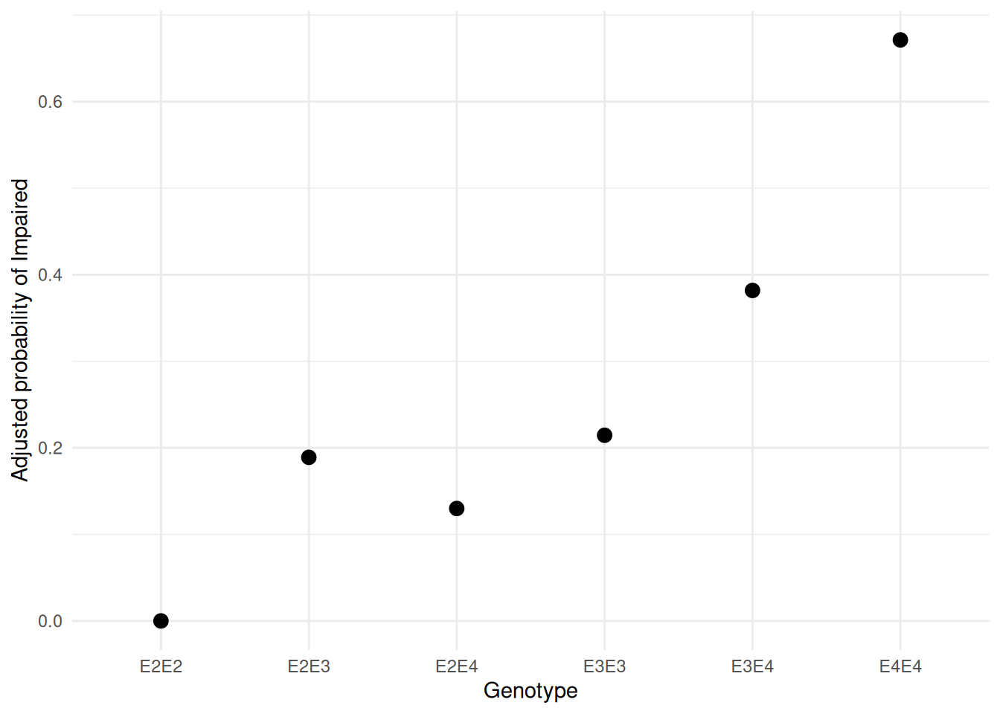

## Continuous-outcome appendix

`SampleData` does not contain a credible continuous clinical endpoint.
This small simulated appendix exists only to demonstrate the
continuous-outcome API; the main workflow above remains entirely based
on bundled sample data.

    # A tibble: 3 × 29
      Model     Status Note    AUC AUC_Lower AUC_Upper Brier Brier_Lower Brier_Upper
      <chr>     <chr>  <chr> <dbl>     <dbl>     <dbl> <dbl>       <dbl>       <dbl>
    1 Biomarker ok     ""       NA        NA        NA    NA          NA          NA
    2 Covariat… ok     ""       NA        NA        NA    NA          NA          NA
    3 Adjusted  ok     ""       NA        NA        NA    NA          NA          NA
    # ℹ 20 more variables: CalibrationIntercept <dbl>, CalibrationSlope <dbl>,
    #   ObservedExpectedRatio <dbl>, R2 <dbl>, AdjustedR2 <dbl>, R2_Lower <dbl>,
    #   R2_Upper <dbl>, RMSE <dbl>, RMSE_Lower <dbl>, RMSE_Upper <dbl>, MAE <dbl>,
    #   MAE_Lower <dbl>, MAE_Upper <dbl>, DeltaAUC_vs_Covariates <dbl>,
    #   DeltaR2_vs_Covariates <dbl>, N <int>, NPositive <int>, NNegative <int>,
    #   NMissing <int>, Prevalence <dbl>

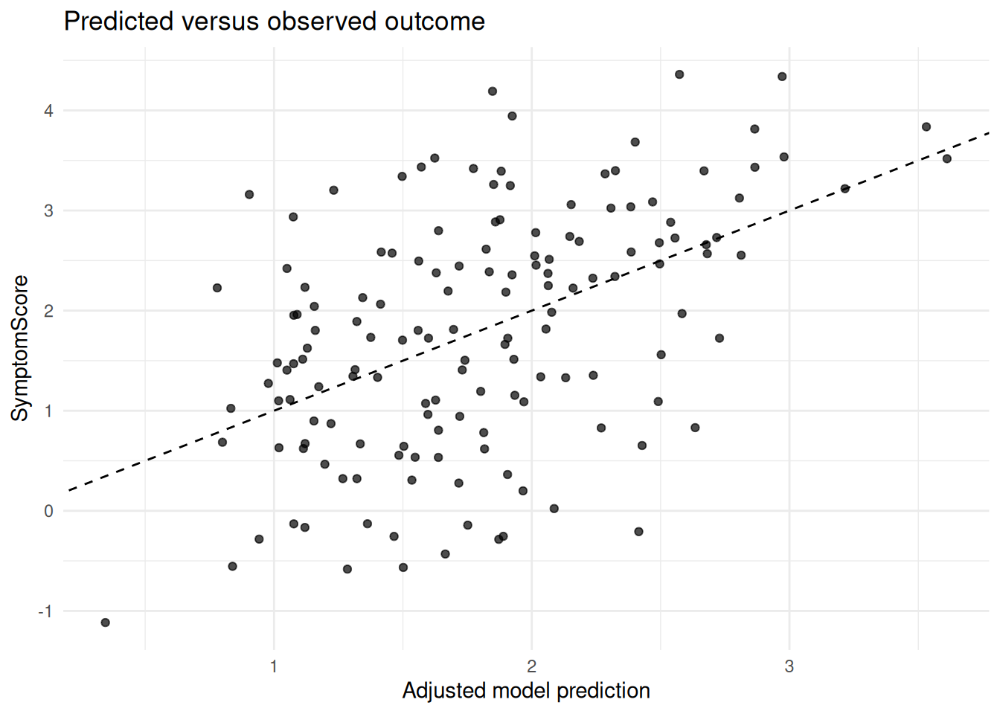

Continuous outcomes use R-squared, adjusted R-squared, incremental
R-squared, RMSE, and MAE. ROC and classification metrics are
intentionally not calculated.

## Internal validation

Apparent performance is evaluated in the same data used to fit the model
and can be optimistic. Cross-validation uses out-of-fold predictions;
bootstrap output is labelled optimism-corrected. Internal validation is
still not external validation in a new population.

## Reproducibility

    R version 4.6.1 (2026-06-24)
    Platform: x86_64-pc-linux-gnu
    Running under: Ubuntu 24.04.4 LTS

    Matrix products: default
    BLAS:   /usr/lib/x86_64-linux-gnu/openblas-pthread/libblas.so.3
    LAPACK: /usr/lib/x86_64-linux-gnu/openblas-pthread/libopenblasp-r0.3.26.so;  LAPACK version 3.12.0

    locale:
     [1] LC_CTYPE=C.UTF-8       LC_NUMERIC=C           LC_TIME=C.UTF-8
     [4] LC_COLLATE=C.UTF-8     LC_MONETARY=C.UTF-8    LC_MESSAGES=C.UTF-8
     [7] LC_PAPER=C.UTF-8       LC_NAME=C              LC_ADDRESS=C
    [10] LC_TELEPHONE=C         LC_MEASUREMENT=C.UTF-8 LC_IDENTIFICATION=C

    time zone: UTC
    tzcode source: system (glibc)

    attached base packages:
    [1] stats     graphics  grDevices utils     datasets  methods   base

    other attached packages:
    [1] plotly_4.12.1          ggplot2_4.0.3          dplyr_1.2.1
    [4] SciDataReportR_20.24.0

    loaded via a namespace (and not attached):
     [1] gtable_0.3.6           xfun_0.60              bayestestR_0.18.1
     [4] htmlwidgets_1.6.4      insight_1.5.2          rstatix_1.1.0
     [7] lattice_0.22-9         paletteer_1.7.0        crosstalk_1.2.2
    [10] vctrs_0.7.3            tools_4.6.1            generics_0.1.4
    [13] datawizard_1.3.1       tibble_3.3.1           pkgconfig_2.0.3
    [16] Matrix_1.7-5           data.table_1.18.4      RColorBrewer_1.1-3
    [19] correlation_0.8.8      S7_0.2.2               RcppParallel_6.2.0
    [22] lifecycle_1.0.5        compiler_4.6.1         farver_2.1.2
    [25] snakecase_0.11.1       carData_3.0-6          htmltools_0.5.9
    [28] yaml_2.3.12            Formula_1.2-6          pillar_1.11.1
    [31] car_3.1-5              tidyr_1.3.2            statsExpressions_2.0.0
    [34] abind_1.4-8            nlme_3.1-169           tidyselect_1.2.1
    [37] sjlabelled_1.2.0       digest_0.6.39          mvtnorm_1.4-2
    [40] gtsummary_2.5.1        purrr_1.2.2            rematch2_2.1.2
    [43] splines_4.6.1          labeling_0.4.3         forcats_1.0.1
    [46] ggstatsplot_1.0.0      labelled_2.16.0        fastmap_1.2.0
    [49] grid_4.6.1             cli_3.6.6              magrittr_2.0.5
    [52] patchwork_1.3.2        utf8_1.2.6             dichromat_2.0-1
    [55] broom_1.0.13           withr_3.0.3            scales_1.4.0
    [58] backports_1.5.1        estimability_2.0.0     httr_1.4.8
    [61] rmarkdown_2.31         emmeans_2.0.4          otel_0.2.0
    [64] hms_1.1.4              coda_0.19-4.1          evaluate_1.0.5
    [67] knitr_1.51             haven_2.5.5            parameters_0.29.2
    [70] viridisLite_0.4.3      mgcv_1.9-4             rstantools_2.7.0
    [73] rlang_1.3.0            Rcpp_1.1.2             xtable_1.8-8
    [76] glue_1.8.1             pROC_1.19.0.1          jsonlite_2.0.0
    [79] effectsize_1.0.3       R6_2.6.1              
