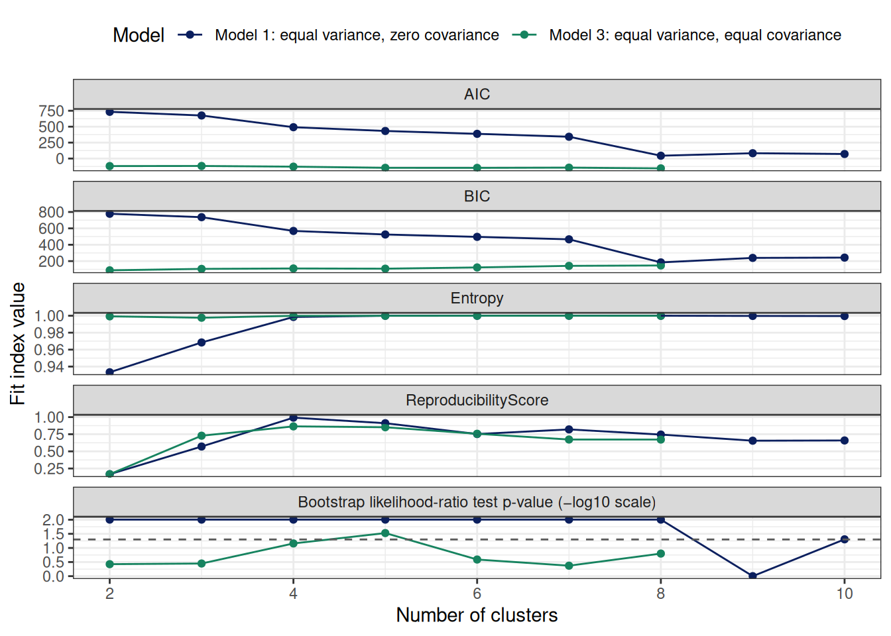
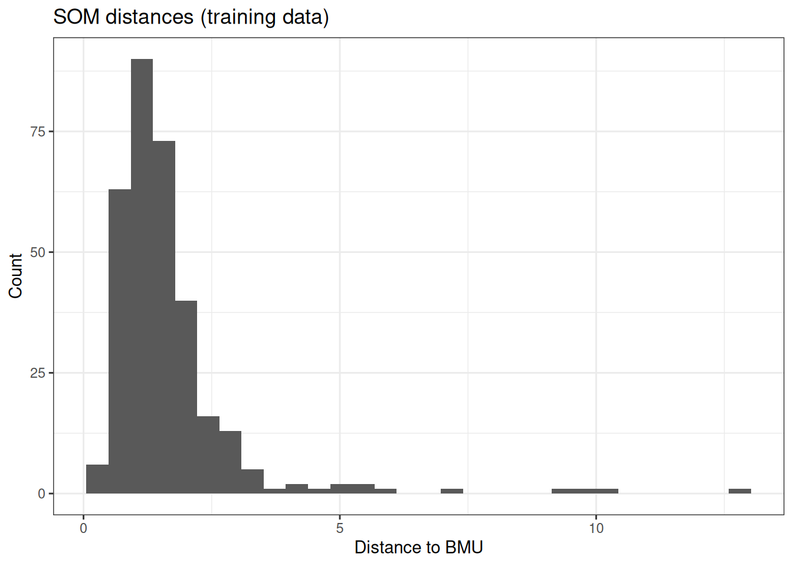
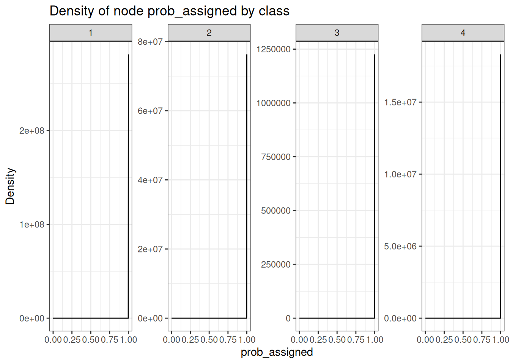
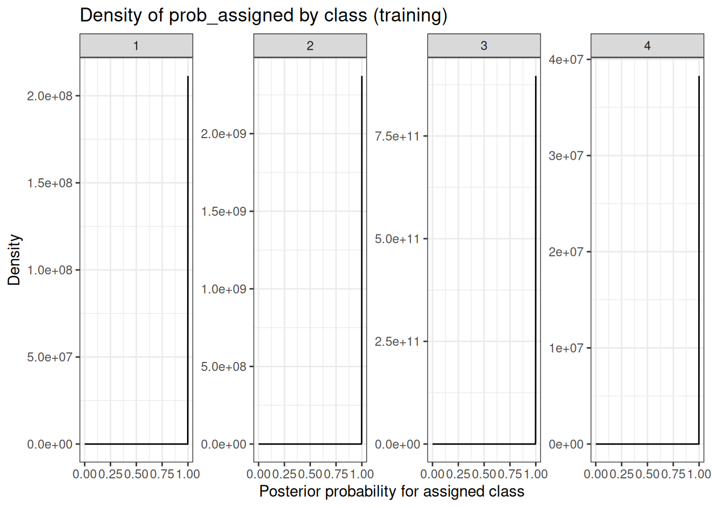
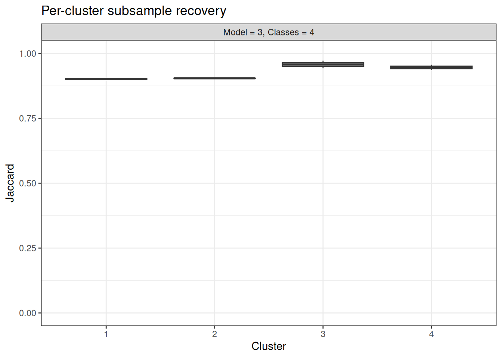
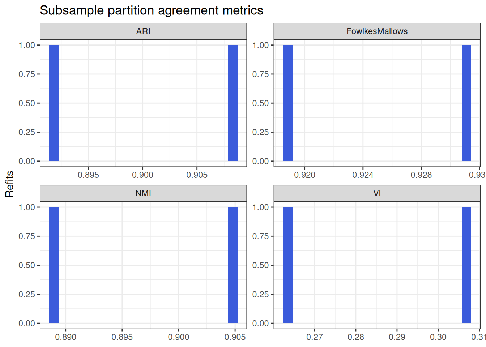
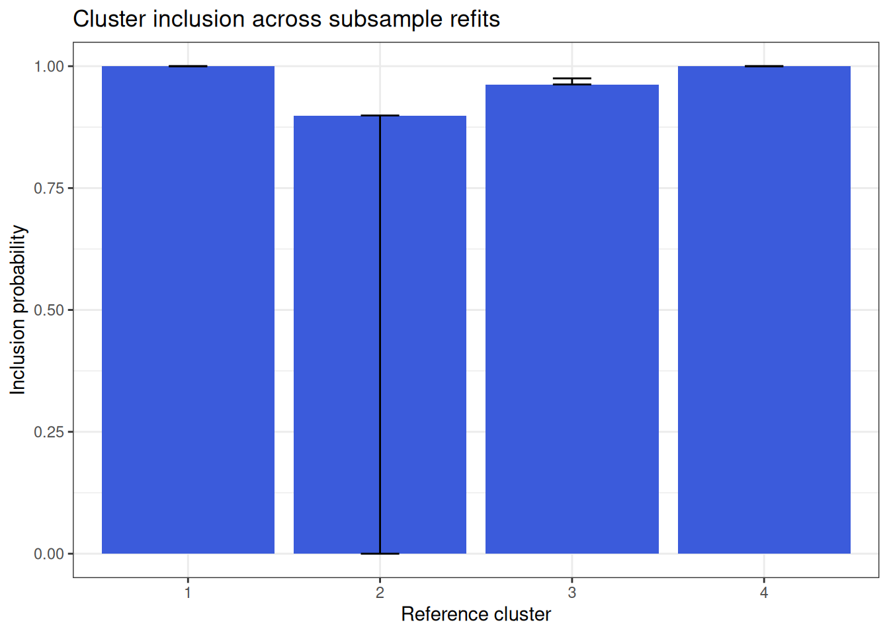
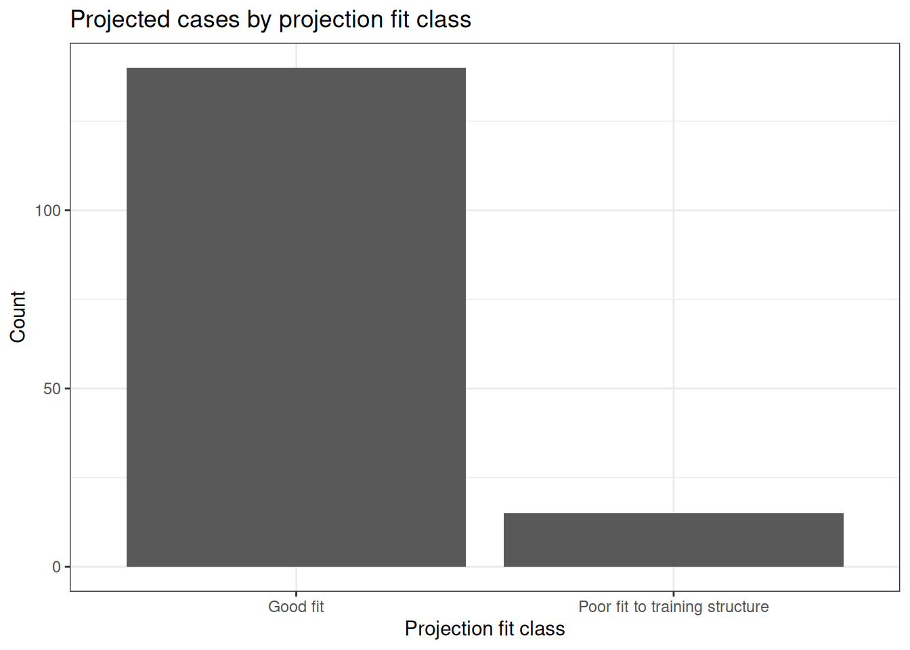
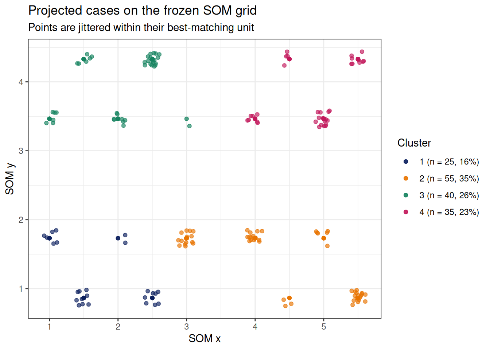

# Clustering and clinical phenotyping

## Purpose

Clinical phenotyping uses prespecified features to discover structure in
a training cohort, then places later participants in that **fixed**
phenotype space. Clustering is exploratory: fit indices, internal
stability, and clean projection do not establish that a phenotype is
biologically real. Clinical interpretation and independent-cohort
validation remain essential.

Every pipeline in this package uses the same train-once/project-many
contract:

- preprocessing and model parameters are learned from training data
  only;
- `DataWithClusters` preserves the original row order and columns;
- incomplete cases remain in the output with `NA` assignments;
- 90% participant subsample stability refits the **entire pipeline**,
  including scaling and PCA/MCA when present;
- fit, membership uncertainty or distance, and projection support are
  reviewed before phenotypes are named.

`method = "exploratory"` (or the shorter alias `"explore"`) compares
candidate settings and gives an advisory AHP-style recommendation. The
researcher then creates an explicit `method = "finalize"` model for
projection.

Lifecycle-specific settings are strict. Exploratory ranges (`k_range`,
`models`, `minPts_range`, and epsilon grids) cannot be supplied to a
finalized fit; finalized settings (`final_k`, `final_model`,
`final_minPts`, and final epsilon) cannot be supplied to exploratory
review. This catches calls that would otherwise look valid while
silently ignoring part of the request.

### Breaking output-name changes

The unreleased clustering interface now uses `DataWithClusters` rather
than `df_with_clusters`, and `ClusterVariableName` rather than
`ClusterName`. `ModelInfo_MClust` is the only correctly cased
Mclust-specific field; the erroneous `ModelInfo_Mclust` field has been
removed. `complete_rows`, `CandidateAudit` and the old `.scidr_rowid`
column are no longer public outputs. Every row-level output instead
carries a merge-safe `.row_id`, labeled `"Row ID"`. Use
`Specification$n_complete` for aggregate training support and the
`fit_table` status/warning/error columns to audit candidates. For
example, merge diagnostics back without relying on row order using
`dplyr::left_join(model$DataWithClusters, model$ProbFit$individual, by = ".row_id")`.

Every method stores its figures in the same places, so the same review
sequence works whichever approach you choose. A figure lives beside the
table it summarises rather than in one flat list:

| Location | What it shows |
|----|----|
| `fit_plot` | candidate solutions across the search grid |
| `ModelInfo$plots` | structure of the selected solution |
| `ModelInfo$FitDiagnostics$plots` | how individual training cases sit inside that structure |
| `ProbFit$plots` | membership confidence |
| `Stability$plots` | 90% subsample reproducibility |
| `ProjectionFit$plots` | projected cases against the frozen training reference |

The *contents* are method-specific: K-means and Gower/PAM give you a
silhouette profile, Mclust a BIC curve and an uncertainty map, HDBSCAN a
persistence review, LCA item response profiles, and the reduction
pipelines a scree plot. The SOM pipeline keeps its own richer set,
including the interactive `aweSOM` maps in `ModelInfo_SOM$plots`.

## Choosing a method

| Method | Data and geometry | Primary diagnostics | Projection rule | Ideal situation | Main caveat |
|----|----|----|----|----|----|
| SOM + Mclust | Continuous; topology and gradients matter | map fit, posterior, SOM distance, stability | scaling → SOM node → mixture class | phenotype maps and nonlinear gradients | most complex workflow |
| Mclust | Continuous; Gaussian mixtures | BIC/ICL, entropy, posterior, stability | exact mixture posterior | probabilistic groups with different covariance | sensitive to distributional mismatch |
| PCA + Mclust | Correlated continuous measures | scree, mixture fit, posterior, stability | frozen PCA → mixture posterior | clustering a lower-dimensional signal space | PCs can obscure individual variables |
| K-means | Numeric; compact centroid geometry | WSS, silhouette, CH, margin, stability | nearest frozen centroid | simple, interpretable baseline | no probability model |
| PCA + K-means | Correlated numeric measures | scree, silhouette, distance, stability | frozen PCA → nearest centroid | fast reduced-space baseline | inherits PCA and K-means assumptions |
| HDBSCAN | Numeric; irregular or unequal-density groups | persistence, membership, noise, support | nearest eligible training core | clusters plus meaningful noise | conservative projection may label many cases noise |
| Gower + PAM | Mixed numeric/categorical/ordinal | silhouette, medoids, distance, stability | nearest frozen medoid | mixed clinical measures and exemplar participants | coding and variable selection define distance |
| LCA | Categorical response patterns | BIC, entropy, response probabilities, stability | latent-class posterior | symptom or questionnaire response phenotypes | local-independence assumption |
| MCA + Mclust | Nominal categorical measures | inertia, mixture fit, posterior, stability | frozen MCA → mixture posterior | reduced categorical response space | MCA dimensions can be abstract |

## Load the benchmark

> **Note**
>
> The data file is `SimulatedPhenotypeData`; the codebook is
> `SimulatedPhenotypeVariableTypes`. The benchmark contains 320 training
> and 160 projection participants. `TruthCluster`, `TruthDensityGroup`,
> and `Cohort` are never supplied to a clustering function. Truth is
> revealed only as a teaching check after fitting.

The 12 numeric measures are three indicators of each of four independent
simulated axes. The default 85% rule therefore retains at least four
PCs. Four balanced truth groups use different combinations of these
axes. Separate `DensityX`/`DensityY` coordinates contain two
unequal-density groups and noise; three categorical variables contain
deliberately strong class-dependent response patterns. That separation
is useful for checking implementation; it is intentionally easier than
most real categorical phenotyping problems.

## Constructor interface

All clustering constructors use `method = "exploratory"` to review
candidates and `method = "finalize"` to create a reusable model.
Fixed-count methods use `k_range` and `final_k`; density methods use
`minPts_range`, epsilon settings, and their matching finalized inputs.
Numeric methods use `ZScoreType`; `Scaling` is retained as a
compatibility alias and must agree if both are supplied.

| Workflow | Candidate settings | Finalized settings | Method-specific control |
|----|----|----|----|
| Mclust, PCA + Mclust, MCA + Mclust, SOM + Mclust | `k_range`, `models` | `final_k`, `final_model` | tidyLPA mclust models: 1 = EEI, 2 = VVI, 3 = EEE, 6 = VVV; models 4 and 5 require OpenMx and are unsupported |
| K-means, PCA + K-means, Gower + PAM, latent class | `k_range` | `final_k` | `nstart` for K-means; `nrep` for LCA |
| HDBSCAN, SOM + HDBSCAN | `minPts_range`, epsilon range | `final_minPts`, final epsilon | extracted class count is data-derived |

The tidyLPA Mclust model numbers describe which within-cluster variances
and covariances may differ between clusters:

| Model | mclust code | Meaning |
|----|----|----|
| Model 1 | EEI | Equal variance across clusters, with covariance fixed at zero |
| Model 2 | VVI | Varying variance across clusters, with covariance fixed at zero |
| Model 3 | EEE | Equal variance and equal covariance across clusters |
| Model 6 | VVV | Varying variance and varying covariance across clusters |

Zero covariance assumes the clustering variables are conditionally
independent within a cluster. Equal parameters pool the corresponding
structure across clusters; varying parameters let each cluster estimate
its own structure.

## Continuous workflows

> **Note**
>
> The non-SOM workflows below are complete, copyable templates, but
> their model fits are intentionally not evaluated while this vignette
> renders. This keeps package checks practical. Run one workflow at a
> time in an analysis project, then increase `stability_resamples` when
> the candidate solution is ready for a real stability assessment.

### Mclust

Gaussian mixture models provide posterior membership and allow clusters
to differ in covariance ([Scrucca et al. 2016](#ref-scrucca2016)).

> **Note**
>
> **When to use it:** continuous measures with approximately
> mixture-shaped groups. **Inspect before naming:** BIC/ICL, entropy,
> posterior confidence, small clusters, subsample ARI/Jaccard, and
> projected uncertainty.

### K-means

K-means is a useful scaled baseline for compact groups ([MacQueen
1967](#ref-macqueen1967)).

> **Note**
>
> **When to use it:** continuous features with roughly compact,
> similarly shaped groups. **Inspect before naming:** WSS, silhouette,
> Calinski–Harabasz index, centroid distance, assignment margin, and
> subsample stability.

### PCA followed by clustering

PCA concentrates correlated variation into orthogonal dimensions
([Jolliffe and Cadima 2016](#ref-jolliffe2016)). These pipelines refit
scaling and PCA inside every stability 90% subsampling, then use the
frozen training transformation for projection.

> **Note**
>
> **When to use it:** correlated continuous variables where a reduced
> signal space is clearer than the raw feature space. **Inspect before
> naming:** scree plot, retained component count/loadings, downstream
> fit and stability, score space separation, and projection distance or
> uncertainty.

### HDBSCAN

HDBSCAN is designed for irregular clusters, unequal density, and noise
([McInnes et al. 2017](#ref-mcinnes2017)). A projected `0` is an
out-of-support/noise assignment, not a new phenotype.

> **Note**
>
> **When to use it:** density structure is more plausible than centroid
> geometry and noise is scientifically meaningful. **Inspect before
> naming:** persistence, membership, noise burden, outlier scores,
> stability, and nearest-core support. All-noise candidates are valid
> negative results.

### SOM followed by Mclust

Self-organizing maps preserve local topology before mixture clustering
([Kohonen 1982](#ref-kohonen1982)).

> **Note**
>
> **When to use it:** a map of phenotype gradients is as useful as the
> final labels. **Inspect before naming:** map topology,
> quantization/SOM distance, node occupancy, posterior confidence,
> stability, and projected distance flags.

For an analysis, use the complete workflow below.
`stability_resamples = 30` is a practical internal-stability screen; the
rendered vignette uses two resamples only to keep build time reasonable.
Stability refits run in parallel by default, using all available
physical cores minus one (and never more than the requested resamples).
Set `stability_cores = 1L` for serial execution or a smaller positive
value when each SOM or high-dimensional refit needs more memory.

``` r

data("SimulatedPhenotypeData")

df_Training <- SimulatedPhenotypeData %>% dplyr::filter(Cohort == "Training")
df_Projection <- SimulatedPhenotypeData %>% dplyr::filter(Cohort == "Projection")
vars_Clust <- paste0("Var", 1:12)

Obj_ClustReview <- CreateClusterModel_SOM_MClust(
  df_Training, vars_Clust, k_range = 2:10, models = c(1, 3),
  method = "exploratory"
)
Obj_ClustFinal <- CreateClusterModel_SOM_MClust(
  df_Training, vars_Clust, final_k = 4, final_model = 3,
  method = "finalize", stability_resamples = 30
)
ObjClustProjected <- ProjectCluster(Obj_ClustFinal, df_Projection)
```

       Model Classes     LogLik parameters  n        AIC       AWE       BIC
    1      1       2 -329.58579         37 25  733.17158 1006.5018 778.26998
    2      3       2  228.12475        169 25 -118.24949 1136.7320  87.74052
    3      1       3 -287.80626         50 25  675.61252 1045.5632 736.55631
    4      3       3  240.31502        182 25 -116.63003 1235.0455 105.20537
    5      1       4 -182.88068         63 25  491.76135  958.3427 568.55053
    6      3       4  258.70221        195 25 -127.40442 1320.9575 110.27637
    7      1       5 -140.28938         76 25  432.57876  995.8480 525.21332
    8      3       5  280.91625        208 25 -145.83250 1399.2200 107.69367
    9      1       6 -104.86298         89 25  387.72596 1047.6860 496.20591
    10     3       6  294.29764        221 25 -146.59528 1495.1479 122.77628
    11     1       7  -68.97640        102 25  341.95280 1098.6035 466.27814
    12     3       7  305.52382        234 25 -143.04764 1595.3863 142.16930
    13     1       8   92.86636        115 25   44.26728  897.6087 184.43800
    14     3       8  324.17474        247 25 -154.34948 1680.7754 146.71285
    15     1       9   86.29563        128 25   83.40875 1033.4415 239.42485
    16     1      10  105.45796        141 25   71.08408 1117.8079 242.94557
           CAIC       CLC       KIC     SABIC        ICL   Entropy  prob_min
    1  815.2700  661.0382 773.17158  663.5296 -779.13189 0.9332915 0.9301147
    2  256.7405 -454.2510  53.75051 -436.3442  -87.74373 0.9992454 0.9996001
    3  786.5563  577.5494 728.61252  581.5017 -737.07542 0.9684421 0.9582059
    4  287.2054 -478.6348  68.36997 -459.1935 -105.22744 0.9976273 0.9975544
    5  631.5505  367.7584 557.76135  373.1817 -568.56586 0.9985197 0.9989606
    6  305.2764 -515.4047  70.59558 -494.4367 -110.27761 0.9998412 0.9998736
    7  601.2133  282.5787 511.57876  289.5303 -525.21375 0.9999468 0.9999677
    8  315.6937 -559.8327  65.16750 -537.3336 -107.69446 0.9999071 0.9999318
    9  585.2059  211.7258 479.72596  220.2087 -496.20645 0.9999445 0.9999460
    10 343.7763 -586.5953  77.40472 -562.5652 -122.77641 0.9999835 0.9999910
    11 568.2781  139.9528 446.95280  149.9667 -466.27815 0.9999983 0.9999985
    12 376.1693 -609.0477  93.95236 -583.4864 -142.16948 0.9999800 0.9999596
    13 299.4380 -183.7327 162.26728 -172.1877 -184.43800 1.0000000 1.0000000
    14 393.7129 -646.3497  95.65052 -619.2571 -146.71397 0.9999090 0.9997218
    15 367.4249 -170.5918 214.40875 -157.5150 -239.42880 0.9997308 0.9980997
    16 383.9456 -208.9167 215.08408 -194.3085 -242.95179 0.9995963 0.9978376
        prob_max BLRTStatistic BLRTPValue MinProfileNodeN MaxProfileNodeN
    1  0.9988990      54.51982 0.00990099               5              20
    2  0.9999998      23.21785 0.37623762               4              21
    3  0.9994780      83.55906 0.00990099               5              15
    4  0.9999982      24.38054 0.35643564               4              17
    5  1.0000000     209.85117 0.00990099               5               8
    6  1.0000000      36.77438 0.06930693               4               9
    7  1.0000000      85.18259 0.00990099               4               7
    8  1.0000000      44.42809 0.02970297               3               8
    9  1.0000000      70.85280 0.00990099               2               6
    10 1.0000000      26.76278 0.25742574               3               6
    11 1.0000000      71.77316 0.00990099               2               6
    12 1.0000000      22.45236 0.42574257               2               5
    13 1.0000000     323.68552 0.00990099               1               5
    14 1.0000000      37.30184 0.15841584               2               4
    15 1.0000000     -13.14147 1.00000000               1               4
    16 1.0000000      38.32467 0.04950495               1               5
       MinProfileNodeProportion MaxProfileNodeProportion StabilitySuccessRate
    1                      0.20                     0.80                    1
    2                      0.16                     0.84                    1
    3                      0.20                     0.60                    1
    4                      0.16                     0.68                    1
    5                      0.20                     0.32                    1
    6                      0.16                     0.36                    1
    7                      0.16                     0.28                    1
    8                      0.12                     0.32                    1
    9                      0.08                     0.24                    1
    10                     0.12                     0.24                    1
    11                     0.08                     0.24                    1
    12                     0.08                     0.20                    1
    13                     0.04                     0.20                    1
    14                     0.08                     0.16                    1
    15                     0.04                     0.16                    1
    16                     0.04                     0.20                    1
       StabilityARI_Mean StabilityARI_P05 StabilityJaccard_Mean
    1        -0.07405551      -0.07567585             0.4073339
    2        -0.07739523      -0.07903535             0.4105530
    3         0.46903693       0.46422493             0.6720126
    4         0.66684005       0.39746911             0.7902435
    5         0.99077955       0.99077791             0.9930542
    6         0.84171019       0.76306706             0.8873817
    7         0.98119947       0.96857320             0.8405554
    8         0.86403318       0.85231845             0.8396266
    9         0.88472023       0.82271465             0.6213525
    10        0.77634504       0.75942331             0.7367578
    11        0.96333112       0.94721579             0.6773956
    12        0.69848800       0.62654505             0.6472360
    13        0.88987084       0.83527273             0.6002413
    14        0.72071710       0.70706574             0.6239612
    15        0.79588039       0.79055734             0.5152091
    16        0.76227531       0.72678383             0.5559166
       StabilityJaccard_Min ReproducibilityScore AIC_scaled BIC_scaled
    1            0.30251509            0.1666392 -1.8609971 -1.9292787
    2            0.30374495            0.1665789  0.8299159  0.9543761
    3            0.51563697            0.5705247 -1.6790819 -1.7550822
    4            0.71103448            0.7285418  0.8247976  0.8814428
    5            0.98591549            0.9919169 -1.0980210 -1.0534891
    6            0.78075460            0.8645459  0.8588500  0.8602663
    7            0.25714286            0.9108774 -0.9109747 -0.8725127
    8            0.52350427            0.8518299  0.9170919  0.8710516
    9            0.02787559            0.7530364 -0.7692176 -0.7513776
    10           0.55000000            0.7565514  0.9195026  0.8080666
    11           0.01459932            0.8203633 -0.6245517 -0.6263991
    12           0.26087963            0.6728620  0.9082903  0.7270812
    13           0.03326023            0.7450560  0.3162822  0.5505669
    14           0.02152015            0.6723391  0.9440097  0.7081073
    15           0.09047619            0.6555447  0.1925758  0.3209415
    16           0.14285714            0.6590959  0.2315279  0.3062390
       Entropy_scaled Reproducibility_scaled   ahp_index
    1      -3.3733248            -2.26413420 -2.35693371
    2       0.3220404            -2.26439680 -0.03951609
    3      -1.4038551            -0.50559061 -1.33590246
    4       0.2313773             0.18242570  0.53001085
    5       0.2813776             1.32917783 -0.13523868
    6       0.3554200             0.77459651  0.71228320
    7       0.3613381             0.97632683 -0.11145562
    8       0.3591120             0.71923007  0.71662141
    9       0.3612093             0.28907667 -0.21757729
    10      0.3633963             0.30438144  0.59883673
    11      0.3642272             0.58222270 -0.07612520
    12      0.3631978            -0.06000766  0.48464042
    13      0.3643198             0.25432988  0.37137470
    14      0.3592224            -0.06228425  0.48726382
    15      0.3492384            -0.13540814  0.18183689
    16      0.3417032            -0.11994596  0.18988101

    [1] "AHP (AIC, BIC, Entropy, reproducibility) recommends Model 3 with k = 5 profiles."

    # A tibble: 16 × 8
       Model Classes StabilitySuccessRate StabilityARI_Mean StabilityARI_P05
       <int>   <int>                <dbl>             <dbl>            <dbl>
     1     1       2                    1           -0.0741          -0.0757
     2     3       2                    1           -0.0774          -0.0790
     3     1       3                    1            0.469            0.464
     4     3       3                    1            0.667            0.397
     5     1       4                    1            0.991            0.991
     6     3       4                    1            0.842            0.763
     7     1       5                    1            0.981            0.969
     8     3       5                    1            0.864            0.852
     9     1       6                    1            0.885            0.823
    10     3       6                    1            0.776            0.759
    11     1       7                    1            0.963            0.947
    12     3       7                    1            0.698            0.627
    13     1       8                    1            0.890            0.835
    14     3       8                    1            0.721            0.707
    15     1       9                    1            0.796            0.791
    16     1      10                    1            0.762            0.727
    # ℹ 3 more variables: StabilityJaccard_Mean <dbl>, StabilityJaccard_Min <dbl>,
    #   ReproducibilityScore <dbl>



##### 

##### 


##### 

##### 


##### 

##### 


















#### Interpreting a SOM projection

`ProbFit` answers the assignment question: which cluster was assigned
and how certain is the node-derived posterior assignment? Use
`ProbFit$individual` for `Cluster`, `prob_assigned`, `max_prob`, and
`uncertainty`.

`ProjectionFit` answers the transportability question: how well do these
new participants fit the frozen training SOM? `ProjectionFit$individual`
contains each participant’s best-matching `SOM_Node`, `SOM_Distance`,
percentile in the training distance distribution, and support flags. A
high distance means the participant is less well represented by the
training map; it does not by itself invalidate the assigned cluster.

`ProjectionFit$out_of_support` lists variables with values below the
observed training minimum or above the observed training maximum.
Projection continues for complete cases, but those values are
extrapolations and should be reviewed. `ProjectionFit$by_cluster` shows
whether that concern concentrates in a specific cluster.

`ProjectionFit$summary` includes `node_occupancy_js_divergence`, a
Jensen–Shannon comparison of the training and projected proportions
mapped to each frozen SOM node. A value of zero means identical node
occupancy; larger values indicate cohort-level use of a different part
of the map. It is not an individual fit score and does not by itself
mean the model failed.

## Mixed and categorical workflows

### Gower distance followed by PAM

Gower distance combines mixed feature types, while PAM represents
clusters by observed medoids ([Gower 1971](#ref-gower1971); [Kaufman and
Rousseeuw 1990](#ref-kaufman1990)). Projection uses training ranges,
levels, and medoids rather than recalculating them in the new cohort.

> **Note**
>
> **When to use it:** numeric, binary, ordinal, and nominal measures
> must be clustered together. **Inspect before naming:** candidate
> silhouette, size balance, medoids, numeric and categorical profiles,
> distance/margin, and subsample stability.

### Latent class analysis

LCA models class-specific categorical response probabilities ([Linzer
and Lewis 2011](#ref-linzer2011)).

> **Note**
>
> **When to use it:** symptom, diagnosis, questionnaire, or assay-call
> items are the phenotype definition. **Inspect before naming:** BIC,
> entropy, class size, response-probability heatmap, posterior
> confidence, and subsample stability. Low posterior confidence is
> evidence of weak class separation.

### MCA followed by Mclust

MCA is a dimension-reduction method for nominal categorical measures
([Greenacre 2017](#ref-greenacre2017)). Each 90% subsample refits MCA
before refitting the mixture.

> **Note**
>
> **When to use it:** several nominal variables form a useful
> lower-dimensional category space. **Inspect before naming:**
> inertia/scree plot, MCA dimensions, mixture fit, score-space
> separation, posterior confidence, and stability.

## Reveal truth for teaching only

The benchmark truth was not used during fitting. ARI is label-invariant,
so cluster numbers do not need to match the truth labels. Strong
simulation recovery confirms that the examples behave as designed; it is
not external or biological validation.

## Compare and interpret profiles

The final label is not the phenotype interpretation. Compare occupancy
and feature distributions across plausible models, then use codebook
labels when describing the profiles.

## Reproducibility

## Candidate metrics and SOM + Mclust workflow

All clustering functions have two modes. `method = "exploratory"`
compares the requested 2:10 candidate settings and returns the fit
table, candidate audit, and AHP advisory only. `method = "finalize"`
requires the selected setting and returns assignments, profiles, fit
diagnostics, and a reusable projection model. AHP is advisory; its
selected row is retained in the table but is never highlighted on a
figure.

`SizeBalance` is the smallest extracted cluster/class size divided by
the largest (1 is perfectly balanced). `MinClusterN`/`MinClassN` is the
smallest group size. Subsample `ARI` measures agreement for the entire
partition, whereas per-cluster Jaccard recovery measures whether each
reference phenotype reappears after refitting. `ReproducibilityScore` is
the mean of subsample mean ARI and mean Jaccard recovery; subsample
success rate is reported separately.

#### Complementary stability diagnostics

Every successful full-pipeline 90% subsample refit records ARI for the
participants included in that refit. The pipeline is retrained from the
subset and assignments are joined to the full-data reference by
`.row_id`; projection is not part of stability. Sampling and model seeds
vary independently and are recorded for each replicate.
`participant_inclusion` reports the probability that a participant
returns to its reference cluster’s label-matched subsample cluster;
`cluster_inclusion` summarizes that probability by reference cluster.

For complete-case cohorts of 2,000 or fewer participants, `coassignment`
contains the subsample probability that each pair is assigned together
and `Stability$plots$coassignment` displays it. Above that size, the
matrix is skipped with a recorded reason to avoid unbounded memory use.
For density-based methods, noise remains in global partition metrics but
is excluded from inclusion and co-assignment summaries. These
diagnostics explain instability; they cannot make a weak phenotype
stable.

### SOM + Mclust candidate-table fields

[`CreateClusterModel_SOM_MClust()`](https://rdastgh1.github.io/SciDataReportR/reference/CreateClusterModel_SOM_MClust.md)
uses tidyLPA with its mclust backend to fit latent profiles to frozen
SOM node codebooks. `ShowFitTable()` in its help example is only a local
display helper: it rounds a table and displays it with a frozen header;
it is not a SciDataReportR function.

| Field | Definition and interpretation |
|----|----|
| `AIC`, `AWE`, `BIC`, `CAIC`, `CLC`, `KIC`, `SABIC`, `ICL` | Likelihood/information criteria from the LPA fit. Lower values are preferred only when comparing candidates fitted to the same SOM nodes and data. AWE, CLC, and ICL incorporate classification uncertainty ([Celeux and Soromenho 1996](#ref-celeux1996)); KIC is based on symmetric Kullback divergence ([Cavanaugh 1999](#ref-cavanaugh1999)), and SABIC is sample-size adjusted ([Sclove 1987](#ref-sclove1987)). `CAIC` and `CLC` are separate criteria, not one combined `CAICCLC` field. |
| `Entropy` | Classification separation summary; higher values indicate cleaner profile separation. |
| `MinProfileNodeN`, `MaxProfileNodeN` | Integer SOM-node counts in the smallest and largest profile. |
| `MinProfileNodeProportion`, `MaxProfileNodeProportion` | The corresponding node counts divided by the total SOM-node count. These replace tidyLPA’s ambiguous decimal `n_min` and `n_max` fields. |
| `BLRTStatistic`, `BLRTPValue` | Bootstrap likelihood-ratio statistic and raw p-value for comparing the k-profile fit with k - 1 profiles ([Nylund et al. 2007](#ref-nylund2007)). A small p-value supports the additional profile’s statistical fit, but does not by itself establish stability, clinical meaning, or a final choice; it is unavailable for one profile. The last candidate-review panel displays `−log10(BLRTPValue)` and marks `−log10(0.05)`, approximately 1.301. |
| `StabilityARI_Mean` | Mean adjusted Rand index across successful full-pipeline 90% participant subsample refits without replacement. It may be negative: this means agreement is worse than expected by chance, not an error. |
| `StabilityJaccard_Mean` | Mean label-matched, per-profile Jaccard recovery across successful 90% participant subsample refits without replacement. |
| `ReproducibilityScore` | Mean of the finite `StabilityARI_Mean` and `StabilityJaccard_Mean`; `StabilitySuccessRate` remains separate. |
| `Reproducibility_scaled` | Min-max rescaling of `ReproducibilityScore` across the current candidate table. It is used only as an AHP input ([Akogul and Erisoglu 2017](#ref-akogul2017)), not as an independently interpretable reproducibility metric. |

| Method | Candidate metrics |
|----|----|
| Mclust, PCA + Mclust, MCA + Mclust | BIC/ICL/AIC (information criteria), entropy, maximum posterior uncertainty, minimum cluster size, size balance |
| K-means, PCA + K-means | WSS, between-cluster sum of squares, silhouette width, Calinski–Harabasz index, minimum size, size balance |
| Gower + PAM | silhouette width, mean distance to assigned medoid, minimum size, size balance |
| Latent class | BIC, AIC, log likelihood, entropy, minimum class size, size balance |
| HDBSCAN and SOM + HDBSCAN | persistence, noise proportion, membership probability, minimum size, size balance; extracted class count is data-derived |
| SOM + Mclust | LPA AIC/BIC/entropy plus SOM node occupancy and subsample stability |

### Candidate-metric definitions for every clustering model

All exploratory `fit_table`s retain the raw metrics produced by their
fitted method. AHP is advisory only: any `*_scaled` field is a
within-search rescaling used to construct its index, not a standalone
scientific result.

| Metric | Definition |
|----|----|
| `Classes` | Requested class/cluster count for fixed-count methods. HDBSCAN variants instead report the data-derived number extracted from each density setting. |
| `MinClusterN` / `MinClassN` | Smallest extracted participant cluster/class size. `SizeBalance` is smallest divided by largest extracted participant group size. SOM + Mclust reports its separate integer node-count and node-proportion fields above. |
| `StabilitySuccessRate` | Proportion of requested 90% subsample refits that successfully complete. It is reported separately and is never multiplied into reproducibility. |
| `StabilityARI_Mean`, `StabilityARI_P05` | Mean and fifth percentile of the adjusted Rand index comparing sampled participants’ full-data and subset-refit assignments ([Hubert and Arabie 1985](#ref-hubert1985)). ARI is invariant to cluster numbering and can be negative when agreement is worse than chance. |
| `StabilityJaccard_Mean`, `StabilityJaccard_Min` | Mean cluster-level Jaccard recovery and the minimum cluster-specific mean recovery across successful 90% participant subsample refits ([Jaccard 1901](#ref-jaccard1901)). |
| `ReproducibilityScore` | Mean of finite `StabilityARI_Mean` and `StabilityJaccard_Mean`; it is unavailable when neither component is estimable. |
| `AHPIndex` / `ahp_index` and `*_scaled` | Advisory within-candidate ranking, calculated from the documented method-specific raw metrics. The recommendation does not finalize a model or alter any fit plot. |

| Pipeline | Method-specific candidate metrics |
|----|----|
| Mclust, PCA + Mclust, MCA + Mclust | `BIC`, `ICL`, `AIC`, entropy, and maximum posterior uncertainty. `BIC` and `ICL` are reported on the scale `mclust` returns them on, where **higher is better** ([Scrucca et al. 2016](#ref-scrucca2016)); `AIC` is reported on the conventional scale, where lower is better. Entropy is higher-is-better and uncertainty is lower-is-better. |
| K-means, PCA + K-means | Within-cluster sum of squares (`WSS`; lower), between-cluster sum of squares (`BSS`; higher), mean silhouette width (higher), and Calinski–Harabasz index (higher) ([Calinski and Harabasz 1974](#ref-calinski1974); [Rousseeuw 1987](#ref-rousseeuw1987)). |
| Gower + PAM | Mean silhouette width (higher) and mean assigned-medoid Gower distance (lower). The latter is a dissimilarity, not a probability ([Gower 1971](#ref-gower1971); [Kaufman and Rousseeuw 1990](#ref-kaufman1990)). |
| Latent class analysis | Log likelihood (higher), `AIC`/`BIC` (lower), and entropy (higher) from the fitted item-response model ([Linzer and Lewis 2011](#ref-linzer2011)). |
| HDBSCAN | `Persistence` (mean cluster persistence; higher), `NoiseProportion` (lower), and the data-derived extracted class count. Membership probability and outlier score are assignment diagnostics, not candidate-selection probabilities ([McInnes et al. 2017](#ref-mcinnes2017)). |
| SOM + Mclust | The LPA criteria, node allocation, BLRT, and subsample metrics defined in the dedicated SOM + Mclust table below. SOM distances describe map representation, not phenotype probability ([Kohonen 1982](#ref-kohonen1982)). |
| SOM + HDBSCAN | Node-codebook HDBSCAN persistence, noise proportion, extracted node-cluster count, and 90% participant subsample stability. `minPts` and epsilon are requested settings; class count is data-derived. |

[`CreateClusterModel_SOM_MClust()`](https://rdastgh1.github.io/SciDataReportR/reference/CreateClusterModel_SOM_MClust.md)
is the explicit SOM + Mclust API.
[`CreateSOMClusterModel()`](https://rdastgh1.github.io/SciDataReportR/reference/CreateClusterModel_SOM_MClust.md)
remains available for compatibility but is deprecated. The SOM first
freezes Z-score preprocessing and learns map nodes; Mclust then clusters
those node prototypes. A SOM distance is the distance, in this frozen
scaled feature space, between a participant and their best-matching map
node. Lower values mean the participant is better represented by the
map; they do not mean stronger membership in a phenotype. Interpret it
against the frozen training distribution only: distances above the
training p95 flag a case that is poorly represented by the training
phenotype space.

`Specification$rng_kind` is R’s
[`RNGkind()`](https://rdrr.io/r/base/Random.html) configuration: the
uniform random number generator, normal random-number generator, and
sampling algorithm in effect when the model was fitted. It is provenance
for reproducing seeded fits, not a clustering tuning parameter.

## How projection works

Every fitted clustering object freezes its preprocessing and records it
in `Specification`; every projected object reports participant-level
diagnostics in `ProjectionFit$individual`, cohort summaries in
`ProjectionFit$summary`, cluster summaries in
`ProjectionFit$by_cluster`, support violations in
`ProjectionFit$out_of_support`, and the applied thresholds in
`ProjectionFit$policy`.

| Workflow | Frozen projection rule | Assignment evidence |
|----|----|----|
| Mclust | Gaussian-mixture [`predict()`](https://rdrr.io/r/stats/predict.html) after training scaling | Posterior probabilities and assigned-component Mahalanobis distance |
| K-means | Nearest frozen centroid | Euclidean centroid distance and second-centroid margin; not a probability |
| PCA/MCA + clustering | Training scaling and frozen reduction, then the fitted downstream model | The downstream model’s metric/probability |
| Gower + PAM | Nearest frozen observed medoid using training ranges and levels | Gower medoid distance and runner-up margin |
| Latent class | Frozen class prevalence and item-response probabilities | Posterior class probabilities |
| HDBSCAN | Conservative nearest in-training-cluster support rule | Nearest-core distance and support flag; **not native HDBSCAN prediction** |
| SOM + Mclust | Frozen scaling, SOM BMU, and node mixture probabilities | BMU distance and node-derived posterior probability |
| SOM + HDBSCAN | Frozen scaling, SOM BMU, and node HDBSCAN label | BMU distance and inherited node cluster/noise label; **not native HDBSCAN prediction** |

`ReproducibilityScore` is the mean of subsample mean ARI and mean
per-cluster Jaccard recovery. ARI summarizes agreement for the whole
partition, whereas Jaccard asks whether each individual phenotype was
recovered. Subsample success rate is reported separately and is not
folded into the score.

Session information

    R version 4.6.1 (2026-06-24)
    Platform: x86_64-pc-linux-gnu
    Running under: Ubuntu 24.04.4 LTS

    Matrix products: default
    BLAS:   /usr/lib/x86_64-linux-gnu/openblas-pthread/libblas.so.3
    LAPACK: /usr/lib/x86_64-linux-gnu/openblas-pthread/libopenblasp-r0.3.26.so;  LAPACK version 3.12.0

    locale:
     [1] LC_CTYPE=C.UTF-8       LC_NUMERIC=C           LC_TIME=C.UTF-8
     [4] LC_COLLATE=C.UTF-8     LC_MONETARY=C.UTF-8    LC_MESSAGES=C.UTF-8
     [7] LC_PAPER=C.UTF-8       LC_NAME=C              LC_ADDRESS=C
    [10] LC_TELEPHONE=C         LC_MEASUREMENT=C.UTF-8 LC_IDENTIFICATION=C

    time zone: UTC
    tzcode source: system (glibc)

    attached base packages:
    [1] stats     graphics  grDevices utils     datasets  methods   base

    other attached packages:
    [1] ggplot2_4.0.3         dplyr_1.2.1           SciDataReportR_21.4.0

    loaded via a namespace (and not attached):
      [1] RColorBrewer_1.1-3     rstudioapi_0.19.0      jsonlite_2.0.0
      [4] datawizard_1.3.1       correlation_0.8.8      magrittr_2.0.5
      [7] estimability_2.0.0     farver_2.1.2           rmarkdown_2.32
     [10] vctrs_0.7.3            paletteer_1.7.0        CompQuadForm_1.4.4
     [13] base64enc_0.1-6        rstatix_1.1.0          htmltools_0.5.9
     [16] forcats_1.0.1          progress_1.2.3         haven_2.5.5
     [19] broom_1.0.13           Formula_1.2-6          parallelly_1.48.0
     [22] htmlwidgets_1.6.4      gsubfn_0.7             plyr_1.8.9
     [25] sandwich_3.1-3         emmeans_2.0.4          zoo_1.9-0
     [28] igraph_2.3.3           mime_0.13              lifecycle_1.0.5
     [31] pkgconfig_2.0.3        sjlabelled_1.2.0       R6_2.6.1
     [34] fastmap_1.2.0          future_1.75.0          shiny_1.14.0
     [37] digest_0.6.39          colorspace_2.1-3       rematch2_2.1.2
     [40] patchwork_1.3.2        Hmisc_5.2-6            labeling_0.4.3
     [43] gtsummary_2.6.0        progressr_1.0.0        httr_1.4.9
     [46] abind_1.4-8            compiler_4.6.1         withr_3.0.3
     [49] pander_0.6.6           htmlTable_2.5.0        S7_0.2.2
     [52] backports_1.5.1        viridis_0.6.5          carData_3.0-6
     [55] psych_2.6.5            fastDummies_1.7.6      R.utils_2.13.0
     [58] MASS_7.3-65            scatterplot3d_0.3-45   tools_4.6.1
     [61] pbivnorm_0.6.0         MplusAutomation_1.3    foreign_0.8-91
     [64] otel_0.2.0             httpuv_1.6.17          future.apply_1.20.2
     [67] statsExpressions_2.1.1 nnet_7.3-20            R.oo_1.27.1
     [70] glue_1.8.1             quadprog_1.5-8         dbscan_1.2.6
     [73] nlme_3.1-169           promises_1.5.0         grid_4.6.1
     [76] checkmate_2.3.4        cluster_2.1.8.2        generics_0.1.4
     [79] gtable_0.3.6           labelled_2.16.1        R.methodsS3_1.8.2
     [82] tidyr_1.3.2            aweSOM_1.3             data.table_1.18.6.1
     [85] hms_1.1.4              car_3.1-5              stringr_1.6.0
     [88] RANN_2.6.3             pillar_1.11.1          later_1.4.8
     [91] lattice_0.22-9         ggstatsplot_1.1.1      tidyselect_1.2.1
     [94] knitr_1.51             gridExtra_2.3.1        stats4_4.6.1
     [97] xfun_0.60              texreg_1.40            stringi_1.8.9
    [100] proto_1.0.0            yaml_2.3.12            boot_1.3-32
    [103] evaluate_1.0.5         codetools_0.2-20       nonnest2_0.5-9
    [106] tibble_3.3.1           cli_3.6.6              RcppParallel_6.2.1
    [109] rpart_4.1.27           xtable_1.8-8           parameters_0.29.3
    [112] lavaan_0.7-2           dichromat_2.0-1        Rcpp_1.1.2
    [115] tidySEM_0.2.11         globals_0.19.1         coda_0.19-4.1
    [118] parallel_4.6.1         kohonen_3.0.13         rstantools_2.7.1
    [121] prettyunits_1.2.0      mclust_6.1.3           bayestestR_0.18.1
    [124] listenv_1.0.0          viridisLite_0.4.3      mvtnorm_1.4-2
    [127] scales_1.4.0           insight_1.5.3          purrr_1.2.2
    [130] crayon_1.5.3           rlang_1.3.0            mnormt_2.1.2
    [133] poLCA_1.6.0.2          tidyLPA_2.0.2         

## References

Akogul, Serkan, and Mahir Erisoglu. 2017. “An Approach for Determining
the Number of Clusters in a Model-Based Cluster Analysis.” *Entropy* 19
(9): 452.

Calinski, Tadeusz, and Jerzy Harabasz. 1974. “A Dendrite Method for
Cluster Analysis.” *Communications in Statistics* 3: 1–27.

Cavanaugh, Joseph E. 1999. “A Large-Sample Model Selection Criterion
Based on Kullback’s Symmetric Divergence.” *Statistical Methodology* 61:
165–80.

Celeux, Gilles, and Gilda Soromenho. 1996. “An Entropy Criterion for
Assessing the Number of Clusters in a Mixture Model.” *Journal of
Classification* 13: 195–212.

Gower, John C. 1971. “A General Coefficient of Similarity and Some of
Its Properties.” *Biometrics* 27: 857–71.

Greenacre, Michael. 2017. *Correspondence Analysis in Practice*. 3rd ed.
Chapman; Hall/CRC.

Hubert, Lawrence, and Phipps Arabie. 1985. “Comparing Partitions.”
*Journal of Classification* 2: 193–218.

Jaccard, Paul. 1901. “Etude Comparative de La Distribution Florale Dans
Une Portion Des Alpes Et Des Jura.” *Bulletin de La Société Vaudoise Des
Sciences Naturelles* 37: 547–79.

Jolliffe, Ian T, and Jorge Cadima. 2016. “Principal Component Analysis:
A Review and Recent Developments.” *Philosophical Transactions of the
Royal Society A* 374 (2065): 20150202.

Kaufman, Leonard, and Peter J Rousseeuw. 1990. *Finding Groups in Data:
An Introduction to Cluster Analysis*. Wiley.

Kohonen, Teuvo. 1982. “Self-Organized Formation of Topologically Correct
Feature Maps.” *Biological Cybernetics* 43: 59–69.

Linzer, Drew A, and Jeffrey B Lewis. 2011. “poLCA: An r Package for
Polytomous Variable Latent Class Analysis.” *Journal of Statistical
Software* 42 (10): 1–29.

MacQueen, James B. 1967. “Some Methods for Classification and Analysis
of Multivariate Observations.” *Proceedings of the Fifth Berkeley
Symposium on Mathematical Statistics and Probability* 1: 281–97.

McInnes, Leland, John Healy, and Steve Astels. 2017. “Hdbscan:
Hierarchical Density Based Clustering.” *Journal of Open Source
Software* 2 (11): 205.

Nylund, Karen L, Tihomir Asparouhov, and Bengt O Muthén. 2007. “Deciding
on the Number of Classes in Latent Class Analysis and Growth Mixture
Modeling: A Monte Carlo Simulation Study.” *Structural Equation
Modeling* 14 (4): 535–69.

Rousseeuw, Peter J. 1987. “Silhouettes: A Graphical Aid to the
Interpretation and Validation of Cluster Analysis.” *Journal of
Computational and Applied Mathematics* 20: 53–65.

Sclove, Stanley L. 1987. “Application of Model-Selection Criteria to
Some Problems in Multivariate Analysis.” *Psychometrika* 52: 333–43.

Scrucca, Luca, Michael Fop, Thomas B Murphy, and Adrian E Raftery. 2016.
“Mclust 5: Clustering, Classification and Density Estimation Using
Gaussian Finite Mixture Models.” *Journal of Statistical Software* 71
(11): 1–29.
