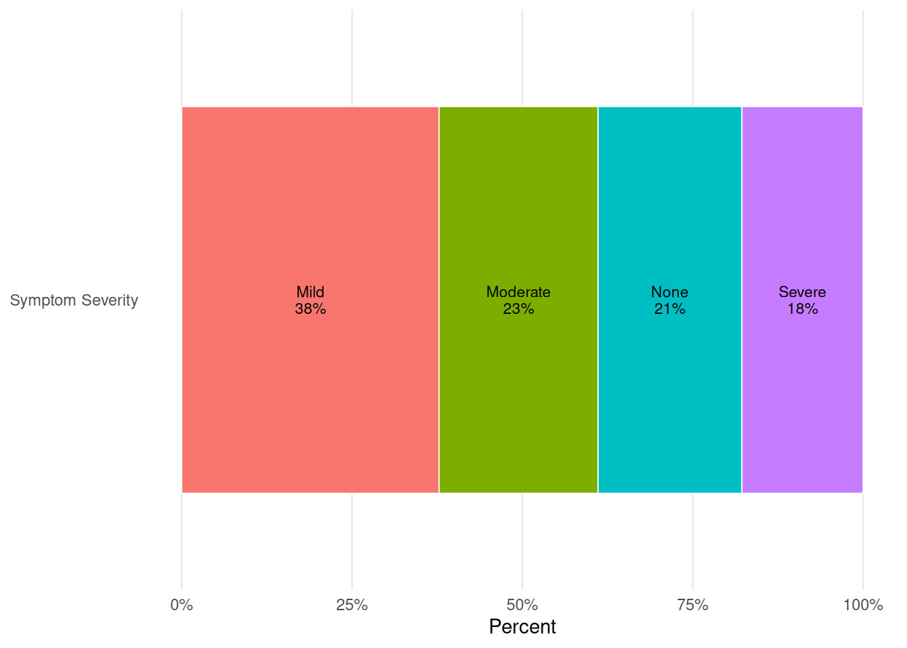
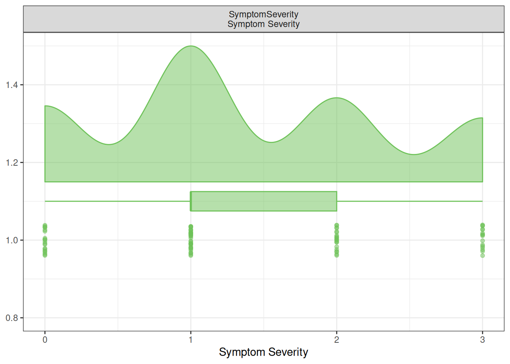
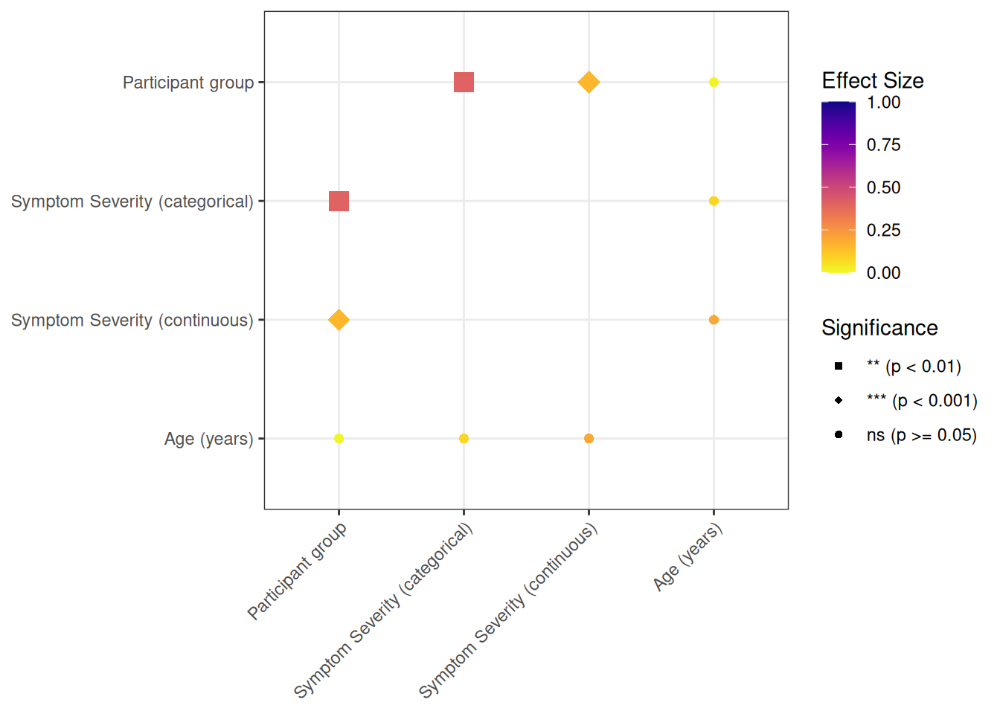

# Working with ordinal variables

## Why use more than one ordinal perspective?

Ordinal variables have a meaningful order, but their adjacent categories
are not automatically equally spaced. A symptom scale with *None*,
*Mild*, *Moderate*, and *Severe* can therefore be useful as a
categorical outcome when we care about the distribution across levels,
or as a continuous score when a one-step increase is a clinically
reasonable working scale.

Neither view is universally correct. Looking at both is often useful
during EDA: the categorical result shows whether a pattern is
concentrated in one level, while the continuous result is a compact
summary of an ordered trend. The appropriate confirmatory analysis
should still be chosen from the study question, measurement properties,
and prespecified analysis plan.

## Load packages

## Create a labelled ordinal example

> **Note**
>
> This vignette constructs a small example dataset in the document. The
> `VariableTypes` object above is the codebook used by
> [`RevalueData()`](https://rdastgh1.github.io/SciDataReportR/reference/RevalueData.md).

[`RevalueData()`](https://rdastgh1.github.io/SciDataReportR/reference/RevalueData.md)
keeps `SymptomSeverity` as an ordered factor for categorical analysis
and records its numeric codebook scores (`0` through `3`) for a
continuous analysis. If a codebook has no complete numeric mapping, the
ordered level ranks are used instead.

## Comparison tables

`TreatOrdinalAs` is the common control for tables:

| Value | Table behavior |
|----|----|
| `"Categorical"` | Show ordinal levels and use a categorical test. |
| `"Continuous"` | Use the preserved numeric score and continuous summary/test. |
| `"Both"` | Show separate categorical and continuous entries. |
| `"Exclude"` | Omit ordinal variables from automatic selection. |

``` r

tbl_Categorical <- MakeComparisonTable(
  data = df_Revalued,
  group_var = "Group",
  variables = "SymptomSeverity",
  TreatOrdinalAs = "Categorical"
)

tbl_Categorical
```

[TABLE]

Comparison table (display: mean (SD)). Global p-values: unadjusted (no
covariates). Categorical global test: auto; adjusted multi-category:
multinomial_LR. Pairwise: not included (p-adjust: bonferroni). {.table
.gt_table .caption-top quarto-bootstrap="false"}

``` r

tbl_Continuous <- MakeComparisonTable(
  data = df_Revalued,
  group_var = "Group",
  variables = "SymptomSeverity",
  TreatOrdinalAs = "Continuous"
)

tbl_Continuous
```

[TABLE]

Comparison table (display: mean (SD)). Global p-values: unadjusted (no
covariates). Categorical global test: auto; adjusted multi-category:
multinomial_LR. Pairwise: not included (p-adjust: bonferroni). {.table
.gt_table .caption-top quarto-bootstrap="false"}

``` r

tbl_Both <- MakeComparisonTable(
  data = df_Revalued,
  group_var = "Group",
  variables = "SymptomSeverity",
  TreatOrdinalAs = "Both"
)

tbl_Both
```

[TABLE]

Comparison table (display: mean (SD)). Global p-values: unadjusted (no
covariates). Categorical global test: auto; adjusted multi-category:
multinomial_LR. Pairwise: not included (p-adjust: bonferroni). {.table
.gt_table .caption-top quarto-bootstrap="false"}

With `TreatOrdinalAs = "Both"`, the original data are not changed. The
table uses temporary analysis columns and displays them as **Symptom
Severity (categorical)** and **Symptom Severity (continuous)**. With
`Relabel = FALSE`, the same entries use the raw variable name instead:
`SymptomSeverity (categorical)` and `SymptomSeverity (continuous)`.

## Plotting options

Plots intentionally allow only representations that make sense for the
plot.

| Function | Ordinal parameter | Valid values |
|----|----|----|
| [`PlotCategoricalDistributions()`](https://rdastgh1.github.io/SciDataReportR/reference/PlotCategoricalDistributions.md) | `TreatOrdinalAs` | `"Categorical"`, `"Exclude"` |
| [`PlotContinuousDistributions()`](https://rdastgh1.github.io/SciDataReportR/reference/PlotContinuousDistributions.md) | `TreatOrdinalAs` | `"Continuous"`, `"Exclude"` |
| [`PlotCorrelationsHeatmap()`](https://rdastgh1.github.io/SciDataReportR/reference/PlotCorrelationsHeatmap.md) | `TreatOrdinalAs` | `"Continuous"`, `"Exclude"` |
| [`PlotMiningMatrix()`](https://rdastgh1.github.io/SciDataReportR/reference/PlotMiningMatrix.md) | `TreatOrdinalAs` | all four values |

`"Both"` is rejected by single-representation plots because it would
make the analytic question ambiguous. Use separate categorical and
continuous plots when you want to inspect both perspectives.

``` r

PlotCategoricalDistributions(
  data = df_Revalued,
  variables = "SymptomSeverity",
  TreatOrdinalAs = "Categorical"
)
```



``` r

PlotContinuousDistributions(
  data = df_Revalued,
  variables = "SymptomSeverity",
  TreatOrdinalAs = "Continuous"
)
```



## PlotMiningMatrix() with both representations

[`PlotMiningMatrix()`](https://rdastgh1.github.io/SciDataReportR/reference/PlotMiningMatrix.md)
is the exception: it can examine mixed variable types, so
`TreatOrdinalAs = "Both"` adds two temporary analysis variables for each
ordinal field. It evaluates each representation wherever a valid
pairwise test is available; a particular representation will not appear
when no compatible variable pair exists.

``` r

vars_Mining <- c("Group", "SymptomSeverity", "Age")

MiningObj <- PlotMiningMatrix(
  data = df_Revalued,
  outcome_vars = vars_Mining,
  TreatOrdinalAs = "Both",
  Relabel = TRUE
)

MiningObj$Unadjusted$plot
```



The plot labels use the same suffixes as the table: **Symptom Severity
(categorical)** and **Symptom Severity (continuous)**. This makes the
statistical interpretation visible rather than hiding it behind an
internal duplicate-column name. Set `Relabel = FALSE` to use raw
variable names with those same suffixes.

## Reproducibility
