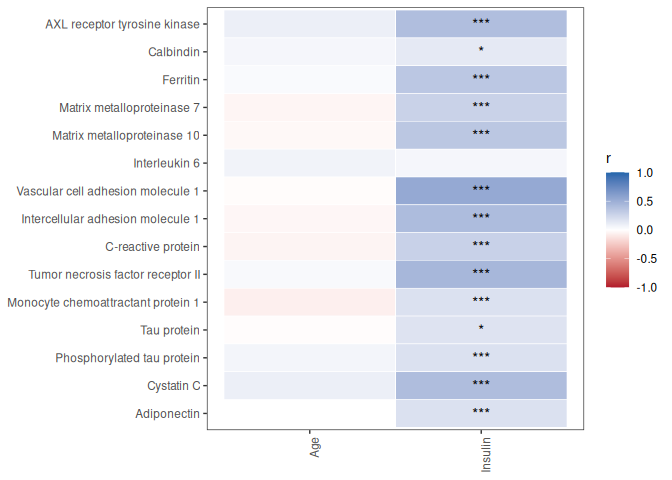
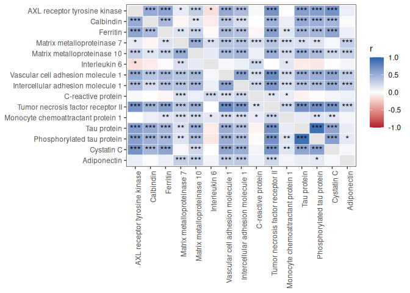
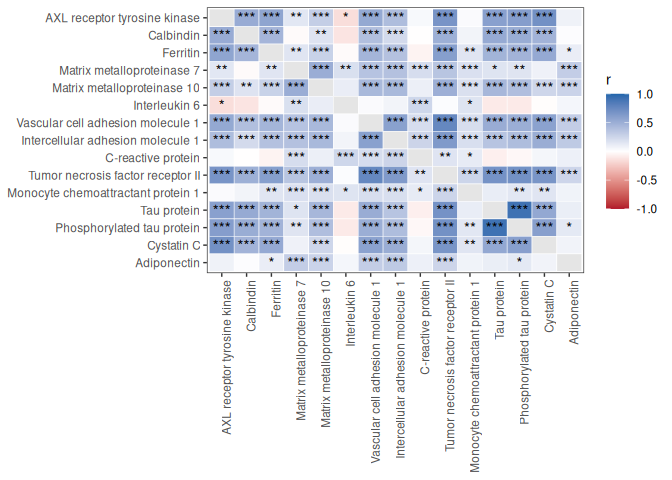
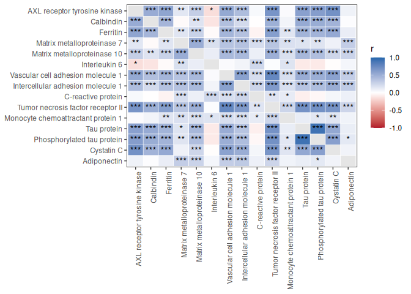
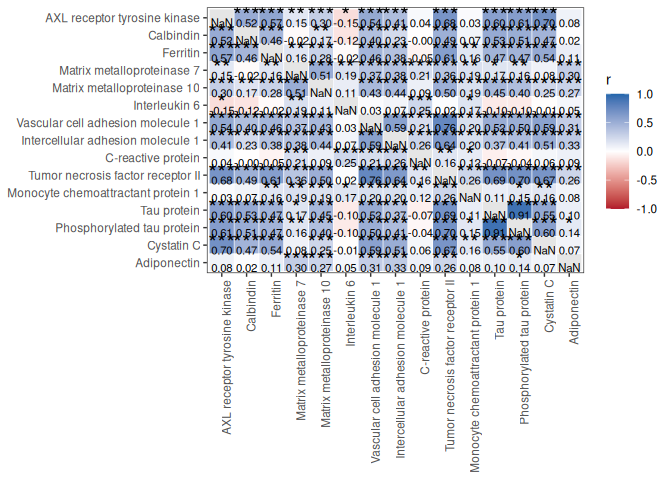
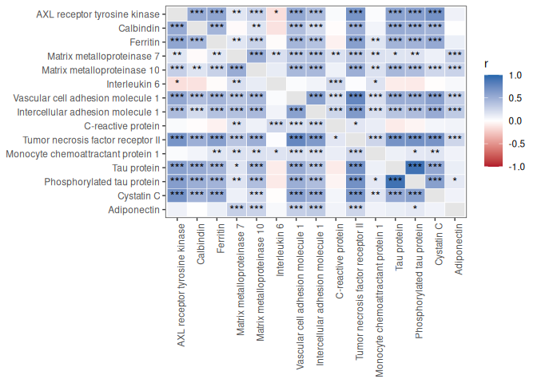

# Exploring associations with PlotCorrelationsHeatmap()

## 1 Overview

[`PlotCorrelationsHeatmap()`](https://rdastgh1.github.io/SciDataReportR/reference/PlotCorrelationsHeatmap.md)
computes correlations or partial correlations and visualizes the results
as a heatmap.

This vignette demonstrates:

- Correlations among biomarkers
- Correlations between biomarkers and clinical variables
- Pearson versus Spearman correlations
- False discovery rate (FDR) correction
- Covariate-adjusted correlations
- Annotating heatmaps with correlation coefficients and significance
  stars
- Interactive exploration using plotly
- Follow-up visualization of significant correlations

## 2 Load packages

``` r

library(SciDataReportR)
library(dplyr)
library(plotly)
```

## 3 Load example data

SciDataReportR includes an example dataset and variable type
specification file.

``` r

data("SampleData")
data("SampleVariableTypes")

RevaluedObj <- RevalueData(
  SampleData,
  SampleVariableTypes
)

df_Revalued <- RevaluedObj$RevaluedData
```

## 4 Select biomarkers

For this vignette we will examine relationships among a panel of
biomarkers.

``` r

biomarkers <- c(
  "AXL",
  "Calbindin",
  "Ferritin",
  "MMP7",
  "MMP10",
  "IL_6",
  "VCAM_1",
  "ICAM_1",
  "C_Reactive_Protein",
  "TNF_RII",
  "MCP_1",
  "tau",
  "p_tau",
  "Cystatin_C",
  "Adiponectin"
)
```

## 5 Correlations among biomarkers

When only `xVars` are supplied, a square correlation matrix is
generated.

``` r

CorrObj <- PlotCorrelationsHeatmap(
  Data = df_Revalued,
  xVars = biomarkers
)

CorrObj$Unadjusted$plot
```


Each tile represents the correlation coefficient between two biomarkers.
Positive and negative correlations are represented by opposite ends of
the color scale.

## 6 Correlations between biomarkers and clinical variables

A rectangular correlation matrix can be created by supplying both
`xVars` and `yVars`.

``` r

clinical_vars <- c(
  "age",
  "Insulin"
)
```

``` r

CorrObj_Clinical <- PlotCorrelationsHeatmap(
  Data = df_Revalued,
  xVars = biomarkers,
  yVars = clinical_vars
)

CorrObj_Clinical$Unadjusted$plot
```



This approach is useful for screening biomarker-clinical relationships.

## 7 Pearson versus Spearman correlations

The choice of correlation method depends on the characteristics of the
data.

| Method   | Recommended Use                                          |
|----------|----------------------------------------------------------|
| Pearson  | Approximately normal variables with linear relationships |
| Spearman | Skewed variables, outliers, or monotonic relationships   |
| Kendall  | Small samples or ordinal variables                       |

### 7.1 Pearson correlations

Pearson correlation measures linear relationships between variables and
is most appropriate when variables are approximately normally
distributed.

``` r

PearsonObj <- PlotCorrelationsHeatmap(
  Data = df_Revalued,
  xVars = biomarkers,
  method = "pearson"
)

PearsonObj$Unadjusted$plot
```


### 7.2 Spearman correlations

Spearman correlation is rank-based and is often preferred for biomarker
data because it is more robust to skewed distributions and outliers.

``` r

SpearmanObj <- PlotCorrelationsHeatmap(
  Data = df_Revalued,
  xVars = biomarkers,
  method = "spearman"
)

SpearmanObj$Unadjusted$plot
```



Researchers frequently compare both methods to determine whether
findings are sensitive to distributional assumptions.

## 8 Unadjusted versus FDR-corrected significance

[`PlotCorrelationsHeatmap()`](https://rdastgh1.github.io/SciDataReportR/reference/PlotCorrelationsHeatmap.md)
automatically computes both unadjusted and FDR-corrected p-values.

### 8.1 Unadjusted significance

``` r

CorrObj$Unadjusted$plot
```



### 8.2 FDR-corrected significance

``` r

CorrObj$FDRCorrected$plot
```



When evaluating many correlations simultaneously, false discovery rate
correction is recommended to reduce the likelihood of false positive
findings.

## 9 Adding correlation coefficients and significance stars

The default heatmaps display significance stars. Additional annotations
can be added using
[`add_r_and_stars()`](https://rdastgh1.github.io/SciDataReportR/reference/add_r_and_stars.md).

### 9.1 Raw p-values

``` r

add_r_and_stars(
  CorrObj,
  star_from = "raw"
)
```


### 9.2 FDR-corrected p-values

``` r

add_r_and_stars(
  CorrObj,
  star_from = "fdr"
)
```



These annotated heatmaps are useful for presentations and publications.

## 10 Adjusting for covariates

Partial correlations can be estimated by specifying one or more
covariates.

The example below adjusts all correlations for age.

``` r

CorrObj_AgeAdjusted <- PlotCorrelationsHeatmap(
  Data = df_Revalued,
  xVars = biomarkers,
  covars = "age"
)

CorrObj_AgeAdjusted$FDRCorrected$plot
```



When covariates are supplied, variables are residualized prior to
correlation testing. This can help account for potential confounding
factors.

## 11 Interactive heatmaps

Heatmaps can be converted into interactive visualizations using plotly.

``` r

# Not evaluated in the shipped vignette to keep it lightweight - run interactively
ggplotly(
  CorrObj$FDRCorrected$plot
)
```

Interactive plots allow users to:

- Hover over cells to inspect values
- Zoom into regions of interest
- Explore large correlation matrices

## 12 Investigating significant correlations

Significant correlations can be examined individually using
[`plotSigCorrelations()`](https://rdastgh1.github.io/SciDataReportR/reference/plotSigCorrelations.md).

``` r

SigPlots <- plotSigCorrelations(
  DataFrame = df_Revalued,
  CorrelationHeatmapObject = CorrObj
)
```

The resulting object contains a list of scatterplots for significant
associations, one per significant heatmap cell.

``` r

length(SigPlots)
```

These plots can be combined into a single figure.

``` r

AssemblePlots(
  SigPlots,
  LegendPosition = "none",
  ncol = 3
)
```

> These
> [`plotSigCorrelations()`](https://rdastgh1.github.io/SciDataReportR/reference/plotSigCorrelations.md)
> /
> [`AssemblePlots()`](https://rdastgh1.github.io/SciDataReportR/reference/AssemblePlots.md)
> chunks are shown but not executed when the vignette is built, because
> the underlying `ggstatsplot` scatterplots require graphics fonts that
> are not available on all systems. Run them interactively to reproduce
> the figures.

This workflow provides a convenient way to visually inspect the
relationships underlying significant heatmap cells.

## 13 Accessing correlation results

The returned object stores both correlation estimates and p-values.

### 13.1 Unadjusted results

``` r

head(
  CorrObj$Unadjusted$r
)
```

                     AXL   Calbindin   Ferritin        MMP7     MMP10       IL_6
    AXL              NaN  0.52216065  0.5653655  0.14869241 0.3022935 -0.1532338
    Calbindin  0.5221607         NaN  0.4583562 -0.02312424 0.1680769 -0.1237334
    Ferritin   0.5653655  0.45835621        NaN  0.15786447 0.2789080 -0.0224228
    MMP7       0.1486924 -0.02312424  0.1578645         NaN 0.5129789  0.1919149
    MMP10      0.3022935  0.16807693  0.2789080  0.51297885       NaN  0.1084045
    IL_6      -0.1532338 -0.12373337 -0.0224228  0.19191492 0.1084045        NaN
                  VCAM_1     ICAM_1 C_Reactive_Protein    TNF_RII      MCP_1
    AXL       0.53873489 0.41150120        0.038649351 0.67741432 0.02749897
    Calbindin 0.39780711 0.22565283       -0.004856696 0.49383870 0.06739808
    Ferritin  0.46241675 0.38306222       -0.054878991 0.60713734 0.15505013
    MMP7      0.36830975 0.38100789        0.206084412 0.36057242 0.18586979
    MMP10     0.43421585 0.43590038        0.094901361 0.49835015 0.19030718
    IL_6      0.02738943 0.06827897        0.246655833 0.01800354 0.16583270
                      tau       p_tau  Cystatin_C Adiponectin
    AXL        0.59595269  0.61480583  0.69703676  0.08057868
    Calbindin  0.53043489  0.51353191  0.47181482  0.01718580
    Ferritin   0.46923376  0.47090359  0.53677266  0.10879947
    MMP7       0.16510916  0.16390216  0.08184740  0.30420057
    MMP10      0.44857101  0.39972750  0.24843017  0.26924069
    IL_6      -0.09860427 -0.09659908 -0.01090426  0.05404693

### 13.2 FDR-corrected results

``` r

head(
  CorrObj$FDRCorrected$p
)
```

                       AXL    Calbindin     Ferritin         MMP7        MMP10
    AXL                 NA 6.754432e-24 1.202720e-28 9.842573e-03 3.992599e-08
    Calbindin 6.754432e-24           NA 3.833275e-18 7.113488e-01 3.479022e-03
    Ferritin  1.202720e-28 3.833275e-18           NA 6.074841e-03 4.923868e-07
    MMP7      9.842573e-03 7.113488e-01 6.074841e-03           NA 4.769713e-23
    MMP10     3.992599e-08 3.479022e-03 4.923868e-07 4.769713e-23           NA
    IL_6      2.697762e-02 7.985582e-02 7.625512e-01 5.203272e-03 1.280759e-01
                     IL_6       VCAM_1       ICAM_1 C_Reactive_Protein      TNF_RII
    AXL       0.026977618 1.293370e-25 1.499682e-14       0.5273199829 9.778606e-45
    Calbindin 0.079855821 1.243125e-13 6.182377e-05       0.9296432819 3.106130e-21
    Ferritin  0.762551228 1.795021e-18 1.189938e-12       0.3552895169 7.443312e-34
    MMP7      0.005203272 9.714927e-12 1.580795e-12       0.0002757268 2.841208e-11
    MMP10     0.128075909 3.052323e-16 2.324964e-16       0.1113490246 1.202488e-21
    IL_6               NA 7.113488e-01 3.379698e-01       0.0002625664 7.998138e-01
                     MCP_1          tau        p_tau   Cystatin_C  Adiponectin
    AXL       0.6611392544 4.541696e-23 6.963711e-35 2.512685e-48 1.737381e-01
    Calbindin 0.2566044219 9.150503e-18 4.541696e-23 3.072925e-19 7.768915e-01
    Ferritin  0.0069532031 1.047663e-13 3.553999e-19 1.989033e-25 6.446548e-02
    MMP7      0.0011050183 1.668540e-02 4.429348e-03 1.701290e-01 3.283011e-08
    MMP10     0.0008262027 1.583878e-12 9.662275e-14 8.680291e-06 1.287152e-06
    IL_6      0.0163849398 2.499962e-01 1.737381e-01 8.768573e-01 4.548805e-01

These results can be exported for reporting or used in downstream
analyses.

## 14 Summary

[`PlotCorrelationsHeatmap()`](https://rdastgh1.github.io/SciDataReportR/reference/PlotCorrelationsHeatmap.md)
provides a comprehensive workflow for exploratory association analysis,
including:

- Pearson, Spearman, and Kendall correlations
- Partial correlations using covariate adjustment
- Automatic FDR correction
- Label-aware visualization
- Interactive heatmaps
- Correlation coefficient annotation
- Follow-up visualization of significant associations

## 15 Related functions

- [`add_r_and_stars()`](https://rdastgh1.github.io/SciDataReportR/reference/add_r_and_stars.md)
- [`plotSigCorrelations()`](https://rdastgh1.github.io/SciDataReportR/reference/plotSigCorrelations.md)
- [`MakeComparisonTable()`](https://rdastgh1.github.io/SciDataReportR/reference/MakeComparisonTable.md)
- [`PlotVolcanoEffects()`](https://rdastgh1.github.io/SciDataReportR/reference/PlotVolcanoEffects.md)
- `CreatePCA()`

## 16 Session information

``` r

sessionInfo()
```

    R version 4.6.1 (2026-06-24)
    Platform: x86_64-pc-linux-gnu
    Running under: Ubuntu 24.04.4 LTS

    Matrix products: default
    BLAS:   /usr/lib/x86_64-linux-gnu/openblas-pthread/libblas.so.3
    LAPACK: /usr/lib/x86_64-linux-gnu/openblas-pthread/libopenblasp-r0.3.26.so;  LAPACK version 3.12.0

    locale:
     [1] LC_CTYPE=C.UTF-8       LC_NUMERIC=C           LC_TIME=C.UTF-8
     [4] LC_COLLATE=C.UTF-8     LC_MONETARY=C.UTF-8    LC_MESSAGES=C.UTF-8
     [7] LC_PAPER=C.UTF-8       LC_NAME=C              LC_ADDRESS=C
    [10] LC_TELEPHONE=C         LC_MEASUREMENT=C.UTF-8 LC_IDENTIFICATION=C

    time zone: UTC
    tzcode source: system (glibc)

    attached base packages:
    [1] stats     graphics  grDevices utils     datasets  methods   base

    other attached packages:
    [1] plotly_4.12.1          ggplot2_4.0.3          dplyr_1.2.1
    [4] SciDataReportR_20.24.0

    loaded via a namespace (and not attached):
     [1] gtable_0.3.6           xfun_0.60              bayestestR_0.18.1
     [4] htmlwidgets_1.6.4      insight_1.5.2          rstatix_1.1.0
     [7] lattice_0.22-9         paletteer_1.7.0        vctrs_0.7.3
    [10] tools_4.6.1            generics_0.1.4         datawizard_1.3.1
    [13] tibble_3.3.1           pkgconfig_2.0.3        data.table_1.18.4
    [16] RColorBrewer_1.1-3     correlation_0.8.8      S7_0.2.2
    [19] RcppParallel_6.2.0     lifecycle_1.0.5        compiler_4.6.1
    [22] farver_2.1.2           snakecase_0.11.1       carData_3.0-6
    [25] htmltools_0.5.9        yaml_2.3.12            Formula_1.2-6
    [28] pillar_1.11.1          car_3.1-5              tidyr_1.3.2
    [31] statsExpressions_2.0.0 abind_1.4-8            tidyselect_1.2.1
    [34] sjlabelled_1.2.0       digest_0.6.39          mvtnorm_1.4-2
    [37] gtsummary_2.5.1        purrr_1.2.2            rematch2_2.1.2
    [40] labeling_0.4.3         forcats_1.0.1          ggstatsplot_1.0.0
    [43] labelled_2.16.0        fastmap_1.2.0          grid_4.6.1
    [46] cli_3.6.6              magrittr_2.0.5         patchwork_1.3.2
    [49] dichromat_2.0-1        broom_1.0.13           withr_3.0.3
    [52] scales_1.4.0           backports_1.5.1        estimability_2.0.0
    [55] httr_1.4.8             rmarkdown_2.31         emmeans_2.0.4
    [58] otel_0.2.0             hms_1.1.4              coda_0.19-4.1
    [61] evaluate_1.0.5         knitr_1.51             haven_2.5.5
    [64] parameters_0.29.2      viridisLite_0.4.3      rstantools_2.7.0
    [67] rlang_1.3.0            xtable_1.8-8           glue_1.8.1
    [70] jsonlite_2.0.0         effectsize_1.0.3       R6_2.6.1              
