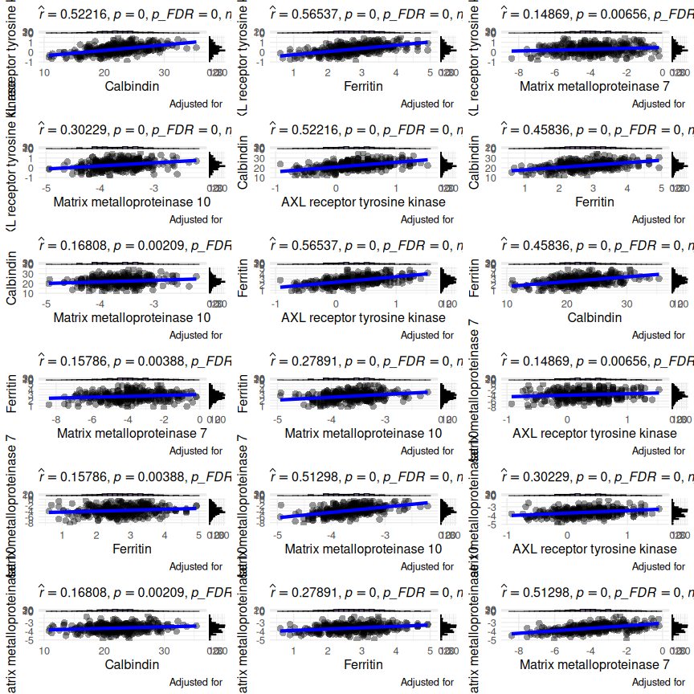

# Exploring associations with PlotCorrelationsHeatmap()

## 1 Overview

[`PlotCorrelationsHeatmap()`](https://rdastgh1.github.io/SciDataReportR/reference/PlotCorrelationsHeatmap.md)
computes correlations or partial correlations and visualizes the results
as a heatmap.

This vignette demonstrates:

- Correlations among biomarkers
- Correlations between biomarkers and clinical variables
- Pearson versus Spearman correlations
- False discovery rate (FDR) correction
- Covariate-adjusted correlations
- Annotating heatmaps with correlation coefficients and significance
  stars
- Interactive exploration using plotly
- Follow-up visualization of significant correlations

## 2 Load packages

``` r

library(SciDataReportR)
library(dplyr)
library(plotly)
```

## 3 Load example data

SciDataReportR includes an example dataset and variable type
specification file.

``` r

data("SampleData")
data("SampleVariableTypes")

RevaluedObj <- RevalueData(
  SampleData,
  SampleVariableTypes
)

df_Revalued <- RevaluedObj$RevaluedData
```

## 4 Select biomarkers

For this vignette we will examine relationships among a panel of
biomarkers.

``` r

biomarkers <- c(
  "AXL",
  "Calbindin",
  "Ferritin",
  "MMP7",
  "MMP10",
  "NFL",
  "GFAP",
  "IL6",
  "VCAM1",
  "ICAM1",
  "CRP",
  "TNFa",
  "MCP1",
  "YKL40",
  "Tau"
)
```

## 5 Correlations among biomarkers

When only `xVars` are supplied, a square correlation matrix is
generated.

``` r

CorrObj <- PlotCorrelationsHeatmap(
  Data = df_Revalued,
  xVars = biomarkers
)

CorrObj$Unadjusted$plot
```


Each tile represents the correlation coefficient between two biomarkers.
Positive and negative correlations are represented by opposite ends of
the color scale.

## 6 Correlations between biomarkers and clinical variables

A rectangular correlation matrix can be created by supplying both
`xVars` and `yVars`.

``` r

clinical_vars <- c(
  "age",
  "Insulin"
)
```

``` r

CorrObj_Clinical <- PlotCorrelationsHeatmap(
  Data = df_Revalued,
  xVars = biomarkers,
  yVars = clinical_vars
)

CorrObj_Clinical$Unadjusted$plot
```


This approach is useful for screening biomarker-clinical relationships.

## 7 Pearson versus Spearman correlations

The choice of correlation method depends on the characteristics of the
data.

| Method   | Recommended Use                                          |
|----------|----------------------------------------------------------|
| Pearson  | Approximately normal variables with linear relationships |
| Spearman | Skewed variables, outliers, or monotonic relationships   |
| Kendall  | Small samples or ordinal variables                       |

### 7.1 Pearson correlations

Pearson correlation measures linear relationships between variables and
is most appropriate when variables are approximately normally
distributed.

``` r

PearsonObj <- PlotCorrelationsHeatmap(
  Data = df_Revalued,
  xVars = biomarkers,
  method = "pearson"
)

PearsonObj$Unadjusted$plot
```


### 7.2 Spearman correlations

Spearman correlation is rank-based and is often preferred for biomarker
data because it is more robust to skewed distributions and outliers.

``` r

SpearmanObj <- PlotCorrelationsHeatmap(
  Data = df_Revalued,
  xVars = biomarkers,
  method = "spearman"
)

SpearmanObj$Unadjusted$plot
```


Researchers frequently compare both methods to determine whether
findings are sensitive to distributional assumptions.

## 8 Unadjusted versus FDR-corrected significance

[`PlotCorrelationsHeatmap()`](https://rdastgh1.github.io/SciDataReportR/reference/PlotCorrelationsHeatmap.md)
automatically computes both unadjusted and FDR-corrected p-values.

### 8.1 Unadjusted significance

``` r

CorrObj$Unadjusted$plot
```


### 8.2 FDR-corrected significance

``` r

CorrObj$FDRCorrected$plot
```


When evaluating many correlations simultaneously, false discovery rate
correction is recommended to reduce the likelihood of false positive
findings.

## 9 Adding correlation coefficients and significance stars

The default heatmaps display significance stars. Additional annotations
can be added using
[`add_r_and_stars()`](https://rdastgh1.github.io/SciDataReportR/reference/add_r_and_stars.md).

### 9.1 Raw p-values

``` r

add_r_and_stars(
  CorrObj,
  star_from = "raw"
)
```


### 9.2 FDR-corrected p-values

``` r

add_r_and_stars(
  CorrObj,
  star_from = "fdr"
)
```


These annotated heatmaps are useful for presentations and publications.

## 10 Adjusting for covariates

Partial correlations can be estimated by specifying one or more
covariates.

The example below adjusts all correlations for age.

``` r

CorrObj_AgeAdjusted <- PlotCorrelationsHeatmap(
  Data = df_Revalued,
  xVars = biomarkers,
  covars = "age"
)

CorrObj_AgeAdjusted$FDRCorrected$plot
```


When covariates are supplied, variables are residualized prior to
correlation testing. This can help account for potential confounding
factors.

## 11 Interactive heatmaps

Heatmaps can be converted into interactive visualizations using plotly.

``` r

# Not evaluated in the shipped vignette to keep it lightweight - run interactively
ggplotly(
  CorrObj$FDRCorrected$plot
)
```

Interactive plots allow users to:

- Hover over cells to inspect values
- Zoom into regions of interest
- Explore large correlation matrices

## 12 Investigating significant correlations

Significant correlations can be examined individually using
[`plotSigCorrelations()`](https://rdastgh1.github.io/SciDataReportR/reference/plotSigCorrelations.md).

``` r

SigPlots <- plotSigCorrelations(
  DataFrame = df_Revalued,
  CorrelationHeatmapObject = CorrObj
)
```

The resulting object contains a list of scatterplots for significant
associations.

``` r

length(SigPlots)
```

    [1] 18

These plots can be combined into a single figure.

``` r

AssemblePlots(
  SigPlots,
  LegendPosition = "none",
  ncol = 3
)
```



This workflow provides a convenient way to visually inspect the
relationships underlying significant heatmap cells.

## 13 Accessing correlation results

The returned object stores both correlation estimates and p-values.

### 13.1 Unadjusted results

``` r

head(
  CorrObj$Unadjusted$r
)
```

                    AXL   Calbindin  Ferritin        MMP7     MMP10
    AXL             NaN  0.52216065 0.5653655  0.14869241 0.3022935
    Calbindin 0.5221607         NaN 0.4583562 -0.02312424 0.1680769
    Ferritin  0.5653655  0.45835621       NaN  0.15786447 0.2789080
    MMP7      0.1486924 -0.02312424 0.1578645         NaN 0.5129789
    MMP10     0.3022935  0.16807693 0.2789080  0.51297885       NaN

### 13.2 FDR-corrected results

``` r

head(
  CorrObj$FDRCorrected$p
)
```

                       AXL    Calbindin     Ferritin         MMP7        MMP10
    AXL                 NA 5.467874e-24 1.603627e-28 7.290795e-03 3.650376e-08
    Calbindin 5.467874e-24           NA 2.646785e-18 6.741588e-01 2.982019e-03
    Ferritin  1.603627e-28 2.646785e-18           NA 4.845409e-03 3.829675e-07
    MMP7      7.290795e-03 6.741588e-01 4.845409e-03           NA 3.179809e-23
    MMP10     3.650376e-08 2.982019e-03 3.829675e-07 3.179809e-23           NA

These results can be exported for reporting or used in downstream
analyses.

## 14 Summary

[`PlotCorrelationsHeatmap()`](https://rdastgh1.github.io/SciDataReportR/reference/PlotCorrelationsHeatmap.md)
provides a comprehensive workflow for exploratory association analysis,
including:

- Pearson, Spearman, and Kendall correlations
- Partial correlations using covariate adjustment
- Automatic FDR correction
- Label-aware visualization
- Interactive heatmaps
- Correlation coefficient annotation
- Follow-up visualization of significant associations

## 15 Related functions

- [`add_r_and_stars()`](https://rdastgh1.github.io/SciDataReportR/reference/add_r_and_stars.md)
- [`plotSigCorrelations()`](https://rdastgh1.github.io/SciDataReportR/reference/plotSigCorrelations.md)
- [`MakeComparisonTable()`](https://rdastgh1.github.io/SciDataReportR/reference/MakeComparisonTable.md)
- [`PlotVolcanoEffects()`](https://rdastgh1.github.io/SciDataReportR/reference/PlotVolcanoEffects.md)
- `CreatePCA()`

## 16 Session information

``` r

sessionInfo()
```

    R version 4.6.1 (2026-06-24)
    Platform: x86_64-pc-linux-gnu
    Running under: Ubuntu 24.04.4 LTS

    Matrix products: default
    BLAS:   /usr/lib/x86_64-linux-gnu/openblas-pthread/libblas.so.3
    LAPACK: /usr/lib/x86_64-linux-gnu/openblas-pthread/libopenblasp-r0.3.26.so;  LAPACK version 3.12.0

    locale:
     [1] LC_CTYPE=C.UTF-8       LC_NUMERIC=C           LC_TIME=C.UTF-8
     [4] LC_COLLATE=C.UTF-8     LC_MONETARY=C.UTF-8    LC_MESSAGES=C.UTF-8
     [7] LC_PAPER=C.UTF-8       LC_NAME=C              LC_ADDRESS=C
    [10] LC_TELEPHONE=C         LC_MEASUREMENT=C.UTF-8 LC_IDENTIFICATION=C

    time zone: UTC
    tzcode source: system (glibc)

    attached base packages:
    [1] stats     graphics  grDevices utils     datasets  methods   base

    other attached packages:
    [1] plotly_4.12.0         ggplot2_4.0.3         dplyr_1.2.1
    [4] SciDataReportR_20.9.0

    loaded via a namespace (and not attached):
     [1] ggstatsplot_1.0.0      sjlabelled_1.2.0       tidyselect_1.2.1
     [4] viridisLite_0.4.3      farver_2.1.2           statsExpressions_2.0.0
     [7] S7_0.2.2               fastmap_1.2.0          lazyeval_0.2.3
    [10] bayestestR_0.18.1      broom.helpers_1.22.0   labelled_2.16.0
    [13] digest_0.6.39          estimability_2.0.0     lifecycle_1.0.5
    [16] magrittr_2.0.5         compiler_4.6.1         rlang_1.2.0
    [19] tools_4.6.1            yaml_2.3.12            data.table_1.18.4
    [22] knitr_1.51             labeling_0.4.3         htmlwidgets_1.6.4
    [25] RColorBrewer_1.1-3     abind_1.4-8            withr_3.0.3
    [28] purrr_1.2.2            grid_4.6.1             datawizard_1.3.1
    [31] xtable_1.8-8           gtsummary_2.5.1        paletteer_1.7.0
    [34] emmeans_2.0.3          scales_1.4.0           dichromat_2.0-0.1
    [37] insight_1.5.2          cli_3.6.6              mvtnorm_1.4-1
    [40] rmarkdown_2.31         generics_0.1.4         otel_0.2.0
    [43] RcppParallel_5.1.11-2  httr_1.4.8             parameters_0.29.2
    [46] pbapply_1.7-4          stringr_1.6.0          splines_4.6.1
    [49] parallel_4.6.1         effectsize_1.0.2       BayesFactor_0.9.12-4.8
    [52] vctrs_0.7.3            Matrix_1.7-5           jsonlite_2.0.0
    [55] carData_3.0-6          car_3.1-5              hms_1.1.4
    [58] patchwork_1.3.2        rstatix_1.0.0          Formula_1.2-5
    [61] correlation_0.8.8      tidyr_1.3.2            glue_1.8.1
    [64] ggside_0.4.1           rematch2_2.1.2         cowplot_1.2.0
    [67] stringi_1.8.7          gtable_0.3.6           tibble_3.3.1
    [70] pillar_1.11.1          htmltools_0.5.9        R6_2.6.1
    [73] evaluate_1.0.5         lattice_0.22-9         haven_2.5.5
    [76] backports_1.5.1        broom_1.0.13           snakecase_0.11.1
    [79] rstantools_2.6.0       MatrixModels_0.5-4     Rcpp_1.1.1-1.1
    [82] nlme_3.1-169           coda_0.19-4.1          mgcv_1.9-4
    [85] xfun_0.59              forcats_1.0.1          pkgconfig_2.0.3       
