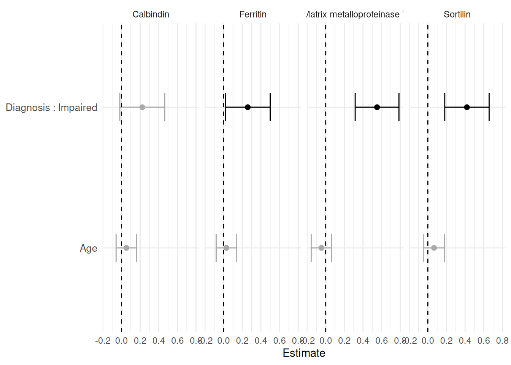
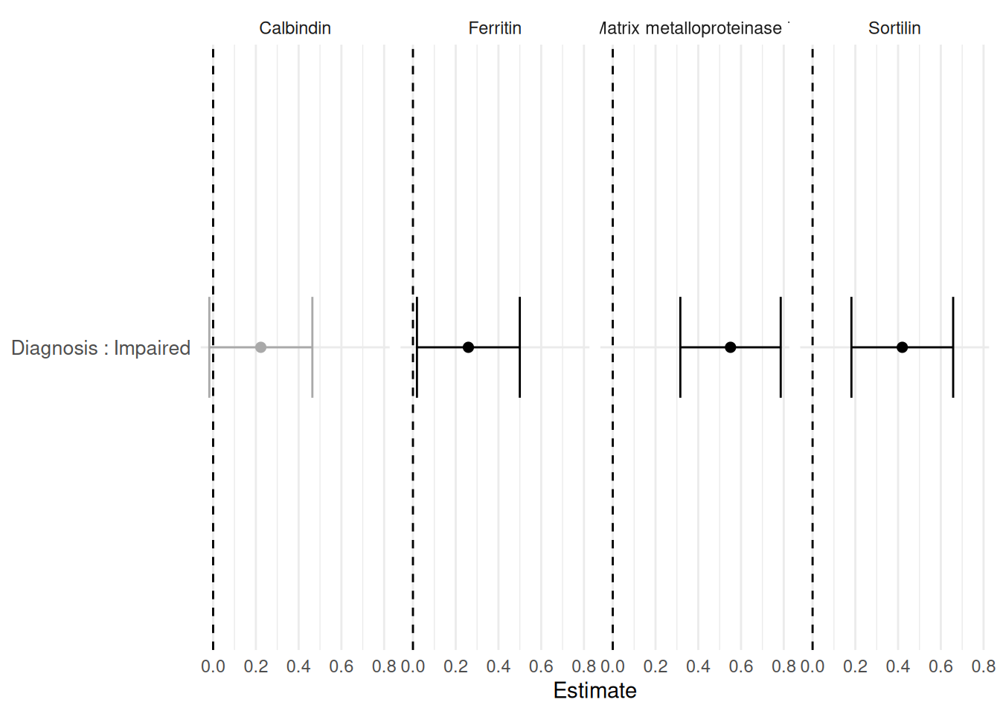
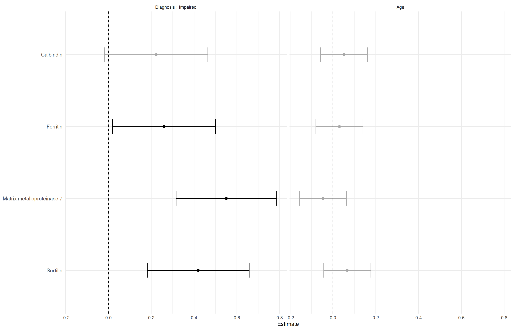
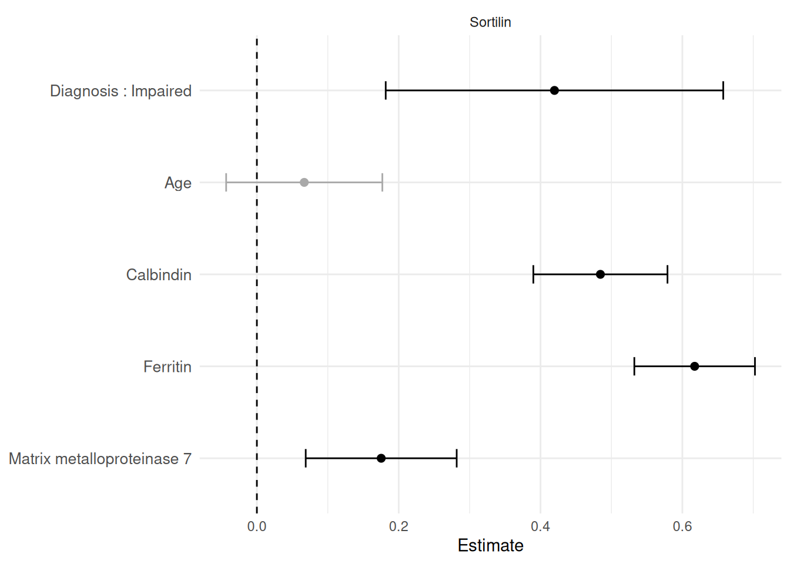
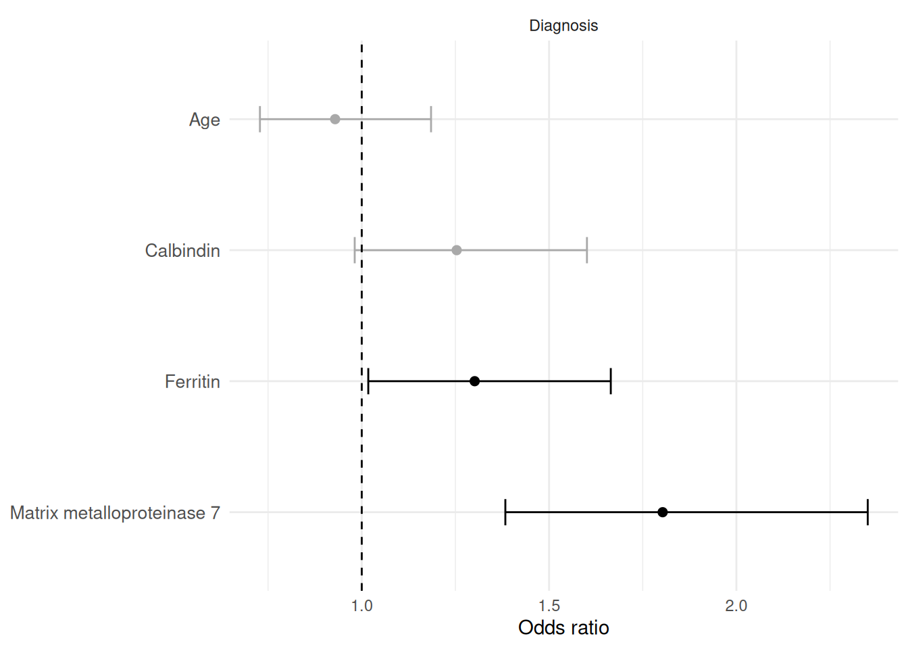

# Forest Plots from Univariate Regression Tables

## 1 Overview

[`PlotForestFromTable()`](https://rdastgh1.github.io/SciDataReportR/reference/PlotForestFromTable.md)
visualizes the estimates and confidence intervals from a
[`MakeUnivariateRegressionTable()`](https://rdastgh1.github.io/SciDataReportR/reference/MakeUnivariateRegressionTable.md)
object. It plots from the tidy `Results` dataframe that
[`MakeUnivariateRegressionTable()`](https://rdastgh1.github.io/SciDataReportR/reference/MakeUnivariateRegressionTable.md)
returns, and it also accepts that dataframe directly, so you can filter
or reorder results before plotting.

The default layout is:

- facets = outcomes
- rows = predictors or predictor levels
- x-axis = regression estimate

Use `Flip = TRUE` when it is easier to read outcomes as rows and
predictors as facets.

> **Note**
>
> [`PlotForestFromTable()`](https://rdastgh1.github.io/SciDataReportR/reference/PlotForestFromTable.md)
> was previously named
> [`plotForestFromTable()`](https://rdastgh1.github.io/SciDataReportR/reference/PlotForestFromTable.md).
> The old name still works as a backwards-compatible synonym, so
> existing scripts continue to run.

## 2 Load packages

``` r

library(SciDataReportR)
library(dplyr)
```

## 3 Load example data

The examples use `SampleData` and `SampleVariableTypes`, then apply
labels and recoding with
[`RevalueData()`](https://rdastgh1.github.io/SciDataReportR/reference/RevalueData.md).

``` r

data("SampleData")
data("SampleVariableTypes")

RevaluedObj <- RevalueData(
  SampleData,
  SampleVariableTypes
)

df_Revalued <- RevaluedObj$RevaluedData
```

## 4 Many outcomes and predictors

This is a common screening pattern: several outcomes tested against
several predictors.

``` r

vars_Outcomes <- c(
  "Calbindin",
  "Ferritin",
  "MMP7",
  "Sortilin"
)

vars_Predictors <- c(
  "Diagnosis",
  "age"
)

Reg_Obj_Outcomes <- MakeUnivariateRegressionTable(
  data = df_Revalued,
  outcome_vars = vars_Outcomes,
  predictor_vars = vars_Predictors,
  Standardize = TRUE
)
```

## 5 Default forest plot

The default plot keeps outcomes as facets and terms as rows.

``` r

PlotForestFromTable(Reg_Obj_Outcomes)
```



Black points indicate `p < 0.05`; grey points are not significant. The
dashed vertical line is the null value for linear estimates.

## 6 Plot from the Results dataframe

The plot is drawn from `Reg_Obj_Outcomes$Results`, and you can pass that
dataframe (or any subset of it) directly. This makes it easy to plot
only the rows you care about.

``` r

Reg_Obj_Outcomes$Results %>%
  filter(Predictor == "Diagnosis") %>%
  PlotForestFromTable()
```



## 7 Flip outcomes and predictors

When there are many outcomes and a small predictor set, `Flip = TRUE` is
often easier to read.

``` r

PlotForestFromTable(
  Reg_Obj_Outcomes,
  Flip = TRUE
)
```



With `Flip = TRUE`, predictors or predictor levels become facets, and
outcomes become rows.

## 8 Many predictors, one outcome

For one outcome and many predictors, the default layout is usually
already compact.

``` r

Reg_Obj_Predictors <- MakeUnivariateRegressionTable(
  data = df_Revalued,
  outcome_vars = "Sortilin",
  predictor_vars = c("Diagnosis", "age", "Calbindin", "Ferritin", "MMP7"),
  Standardize = TRUE
)
```

``` r

PlotForestFromTable(Reg_Obj_Predictors)
```



## 9 Labels

Forest plot facets and rows use labels inherited from
`SampleVariableTypes` through
[`RevalueData()`](https://rdastgh1.github.io/SciDataReportR/reference/RevalueData.md).
If labels are missing, the plot falls back to the variable names.

``` r

Reg_Obj_Outcomes$Metadata$Outcomes
```

        Outcome               OutcomeLabel OutcomeFamily ReferenceLevel EventLevel
    1 Calbindin                  Calbindin        linear           <NA>       <NA>
    2  Ferritin                   Ferritin        linear           <NA>       <NA>
    3      MMP7 Matrix metalloproteinase 7        linear           <NA>       <NA>
    4  Sortilin                   Sortilin        linear           <NA>       <NA>

Categorical and dichotomous predictors are shown with the modeled level,
for example `Diagnosis : Impaired`.

## 10 Logistic models

[`MakeUnivariateRegressionTable()`](https://rdastgh1.github.io/SciDataReportR/reference/MakeUnivariateRegressionTable.md)
uses logistic regression automatically for two-level outcomes and
reports odds ratios by default.

``` r

Reg_Obj_Logistic <- MakeUnivariateRegressionTable(
  data = df_Revalued,
  outcome_vars = "Diagnosis",
  predictor_vars = c("age", "Calbindin", "Ferritin", "MMP7"),
  Standardize = TRUE
)

Reg_Obj_Logistic$FormattedTable
```

| Variable                   | Effect     | N   | Estimate (95% CI)   | p-value |
|----------------------------|------------|-----|---------------------|---------|
| Diagnosis                  |            |     |                     |         |
| Age                        | Odds ratio | 322 | 0.929 (0.728, 1.18) | 0.55    |
| Calbindin                  | Odds ratio | 333 | 1.25 (0.981, 1.6)   | 0.071   |
| Ferritin                   | Odds ratio | 333 | 1.3 (1.02, 1.66)    | 0.036   |
| Matrix metalloproteinase 7 | Odds ratio | 333 | 1.8 (1.38, 2.35)    | \<0.001 |

``` r

Reg_Obj_Logistic$Metadata$Outcomes
```

        Outcome OutcomeLabel OutcomeFamily ReferenceLevel EventLevel
    1 Diagnosis    Diagnosis      logistic        Control   Impaired

``` r

PlotForestFromTable(Reg_Obj_Logistic)
```



For logistic models, check the event level in `Metadata$Outcomes` before
interpreting odds ratios. Mixed linear and logistic forest plots can be
visually convenient, but they combine different effect scales.

## 11 Reproducibility

``` r

# save.image("PlotForestFromTable_workspace.RData")
print(sessionInfo())
```

    R version 4.6.1 (2026-06-24)
    Platform: x86_64-pc-linux-gnu
    Running under: Ubuntu 24.04.4 LTS

    Matrix products: default
    BLAS:   /usr/lib/x86_64-linux-gnu/openblas-pthread/libblas.so.3
    LAPACK: /usr/lib/x86_64-linux-gnu/openblas-pthread/libopenblasp-r0.3.26.so;  LAPACK version 3.12.0

    locale:
     [1] LC_CTYPE=C.UTF-8       LC_NUMERIC=C           LC_TIME=C.UTF-8
     [4] LC_COLLATE=C.UTF-8     LC_MONETARY=C.UTF-8    LC_MESSAGES=C.UTF-8
     [7] LC_PAPER=C.UTF-8       LC_NAME=C              LC_ADDRESS=C
    [10] LC_TELEPHONE=C         LC_MEASUREMENT=C.UTF-8 LC_IDENTIFICATION=C

    time zone: UTC
    tzcode source: system (glibc)

    attached base packages:
    [1] stats     graphics  grDevices utils     datasets  methods   base

    other attached packages:
    [1] dplyr_1.2.1            SciDataReportR_20.13.0

    loaded via a namespace (and not attached):
     [1] gtable_0.3.6           xfun_0.60              bayestestR_0.18.1
     [4] ggplot2_4.0.3          insight_1.5.2          rstatix_1.0.0
     [7] lattice_0.22-9         paletteer_1.7.0        vctrs_0.7.3
    [10] tools_4.6.1            generics_0.1.4         datawizard_1.3.1
    [13] tibble_3.3.1           pkgconfig_2.0.3        RColorBrewer_1.1-3
    [16] correlation_0.8.8      S7_0.2.2               RcppParallel_5.1.11-2
    [19] gt_1.3.0               lifecycle_1.0.5        compiler_4.6.1
    [22] farver_2.1.2           carData_3.0-6          snakecase_0.11.1
    [25] sass_0.4.10            htmltools_0.5.9        yaml_2.3.12
    [28] Formula_1.2-5          pillar_1.11.1          car_3.1-5
    [31] tidyr_1.3.2            statsExpressions_2.0.0 abind_1.4-8
    [34] tidyselect_1.2.1       sjlabelled_1.2.0       digest_0.6.39
    [37] mvtnorm_1.4-2          gtsummary_2.5.1        purrr_1.2.2
    [40] rematch2_2.1.2         labeling_0.4.3         forcats_1.0.1
    [43] ggstatsplot_1.0.0      labelled_2.16.0        fastmap_1.2.0
    [46] grid_4.6.1             cli_3.6.6              magrittr_2.0.5
    [49] patchwork_1.3.2        dichromat_2.0-0.1      broom_1.0.13
    [52] withr_3.0.3            scales_1.4.0           backports_1.5.1
    [55] estimability_2.0.0     rmarkdown_2.31         emmeans_2.0.3
    [58] otel_0.2.0             hms_1.1.4              coda_0.19-4.1
    [61] evaluate_1.0.5         knitr_1.51             haven_2.5.5
    [64] parameters_0.29.2      rstantools_2.6.0       rlang_1.3.0
    [67] xtable_1.8-8           glue_1.8.1             xml2_1.6.0
    [70] jsonlite_2.0.0         effectsize_1.0.3       R6_2.6.1
    [73] fs_2.1.0              
