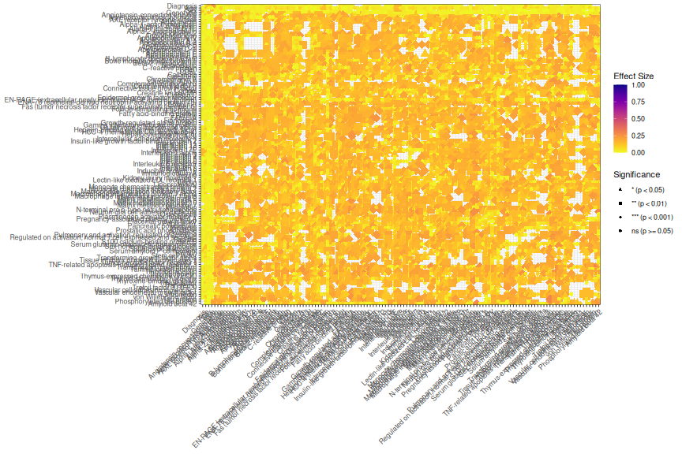
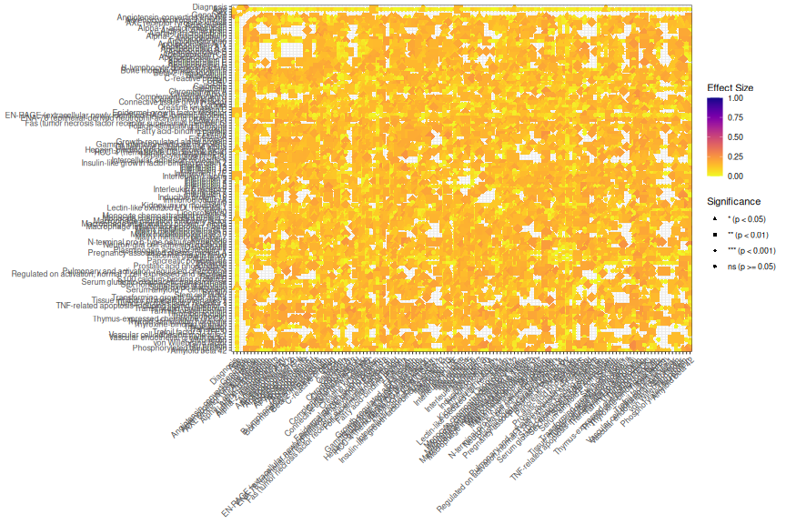
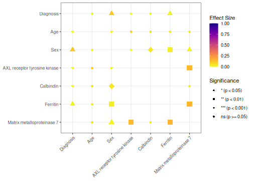

# Exploratory discovery with PlotMiningMatrix()

## 1 Overview

[`PlotMiningMatrix()`](https://rdastgh1.github.io/SciDataReportR/reference/PlotMiningMatrix.md)
is designed for exploratory data mining and hypothesis generation.

Rather than requiring separate correlation analyses, ANOVA models, and
chi-square tests, the function automatically identifies appropriate
statistical relationships based on variable type and summarizes the
results in a single visualization.

This function is particularly useful for:

- Identifying unexpected relationships
- Detecting potential confounders and covariates
- Discovering clusters of related variables
- Generating hypotheses for future analyses
- Performing exploratory quality control
- Prioritizing variables for downstream modeling

Unlike a traditional correlation matrix,
[`PlotMiningMatrix()`](https://rdastgh1.github.io/SciDataReportR/reference/PlotMiningMatrix.md)
can simultaneously evaluate:

- Continuous vs continuous relationships
- Categorical vs continuous relationships
- Categorical vs categorical relationships

using appropriate statistical methods for each comparison.

## 2 Load packages

``` r

library(SciDataReportR)
library(dplyr)
library(plotly)
```

## 3 Load example data

``` r

data("SampleData")
data("SampleVariableTypes")

RevaluedObj <- RevalueData(
  SampleData,
  SampleVariableTypes
)

df_Revalued <- RevaluedObj$RevaluedData
```

## 4 Create a mining matrix

For exploratory mining it is often useful to evaluate nearly the entire
dataset simultaneously.

``` r

vars_mining <- names(df_Revalued)

length(vars_mining)
```

    [1] 131

``` r

MiningObj <- PlotMiningMatrix(
  Data = df_Revalued,
  OutcomeVars = vars_mining
)

MiningObj$Unadjusted$plot
```


The resulting visualization summarizes hundreds or thousands of
statistical relationships simultaneously.

Color intensity represents effect size magnitude, while symbol size and
shape represent statistical significance.

## 5 Understanding the statistical tests

[`PlotMiningMatrix()`](https://rdastgh1.github.io/SciDataReportR/reference/PlotMiningMatrix.md)
automatically selects appropriate analyses based on variable type.

| Variable Types             | Statistical Test |
|----------------------------|------------------|
| Continuous vs Continuous   | Correlation      |
| Categorical vs Continuous  | ANOVA            |
| Categorical vs Categorical | Chi-square       |

This allows mixed datasets to be explored without manually specifying
separate analyses.

## 6 Interpreting the mining matrix

The mining matrix is best viewed as a discovery tool rather than a
confirmatory analysis.

Questions it can help answer include:

- Which biomarkers appear related to diagnosis?
- Which demographic variables may act as covariates?
- Which variables tend to cluster together?
- Are there unexpected associations worth investigating?
- Are there patterns suggesting data quality issues?

Large effect sizes combined with strong significance often represent
promising targets for follow-up analyses.

## 7 Parametric analyses

By default, parametric analyses are used.

``` r

MiningParametric <- PlotMiningMatrix(
  Data = df_Revalued,
  OutcomeVars = vars_mining,
  Parametric = TRUE
)

MiningParametric$Unadjusted$plot
```



For continuous variables this uses Pearson correlations and parametric
group comparisons.

## 8 Nonparametric analyses

For skewed variables or datasets containing substantial outliers,
nonparametric methods may be preferable.

``` r

MiningNonParametric <- PlotMiningMatrix(
  Data = df_Revalued,
  OutcomeVars = vars_mining,
  Parametric = FALSE
)

MiningNonParametric$Unadjusted$plot
```



This switches continuous-variable analyses to Spearman correlations and
uses nonparametric group comparisons where applicable.

## 9 Unadjusted significance

The default plot displays significance based on unadjusted p-values.

``` r

MiningObj$Unadjusted$plot
```


This view is useful for exploratory analyses and hypothesis generation.

## 10 FDR-corrected significance

Because large mining matrices may involve hundreds or thousands of
statistical tests, multiple-testing correction is often recommended.

``` r

MiningObj$FDRCorrected$plot
```

    NULL

The FDR-corrected visualization highlights relationships that remain
significant after accounting for multiple comparisons.

In exploratory studies, investigators often review both unadjusted and
FDR-corrected results.

## 11 Examining the underlying results

The statistical results are stored in the returned object.

``` r

head(
  MiningObj$Unadjusted$PvalTable
)
```

    # A tibble: 6 × 11
      XVar              YVar         p EffectSize Test     p_adj stars XLabel YLabel
      <chr>             <chr>    <dbl>      <dbl> <chr>    <dbl> <chr> <fct>  <fct>
    1 ACE_CD143_Angiot… ACTH… 4.03e- 8     0.295  Corr… 1.30e- 7 ****  Angio… Adren…
    2 ACE_CD143_Angiot… AXL   2.32e-51     0.705  Corr… 1.90e-49 ****  Angio… AXL r…
    3 ACE_CD143_Angiot… Adip… 1.40e- 1     0.0811 Corr… 1.89e- 1 ns    Angio… Adipo…
    4 ACE_CD143_Angiot… Alph… 2.13e- 5     0.231  Corr… 5.24e- 5 ****  Angio… Alpha…
    5 ACE_CD143_Angiot… Alph… 4.69e- 1     0.0399 Corr… 5.39e- 1 ns    Angio… Alpha…
    6 ACE_CD143_Angiot… Alph… 3.71e- 5     0.224  Corr… 8.90e- 5 ****  Angio… Alpha…
    # ℹ 2 more variables: EffectSizeAbs <dbl>, size_val <dbl>

The table includes:

- Variables involved in the association
- Effect size estimates
- Raw p-values
- FDR-adjusted p-values
- Statistical test type

## 12 Interactive exploration

Large mining matrices can be easier to interpret interactively.

``` r

# Not evaluated in the shipped vignette to keep it lightweight - run interactively
ggplotly(
  MiningObj$Unadjusted$plot
)
```

Interactive plots allow users to:

- Hover over relationships
- Zoom into regions of interest
- Explore large datasets more efficiently

Interactive exploration is particularly useful for large omics and
clinical datasets.

## 13 Identifying potential covariates

One common use of
[`PlotMiningMatrix()`](https://rdastgh1.github.io/SciDataReportR/reference/PlotMiningMatrix.md)
is identifying variables that may need to be included as covariates in
downstream analyses.

For example:

- Age may be associated with multiple biomarkers.
- Education may be associated with cognitive outcomes.
- Site may be associated with assay measurements.

Variables showing broad associations throughout the mining matrix often
deserve consideration as potential confounders.

## 14 Targeted mining

Although
[`PlotMiningMatrix()`](https://rdastgh1.github.io/SciDataReportR/reference/PlotMiningMatrix.md)
can evaluate nearly an entire dataset, it can also be restricted to a
subset of variables.

``` r

selected_vars <- c(
  "Diagnosis",
  "age",
  "sex",
  "AXL",
  "Calbindin",
  "Ferritin",
  "MMP7"
)

MiningSubset <- PlotMiningMatrix(
  Data = df_Revalued,
  OutcomeVars = selected_vars
)

MiningSubset$Unadjusted$plot
```



This approach is useful when focusing on a particular biological pathway
or clinical domain.

## 15 Recommended workflow

A common SciDataReportR workflow is:

1.  Use
    [`PlotMiningMatrix()`](https://rdastgh1.github.io/SciDataReportR/reference/PlotMiningMatrix.md)
    to identify potentially interesting relationships.
2.  Review FDR-corrected results.
3.  Identify potential covariates.
4.  Visualize significant findings using
    [`plotSigAssociations()`](https://rdastgh1.github.io/SciDataReportR/reference/plotSigAssociations.md).
5.  Perform targeted follow-up analyses using:
    - [`MakeComparisonTable()`](https://rdastgh1.github.io/SciDataReportR/reference/MakeComparisonTable.md)
    - [`PlotCorrelationsHeatmap()`](https://rdastgh1.github.io/SciDataReportR/reference/PlotCorrelationsHeatmap.md)
    - Regression models
    - Longitudinal analyses

## 16 Summary

[`PlotMiningMatrix()`](https://rdastgh1.github.io/SciDataReportR/reference/PlotMiningMatrix.md)
provides a rapid overview of relationships within a dataset and is
particularly useful for exploratory analyses and hypothesis generation.

Key features include:

- Automatic test selection
- Mixed continuous and categorical variables
- Effect size visualization
- FDR correction
- Identification of candidate covariates
- Interactive exploration
- Follow-up visualization workflows

## 17 Related functions

- [`PlotCorrelationsHeatmap()`](https://rdastgh1.github.io/SciDataReportR/reference/PlotCorrelationsHeatmap.md)
- [`PlotAnovaRelationshipsMatrix()`](https://rdastgh1.github.io/SciDataReportR/reference/PlotAnovaRelationshipsMatrix.md)
- [`PlotChiSqCovar()`](https://rdastgh1.github.io/SciDataReportR/reference/PlotChiSqCovar.md)
- [`plotSigAssociations()`](https://rdastgh1.github.io/SciDataReportR/reference/plotSigAssociations.md)
- [`MakeComparisonTable()`](https://rdastgh1.github.io/SciDataReportR/reference/MakeComparisonTable.md)

## 18 Session information

``` r

sessionInfo()
```

    R version 4.6.1 (2026-06-24)
    Platform: x86_64-pc-linux-gnu
    Running under: Ubuntu 24.04.4 LTS

    Matrix products: default
    BLAS:   /usr/lib/x86_64-linux-gnu/openblas-pthread/libblas.so.3
    LAPACK: /usr/lib/x86_64-linux-gnu/openblas-pthread/libopenblasp-r0.3.26.so;  LAPACK version 3.12.0

    locale:
     [1] LC_CTYPE=C.UTF-8       LC_NUMERIC=C           LC_TIME=C.UTF-8
     [4] LC_COLLATE=C.UTF-8     LC_MONETARY=C.UTF-8    LC_MESSAGES=C.UTF-8
     [7] LC_PAPER=C.UTF-8       LC_NAME=C              LC_ADDRESS=C
    [10] LC_TELEPHONE=C         LC_MEASUREMENT=C.UTF-8 LC_IDENTIFICATION=C

    time zone: UTC
    tzcode source: system (glibc)

    attached base packages:
    [1] stats     graphics  grDevices utils     datasets  methods   base

    other attached packages:
    [1] plotly_4.12.1          ggplot2_4.0.3          dplyr_1.2.1
    [4] SciDataReportR_20.14.0

    loaded via a namespace (and not attached):
     [1] gtable_0.3.6           xfun_0.60              bayestestR_0.18.1
     [4] htmlwidgets_1.6.4      insight_1.5.2          rstatix_1.1.0
     [7] lattice_0.22-9         paletteer_1.7.0        vctrs_0.7.3
    [10] tools_4.6.1            generics_0.1.4         datawizard_1.3.1
    [13] tibble_3.3.1           pkgconfig_2.0.3        data.table_1.18.4
    [16] RColorBrewer_1.1-3     correlation_0.8.8      S7_0.2.2
    [19] RcppParallel_6.1.1     lifecycle_1.0.5        compiler_4.6.1
    [22] farver_2.1.2           snakecase_0.11.1       carData_3.0-6
    [25] htmltools_0.5.9        yaml_2.3.12            Formula_1.2-5
    [28] pillar_1.11.1          car_3.1-5              tidyr_1.3.2
    [31] viridis_0.6.5          statsExpressions_2.0.0 abind_1.4-8
    [34] tidyselect_1.2.1       sjlabelled_1.2.0       digest_0.6.39
    [37] mvtnorm_1.4-2          gtsummary_2.5.1        purrr_1.2.2
    [40] rematch2_2.1.2         labeling_0.4.3         forcats_1.0.1
    [43] ggstatsplot_1.0.0      labelled_2.16.0        fastmap_1.2.0
    [46] grid_4.6.1             cli_3.6.6              magrittr_2.0.5
    [49] patchwork_1.3.2        utf8_1.2.6             dichromat_2.0-1
    [52] broom_1.0.13           withr_3.0.3            scales_1.4.0
    [55] backports_1.5.1        estimability_2.0.0     httr_1.4.8
    [58] rmarkdown_2.31         emmeans_2.0.4          otel_0.2.0
    [61] gridExtra_2.3.1        hms_1.1.4              coda_0.19-4.1
    [64] evaluate_1.0.5         knitr_1.51             haven_2.5.5
    [67] parameters_0.29.2      viridisLite_0.4.3      rstantools_2.7.0
    [70] rlang_1.3.0            xtable_1.8-8           glue_1.8.1
    [73] jsonlite_2.0.0         effectsize_1.0.3       R6_2.6.1              
