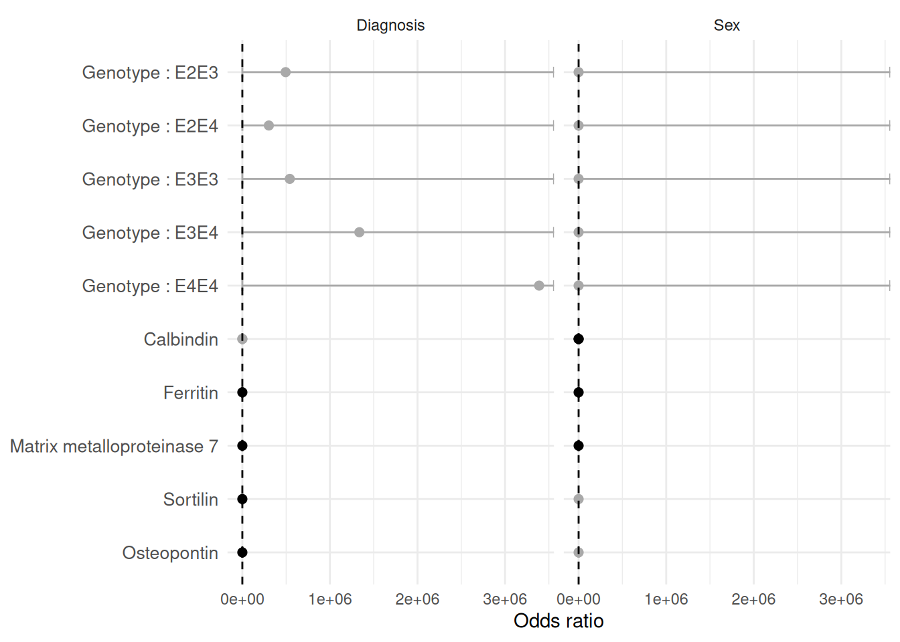
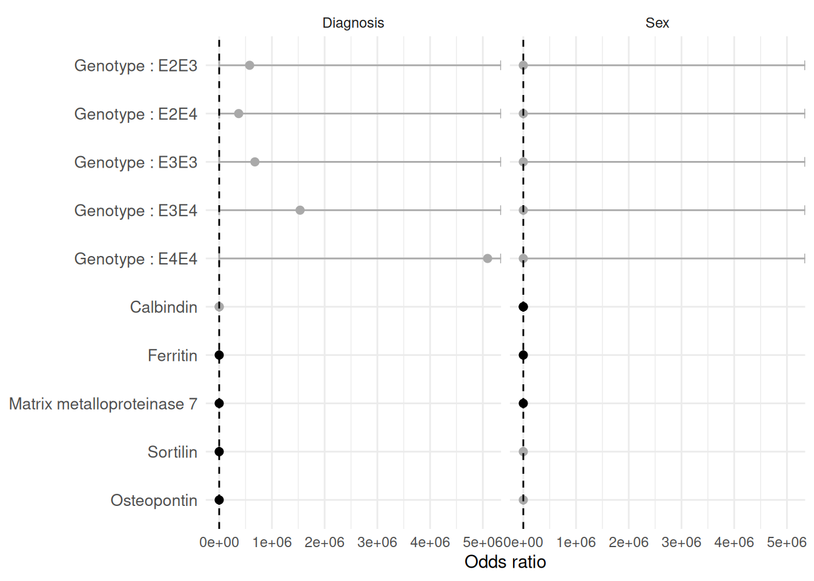

# Screening predictors with MakeUnivariateRegressionTable()

## 1 Overview

[`MakeUnivariateRegressionTable()`](https://rdastgh1.github.io/SciDataReportR/reference/MakeUnivariateRegressionTable.md)
performs large numbers of regression analyses simultaneously and returns
publication-ready summary tables.

This approach is particularly useful for:

- Biomarker screening
- Variable prioritization
- Covariate discovery
- Exploratory analyses
- Hypothesis generation

This vignette demonstrates:

- Running multiple univariate regressions
- Publication-ready tables
- Detailed regression tables
- Covariate adjustment
- Standardized coefficients
- Forest plot visualization

## 2 Load packages

``` r

library(SciDataReportR)
library(dplyr)
```

## 3 Load example data

``` r

data("SampleData")
data("SampleVariableTypes")

RevaluedObj <- RevalueData(
  SampleData,
  SampleVariableTypes
)

df_Revalued <- RevaluedObj$RevaluedData
```

## 4 Define outcomes and predictors

For this example we will evaluate a panel of biomarkers as predictors of
several clinical outcomes.

``` r

OutcomeVars <- c(
  "Diagnosis",
  "sex"
)

PredictorVars <- c(
  "Genotype",
  "Calbindin",
  "Ferritin",
  "MMP7",
  "Calbindin",
  "Sortilin",
  "Osteopontin"
)
```

## 5 Create regression tables

``` r

UniObj <- MakeUnivariateRegressionTable(
  data = df_Revalued,
  outcome_vars = OutcomeVars,
  predictor_vars = PredictorVars
)
```

## 6 Publication-ready table

The formatted table is designed for reporting and manuscript
preparation.

``` r

UniObj$FormattedTable
```

| Variable                   | Effect     | N   | Estimate (95% CI)    | p-value |
|----------------------------|------------|-----|----------------------|---------|
| Diagnosis                  |            |     |                      |         |
| Genotype : E2E3            | Odds ratio | 333 | 494242 (0, Inf)      | 0.98    |
| Genotype : E2E4            | Odds ratio | 333 | 302597 (0, Inf)      | 0.98    |
| Genotype : E3E3            | Odds ratio | 333 | 541490 (0, Inf)      | 0.98    |
| Genotype : E3E4            | Odds ratio | 333 | 1336083 (0, Inf)     | 0.98    |
| Genotype : E4E4            | Odds ratio | 333 | 3389088 (0, Inf)     | 0.98    |
| Calbindin                  | Odds ratio | 333 | 1.06 (0.995, 1.12)   | 0.071   |
| Ferritin                   | Odds ratio | 333 | 1.4 (1.02, 1.92)     | 0.036   |
| Matrix metalloproteinase 7 | Odds ratio | 333 | 1.46 (1.23, 1.73)    | \<0.001 |
| Calbindin                  | Odds ratio | 333 | 1.06 (0.995, 1.12)   | 0.071   |
| Sortilin                   | Odds ratio | 333 | 1.65 (1.23, 2.22)    | \<0.001 |
| Osteopontin                | Odds ratio | 333 | 2.75 (1.45, 5.21)    | 0.0019  |
| Sex                        |            |     |                      |         |
| Genotype : E2E3            | Odds ratio | 333 | 0.000000322 (0, Inf) | 0.98    |
| Genotype : E2E4            | Odds ratio | 333 | 0.000000472 (0, Inf) | 0.98    |
| Genotype : E3E3            | Odds ratio | 333 | 0.000000316 (0, Inf) | 0.98    |
| Genotype : E3E4            | Odds ratio | 333 | 0.000000243 (0, Inf) | 0.98    |
| Genotype : E4E4            | Odds ratio | 333 | 0.000000295 (0, Inf) | 0.98    |
| Calbindin                  | Odds ratio | 333 | 0.908 (0.859, 0.961) | \<0.001 |
| Ferritin                   | Odds ratio | 333 | 1.53 (1.14, 2.05)    | 0.0045  |
| Matrix metalloproteinase 7 | Odds ratio | 333 | 1.2 (1.04, 1.39)     | 0.015   |
| Calbindin                  | Odds ratio | 333 | 0.908 (0.859, 0.961) | \<0.001 |
| Sortilin                   | Odds ratio | 333 | 0.975 (0.756, 1.26)  | 0.84    |
| Osteopontin                | Odds ratio | 333 | 0.634 (0.359, 1.12)  | 0.11    |

Estimates and standard errors are combined into a compact format and
significance stars are automatically added.

## 7 Detailed regression table

The larger table provides additional model details.

``` r

UniObj$LargeTable
```

| Outcome | Variable | Effect | N | Estimate | SE | 95% CI Low | 95% CI High | p-value |
|----|----|----|----|----|----|----|----|----|
| Diagnosis |  |  |  |  |  |  |  |  |
| Diagnosis | Genotype : E2E3 | Odds ratio | 333 | 494,241.994 | 624.194 | 0.000 | Inf | 0.983 |
| Diagnosis | Genotype : E2E4 | Odds ratio | 333 | 302,597.139 | 624.195 | 0.000 | Inf | 0.984 |
| Diagnosis | Genotype : E3E3 | Odds ratio | 333 | 541,489.618 | 624.194 | 0.000 | Inf | 0.983 |
| Diagnosis | Genotype : E3E4 | Odds ratio | 333 | 1,336,082.754 | 624.194 | 0.000 | Inf | 0.982 |
| Diagnosis | Genotype : E4E4 | Odds ratio | 333 | 3,389,087.961 | 624.194 | 0.000 | Inf | 0.981 |
| Diagnosis | Calbindin | Odds ratio | 333 | 1.055 | 0.030 | 0.995 | 1.119 | 0.071 |
| Diagnosis | Ferritin | Odds ratio | 333 | 1.399 | 0.160 | 1.022 | 1.915 | 0.036 |
| Diagnosis | Matrix metalloproteinase 7 | Odds ratio | 333 | 1.462 | 0.087 | 1.232 | 1.734 | 0.000 |
| Diagnosis | Calbindin | Odds ratio | 333 | 1.055 | 0.030 | 0.995 | 1.119 | 0.071 |
| Diagnosis | Sortilin | Odds ratio | 333 | 1.653 | 0.150 | 1.233 | 2.215 | 0.001 |
| Diagnosis | Osteopontin | Odds ratio | 333 | 2.749 | 0.326 | 1.452 | 5.205 | 0.002 |
| Sex |  |  |  |  |  |  |  |  |
| sex | Genotype : E2E3 | Odds ratio | 333 | 0.000 | 624.194 | 0.000 | Inf | 0.981 |
| sex | Genotype : E2E4 | Odds ratio | 333 | 0.000 | 624.194 | 0.000 | Inf | 0.981 |
| sex | Genotype : E3E3 | Odds ratio | 333 | 0.000 | 624.194 | 0.000 | Inf | 0.981 |
| sex | Genotype : E3E4 | Odds ratio | 333 | 0.000 | 624.194 | 0.000 | Inf | 0.981 |
| sex | Genotype : E4E4 | Odds ratio | 333 | 0.000 | 624.194 | 0.000 | Inf | 0.981 |
| sex | Calbindin | Odds ratio | 333 | 0.908 | 0.029 | 0.859 | 0.961 | 0.001 |
| sex | Ferritin | Odds ratio | 333 | 1.527 | 0.149 | 1.140 | 2.046 | 0.005 |
| sex | Matrix metalloproteinase 7 | Odds ratio | 333 | 1.199 | 0.074 | 1.036 | 1.387 | 0.015 |
| sex | Calbindin | Odds ratio | 333 | 0.908 | 0.029 | 0.859 | 0.961 | 0.001 |
| sex | Sortilin | Odds ratio | 333 | 0.975 | 0.130 | 0.756 | 1.257 | 0.843 |
| sex | Osteopontin | Odds ratio | 333 | 0.634 | 0.289 | 0.359 | 1.117 | 0.114 |

This version is often useful during exploratory analyses and quality
control.

## 8 Including covariates

Covariates can be included in every regression model.

For example, age is commonly included when evaluating biomarker
associations.

``` r

UniObj_Covar <- MakeUnivariateRegressionTable(
  data = df_Revalued,
  outcome_vars = OutcomeVars,
  predictor_vars = PredictorVars,
  covariates = "age"
)
```

``` r

UniObj_Covar$FormattedTable
```

| Variable                   | Effect     | N   | Estimate (95% CI)    | p-value |
|----------------------------|------------|-----|----------------------|---------|
| Diagnosis                  |            |     |                      |         |
| Genotype : E2E3            | Odds ratio | 322 | 577505 (0, Inf)      | 0.98    |
| Genotype : E2E4            | Odds ratio | 322 | 369682 (0, Inf)      | 0.98    |
| Genotype : E3E3            | Odds ratio | 322 | 676911 (0, Inf)      | 0.98    |
| Genotype : E3E4            | Odds ratio | 322 | 1534198 (0, Inf)     | 0.98    |
| Genotype : E4E4            | Odds ratio | 322 | 5091058 (0, Inf)     | 0.98    |
| Calbindin                  | Odds ratio | 322 | 1.06 (0.995, 1.12)   | 0.074   |
| Ferritin                   | Odds ratio | 322 | 1.38 (1.01, 1.89)    | 0.046   |
| Matrix metalloproteinase 7 | Odds ratio | 322 | 1.45 (1.22, 1.72)    | \<0.001 |
| Calbindin                  | Odds ratio | 322 | 1.06 (0.995, 1.12)   | 0.074   |
| Sortilin                   | Odds ratio | 322 | 1.64 (1.22, 2.2)     | 0.0011  |
| Osteopontin                | Odds ratio | 322 | 2.69 (1.42, 5.08)    | 0.0024  |
| Sex                        |            |     |                      |         |
| Genotype : E2E3            | Odds ratio | 322 | 0.000000418 (0, Inf) | 0.98    |
| Genotype : E2E4            | Odds ratio | 322 | 0.000000669 (0, Inf) | 0.98    |
| Genotype : E3E3            | Odds ratio | 322 | 0.000000394 (0, Inf) | 0.98    |
| Genotype : E3E4            | Odds ratio | 322 | 0.000000308 (0, Inf) | 0.98    |
| Genotype : E4E4            | Odds ratio | 322 | 0.000000454 (0, Inf) | 0.98    |
| Calbindin                  | Odds ratio | 322 | 0.906 (0.856, 0.96)  | \<0.001 |
| Ferritin                   | Odds ratio | 322 | 1.55 (1.15, 2.09)    | 0.0044  |
| Matrix metalloproteinase 7 | Odds ratio | 322 | 1.18 (1.02, 1.37)    | 0.027   |
| Calbindin                  | Odds ratio | 322 | 0.906 (0.856, 0.96)  | \<0.001 |
| Sortilin                   | Odds ratio | 322 | 0.986 (0.76, 1.28)   | 0.92    |
| Osteopontin                | Odds ratio | 322 | 0.643 (0.362, 1.14)  | 0.13    |

This allows investigators to determine whether associations remain
significant after accounting for potential confounding factors.

## 9 Standardized coefficients

When predictors are measured on different scales, standardized
coefficients can simplify interpretation.

``` r

UniObj_Std <- MakeUnivariateRegressionTable(
  data = df_Revalued,
  outcome_vars = OutcomeVars,
  predictor_vars = PredictorVars,
  Standardize = TRUE
)
```

``` r

UniObj_Std$FormattedTable
```

| Variable                   | Effect     | N   | Estimate (95% CI)    | p-value |
|----------------------------|------------|-----|----------------------|---------|
| Diagnosis                  |            |     |                      |         |
| Genotype : E2E3            | Odds ratio | 333 | 494242 (0, Inf)      | 0.98    |
| Genotype : E2E4            | Odds ratio | 333 | 302597 (0, Inf)      | 0.98    |
| Genotype : E3E3            | Odds ratio | 333 | 541490 (0, Inf)      | 0.98    |
| Genotype : E3E4            | Odds ratio | 333 | 1336083 (0, Inf)     | 0.98    |
| Genotype : E4E4            | Odds ratio | 333 | 3389088 (0, Inf)     | 0.98    |
| Calbindin                  | Odds ratio | 333 | 1.25 (0.981, 1.6)    | 0.071   |
| Ferritin                   | Odds ratio | 333 | 1.3 (1.02, 1.66)     | 0.036   |
| Matrix metalloproteinase 7 | Odds ratio | 333 | 1.8 (1.38, 2.35)     | \<0.001 |
| Calbindin                  | Odds ratio | 333 | 1.25 (0.981, 1.6)    | 0.071   |
| Sortilin                   | Odds ratio | 333 | 1.55 ( 1.2, 1.99)    | \<0.001 |
| Osteopontin                | Odds ratio | 333 | 1.49 (1.16, 1.92)    | 0.0019  |
| Sex                        |            |     |                      |         |
| Genotype : E2E3            | Odds ratio | 333 | 0.000000322 (0, Inf) | 0.98    |
| Genotype : E2E4            | Odds ratio | 333 | 0.000000472 (0, Inf) | 0.98    |
| Genotype : E3E3            | Odds ratio | 333 | 0.000000316 (0, Inf) | 0.98    |
| Genotype : E3E4            | Odds ratio | 333 | 0.000000243 (0, Inf) | 0.98    |
| Genotype : E4E4            | Odds ratio | 333 | 0.000000295 (0, Inf) | 0.98    |
| Calbindin                  | Odds ratio | 333 | 0.669 (0.529, 0.845) | \<0.001 |
| Ferritin                   | Odds ratio | 333 | 1.39 (1.11, 1.75)    | 0.0045  |
| Matrix metalloproteinase 7 | Odds ratio | 333 | 1.33 (1.06, 1.66)    | 0.015   |
| Calbindin                  | Odds ratio | 333 | 0.669 (0.529, 0.845) | \<0.001 |
| Sortilin                   | Odds ratio | 333 | 0.978 (0.784, 1.22)  | 0.84    |
| Osteopontin                | Odds ratio | 333 | 0.835 (0.668, 1.04)  | 0.11    |

Standardized coefficients represent changes in standard deviation units
and facilitate comparison across predictors.

## 10 Accessing model objects

The fitted regression models are returned in the output object.

``` r

names(
  UniObj$ModelSummaries
)
```

    NULL

For example:

``` r

summary(
  UniObj$ModelSummaries$Diagnosis$Ferritin
)
```

    Length  Class   Mode
         0   NULL   NULL 

This allows additional diagnostics and custom analyses.

## 11 Creating a forest plot

A forest plot provides a compact visual summary of regression results.

``` r

ForestPlot <- PlotForestFromTable(
  UniObj
)

ForestPlot
```



Forest plots make it easy to identify:

- Strong predictors
- Significant predictors
- Direction of effects
- Precision of estimates

## 12 Forest plot with covariate adjustment

The same visualization can be generated using adjusted models.

``` r

PlotForestFromTable(
  UniObj_Covar
)
```



Comparing adjusted and unadjusted models can help identify associations
that may be explained by confounding variables.

## 13 Recommended workflow

A common workflow is:

1.  Use
    [`MakeUnivariateRegressionTable()`](https://rdastgh1.github.io/SciDataReportR/reference/MakeUnivariateRegressionTable.md)
    to screen large numbers of predictors.
2.  Review the formatted table.
3.  Compare standardized and unstandardized results.
4.  Add important covariates.
5.  Visualize findings using
    [`PlotForestFromTable()`](https://rdastgh1.github.io/SciDataReportR/reference/PlotForestFromTable.md).
6.  Follow up significant findings using multivariable models.

## 14 Summary

[`MakeUnivariateRegressionTable()`](https://rdastgh1.github.io/SciDataReportR/reference/MakeUnivariateRegressionTable.md)
provides a rapid screening framework for evaluating many predictors
across multiple outcomes.

Key features include:

- Multiple outcomes
- Multiple predictors
- Optional covariate adjustment
- Standardized coefficients
- Publication-ready tables
- Detailed regression output
- Forest plot visualization

## 15 Related functions

- [`PlotForestFromTable()`](https://rdastgh1.github.io/SciDataReportR/reference/PlotForestFromTable.md)
- [`MakeComparisonTable()`](https://rdastgh1.github.io/SciDataReportR/reference/MakeComparisonTable.md)
- [`PlotMiningMatrix()`](https://rdastgh1.github.io/SciDataReportR/reference/PlotMiningMatrix.md)
- [`PlotCorrelationsHeatmap()`](https://rdastgh1.github.io/SciDataReportR/reference/PlotCorrelationsHeatmap.md)
- `CreatePCA()`

## 16 Session information

``` r

sessionInfo()
```

    R version 4.6.1 (2026-06-24)
    Platform: x86_64-pc-linux-gnu
    Running under: Ubuntu 24.04.4 LTS

    Matrix products: default
    BLAS:   /usr/lib/x86_64-linux-gnu/openblas-pthread/libblas.so.3
    LAPACK: /usr/lib/x86_64-linux-gnu/openblas-pthread/libopenblasp-r0.3.26.so;  LAPACK version 3.12.0

    locale:
     [1] LC_CTYPE=C.UTF-8       LC_NUMERIC=C           LC_TIME=C.UTF-8
     [4] LC_COLLATE=C.UTF-8     LC_MONETARY=C.UTF-8    LC_MESSAGES=C.UTF-8
     [7] LC_PAPER=C.UTF-8       LC_NAME=C              LC_ADDRESS=C
    [10] LC_TELEPHONE=C         LC_MEASUREMENT=C.UTF-8 LC_IDENTIFICATION=C

    time zone: UTC
    tzcode source: system (glibc)

    attached base packages:
    [1] stats     graphics  grDevices utils     datasets  methods   base

    other attached packages:
    [1] dplyr_1.2.1            SciDataReportR_20.12.0

    loaded via a namespace (and not attached):
     [1] gtable_0.3.6           xfun_0.60              bayestestR_0.18.1
     [4] ggplot2_4.0.3          insight_1.5.2          rstatix_1.0.0
     [7] lattice_0.22-9         paletteer_1.7.0        vctrs_0.7.3
    [10] tools_4.6.1            generics_0.1.4         datawizard_1.3.1
    [13] tibble_3.3.1           pkgconfig_2.0.3        RColorBrewer_1.1-3
    [16] correlation_0.8.8      S7_0.2.2               RcppParallel_5.1.11-2
    [19] gt_1.3.0               lifecycle_1.0.5        compiler_4.6.1
    [22] farver_2.1.2           carData_3.0-6          snakecase_0.11.1
    [25] sass_0.4.10            htmltools_0.5.9        yaml_2.3.12
    [28] Formula_1.2-5          pillar_1.11.1          car_3.1-5
    [31] tidyr_1.3.2            statsExpressions_2.0.0 abind_1.4-8
    [34] tidyselect_1.2.1       sjlabelled_1.2.0       digest_0.6.39
    [37] mvtnorm_1.4-1          gtsummary_2.5.1        purrr_1.2.2
    [40] rematch2_2.1.2         labeling_0.4.3         forcats_1.0.1
    [43] ggstatsplot_1.0.0      labelled_2.16.0        fastmap_1.2.0
    [46] grid_4.6.1             cli_3.6.6              magrittr_2.0.5
    [49] patchwork_1.3.2        dichromat_2.0-0.1      broom_1.0.13
    [52] withr_3.0.3            scales_1.4.0           backports_1.5.1
    [55] estimability_2.0.0     rmarkdown_2.31         emmeans_2.0.3
    [58] otel_0.2.0             hms_1.1.4              coda_0.19-4.1
    [61] evaluate_1.0.5         knitr_1.51             haven_2.5.5
    [64] parameters_0.29.2      rstantools_2.6.0       rlang_1.3.0
    [67] xtable_1.8-8           glue_1.8.1             xml2_1.6.0
    [70] jsonlite_2.0.0         effectsize_1.0.3       R6_2.6.1
    [73] fs_2.1.0              
