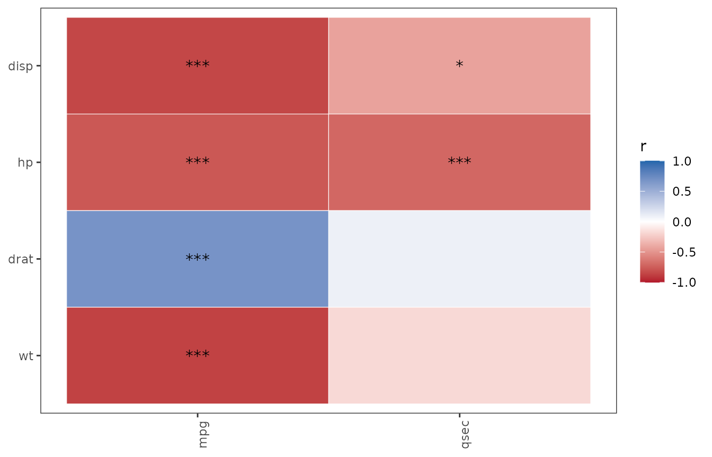

# FDR correction scope: matrix-wide vs per-outcome

``` r

library(SciDataReportR)
```

The heatmap/matrix family in SciDataReportR
([`PlotCorrelationsHeatmap()`](https://rdastgh1.github.io/SciDataReportR/reference/PlotCorrelationsHeatmap.md),
[`PlotPhiHeatmap()`](https://rdastgh1.github.io/SciDataReportR/reference/PlotPhiHeatmap.md),
[`PlotChiSqCovar()`](https://rdastgh1.github.io/SciDataReportR/reference/PlotChiSqCovar.md),
[`PlotAnovaRelationshipsMatrix()`](https://rdastgh1.github.io/SciDataReportR/reference/PlotAnovaRelationshipsMatrix.md),
[`PlotMiningMatrix()`](https://rdastgh1.github.io/SciDataReportR/reference/PlotMiningMatrix.md),
the interaction-effect matrices, and
[`PlotDirectionalHeatmaps()`](https://rdastgh1.github.io/SciDataReportR/reference/PlotDirectionalHeatmaps.md))
tests many hypotheses at once, so every one of these functions applies a
false discovery rate (FDR) correction. As of version 19.15.0 all of that
correction runs through one exported helper,
[`ApplyFDRCorrection()`](https://rdastgh1.github.io/SciDataReportR/reference/ApplyFDRCorrection.md),
and every function in the family takes an `fdr_scope` argument that
controls *which family of tests* the correction is computed over:

- `fdr_scope = "matrix"` (the default, and the historical behavior): all
  p-values in the matrix are corrected together as one family.
- `fdr_scope = "per_outcome"`: each outcome’s p-values are corrected
  separately. Each function documents which axis is the “outcome” axis
  in its `fdr_scope` parameter documentation.

## `ApplyFDRCorrection()` directly

[`ApplyFDRCorrection()`](https://rdastgh1.github.io/SciDataReportR/reference/ApplyFDRCorrection.md)
works on a matrix (or data frame) of p-values. Here is a small made-up
example, with predictors as rows and outcomes as columns:

``` r

pm <- matrix(
  c(0.005, 0.04, 0.03, 0.01, NA, 0.002),
  nrow = 2,
  dimnames = list(c("pred1", "pred2"), c("out1", "out2", "out3"))
)
pm
#>        out1 out2  out3
#> pred1 0.005 0.03    NA
#> pred2 0.040 0.01 0.002
```

Matrix-wide correction treats all five finite p-values as one family
(`NA` cells are left untouched):

``` r

ApplyFDRCorrection(pm, fdr_scope = "matrix")
#>         out1       out2 out3
#> pred1 0.0125 0.03750000   NA
#> pred2 0.0400 0.01666667 0.01
```

Per-outcome correction adjusts each column on its own. Note how `out3`’s
single test is barely penalized at all, while under matrix-wide
correction it shared the burden of all five tests:

``` r

ApplyFDRCorrection(pm, fdr_scope = "per_outcome", outcome_margin = 2)
#>       out1 out2  out3
#> pred1 0.01 0.03    NA
#> pred2 0.04 0.02 0.002
```

## The two scopes in a real analysis

Using `mtcars`, we relate three engine/design predictors to two
performance outcomes with
[`PlotCorrelationsHeatmap()`](https://rdastgh1.github.io/SciDataReportR/reference/PlotCorrelationsHeatmap.md).
In this function the p-value matrix has predictors as rows and outcomes
as columns, so `"per_outcome"` corrects within each column (each
variable in `outcome_vars`).

``` r

res_matrix <- PlotCorrelationsHeatmap(
  mtcars,
  predictor_vars = c("disp", "hp", "drat", "wt"),
  outcome_vars   = c("mpg", "qsec"),
  fdr_scope      = "matrix"
)

res_per_outcome <- PlotCorrelationsHeatmap(
  mtcars,
  predictor_vars = c("disp", "hp", "drat", "wt"),
  outcome_vars   = c("mpg", "qsec"),
  fdr_scope      = "per_outcome"
)
```

The unadjusted p-values are identical by construction:

``` r

round(res_matrix$p$p, 5)          # res$p is an alias for res$Unadjusted
#>        mpg    qsec
#> disp 0e+00 0.01314
#> hp   0e+00 0.00001
#> drat 2e-05 0.61958
#> wt   0e+00 0.33887
all.equal(res_matrix$p$p, res_per_outcome$p$p)
#> [1] TRUE
```

The FDR-adjusted p-values differ (`res$p_fdr` is an alias for
`res$FDRCorrected`):

``` r

round(res_matrix$p_fdr$p, 5)       # one family of 8 tests
#>        mpg    qsec
#> disp 0e+00 0.01753
#> hp   0e+00 0.00001
#> drat 3e-05 0.61958
#> wt   0e+00 0.38728
round(res_per_outcome$p_fdr$p, 5)  # two families of 4 tests each
#>        mpg    qsec
#> disp 0e+00 0.02629
#> hp   0e+00 0.00002
#> drat 2e-05 0.61958
#> wt   0e+00 0.45182
```

Why do they differ? The Benjamini-Hochberg adjustment scales each
p-value by (number of tests in the family) / (rank within the family).
Under `"matrix"` scope, `mpg` and `qsec` tests compete in one ranking of
8 tests. Under `"per_outcome"` scope, the 4 `mpg` tests are ranked only
against each other, and likewise for `qsec` - so a strong predictor of a
“mostly null” outcome is no longer penalized for significant tests that
belong to a different outcome, and vice versa.

The FDR-starred heatmaps reflect the same difference:

``` r

res_matrix$p_fdr$plot
res_per_outcome$p_fdr$plot
```



## Choosing a scope

- Use `"matrix"` (the default) when you view the whole screen as one
  discovery exercise - “which of all these relationships are real?” This
  is the more conservative choice for the individual outcome and is what
  every SciDataReportR version before 19.15.0 did.
- Use `"per_outcome"` when each outcome is a separate scientific
  question and you want the error rate controlled within each outcome’s
  own set of tests - a common convention when outcomes will be reported
  in separate results sections or figures.

Whichever you choose, report it: the two scopes answer different
questions, and the choice should be made before looking at the results.
