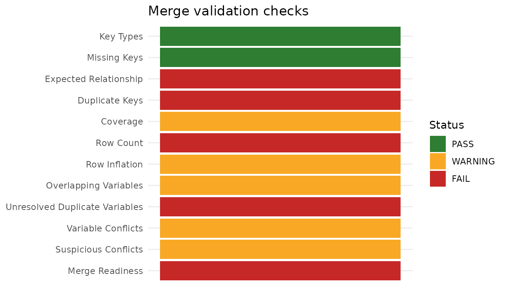
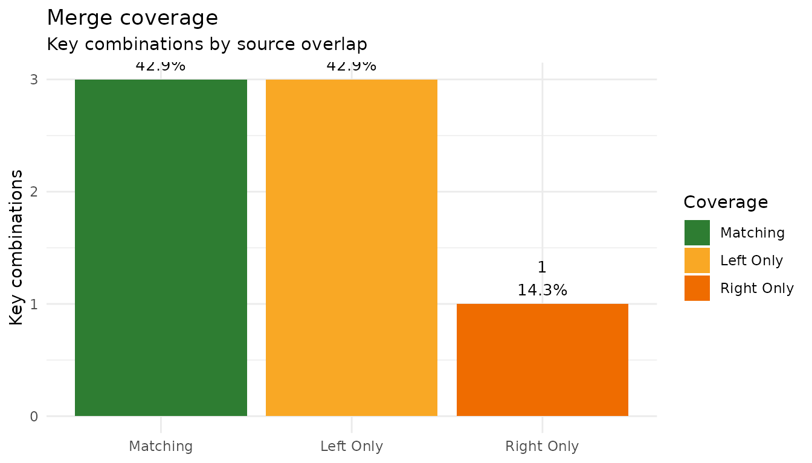

# Merge QC workflow

Merging datasets is where many analysis errors are born: silently
duplicated rows, IDs that never match, and `.x` / `.y` column pairs that
nobody resolves. The damage is quiet — a join that duplicates rows
inflates your sample without error, and the analysis that follows is
wrong in a way no downstream check will catch.

SciDataReportR wraps the merge-and-audit cycle into a small workflow:

- [`safe_merge()`](https://rdastgh1.github.io/SciDataReportR/reference/safe_merge.md)
  performs a left join (exact-key or closest-time) and immediately
  audits the result with
  [`ValidateMerge()`](https://rdastgh1.github.io/SciDataReportR/reference/ValidateMerge.md).
- [`merge_detail()`](https://rdastgh1.github.io/SciDataReportR/reference/merge_detail.md)
  prints plain-text diagnostic tables for one merge.
- [`PlotMergeValidation()`](https://rdastgh1.github.io/SciDataReportR/reference/PlotMergeValidation.md)
  draws the same diagnostics as figures.
- [`ExploreMergeValidation()`](https://rdastgh1.github.io/SciDataReportR/reference/ExploreMergeValidation.md)
  renders an interactive dashboard for one merge.
- [`merge_summary_table()`](https://rdastgh1.github.io/SciDataReportR/reference/merge_summary_table.md)
  stacks the one-row logs from many merges into a pipeline-level rollup.

## The workflow

Every merge goes through the same four steps. The point of the workflow
is that step 2 is never skipped, and that the answer is written down
rather than eyeballed.

**1. State what you expect before merging.** `expected_relationship` is
the argument that turns an assumption into a check. If you believe each
left-hand row matches at most one right-hand row, say `"many-to-one"`;
the audit then compares that against what actually happened instead of
leaving you to notice.

**2. Merge and audit in one call.**
[`safe_merge()`](https://rdastgh1.github.io/SciDataReportR/reference/safe_merge.md)
joins and validates together, so an unaudited merge is not something you
can produce by forgetting a line.

**3. Read the log, then drill into whatever it flags.** The one-row
`$log` is the verdict;
[`merge_detail()`](https://rdastgh1.github.io/SciDataReportR/reference/merge_detail.md),
[`PlotMergeValidation()`](https://rdastgh1.github.io/SciDataReportR/reference/PlotMergeValidation.md),
and
[`ExploreMergeValidation()`](https://rdastgh1.github.io/SciDataReportR/reference/ExploreMergeValidation.md)
are three views of the same underlying `$validation` object, for three
different situations.

**4. Roll the logs up at the end.**
`merge_summary_table(..., flagged_only = TRUE)` over every merge in the
pipeline is the gate: an empty table means every merge passed.

### What to check, and what it means

| Check | The question it answers | When to worry |
|----|----|----|
| **Row count** (`RowsBefore` / `RowsAfter`) | Did the join duplicate rows? | Any increase you did not intend. This is the silent killer: no error, larger sample, wrong analysis |
| **Relationship** (`DetectedRelationship`) | Was the join one-to-one, many-to-one, one-to-many? | It disagrees with `expected_relationship` |
| **Match rate** (`MatchRate`) | What fraction of left-hand keys found a match? | Below what the study design implies — a low rate usually means a key-format problem, not genuinely absent data |
| **Key types** (`KeyHarmonization`) | Were the keys the same type on both sides? | IDs stored as integer in one file and double or character in another; coercion happened, so check it was the coercion you wanted |
| **Duplicate keys** (`DuplicateKeyGroups`) | Does the key uniquely identify a row after merging? | Depends entirely on intent: fatal for one-row-per-participant data, expected for longitudinal data |
| **Unresolved duplicate variables** (`UnresolvedDupVars`) | Did the merge leave `.x` / `.y` column pairs? | Always. Every one is a column whose correct value nobody has decided on |
| **Value conflicts** | Where a variable came from both sources, do they agree? | Disagreement means the two sources disagree about a fact; find out which is right before analyzing either |

### Choosing a review surface

The three review functions read the same `$validation` object and differ
only in how they present it:

| Function | Output | Reach for it when |
|----|----|----|
| [`merge_detail()`](https://rdastgh1.github.io/SciDataReportR/reference/merge_detail.md) | Static [`knitr::kable()`](https://rdrr.io/pkg/knitr/man/kable.html) tables | The merge is part of a rendered report or log, and the record needs to survive in the document |
| [`PlotMergeValidation()`](https://rdastgh1.github.io/SciDataReportR/reference/PlotMergeValidation.md) | ggplot figures | Coverage and conflict *patterns* matter more than exact counts, or the result is going in a slide |
| [`ExploreMergeValidation()`](https://rdastgh1.github.io/SciDataReportR/reference/ExploreMergeValidation.md) | Interactive HTML dashboard | You are working through a problem merge yourself and want to expand, sort, and filter rather than re-run code |

For a merge that passes, the `$log` alone is enough and none of the
three is needed.

``` r

library(SciDataReportR)
library(survival)
```

## Example 1: a real longitudinal merge (survival::pbc + pbcseq)

The `survival` package ships two related datasets from the Mayo Clinic
primary biliary cholangitis trial:

- `pbc`: baseline data, one row per patient (418 patients, including 106
  who did not participate in the randomized trial),
- `pbcseq`: longitudinal follow-up labs, multiple rows per patient (only
  the 312 trial participants).

Merging them by patient `id` is a completely ordinary task — and it
surfaces real coverage gaps and duplicate-key situations that were not
staged for this vignette.

``` r

pbc_baseline <- pbc[, c("id", "age", "sex", "trt", "stage")]
pbc_labs <- pbcseq[, c("id", "day", "bili", "albumin", "platelet")]

m_pbc <- safe_merge(
  pbc_baseline,
  pbc_labs,
  by = "id",
  name = "pbc baseline + follow-up labs"
)
```

[`safe_merge()`](https://rdastgh1.github.io/SciDataReportR/reference/safe_merge.md)
returns four elements and prints nothing on its own. The one-row `log`
is the pipeline-friendly view:

``` r

m_pbc$log
#> # A tibble: 1 × 27
#>   Merge        Status ReadyForAnalysis RowsBefore RowsAfter ColsBefore ColsAfter
#>   <chr>        <chr>  <lgl>                 <int>     <int>      <int>     <int>
#> 1 pbc baselin… FAIL   FALSE                   418      2051          5         9
#> # ℹ 20 more variables: ExpectedColsAdded <int>, ActualColsAdded <int>,
#> #   ExpectedRelationship <chr>, DetectedRelationship <chr>,
#> #   RelationshipMatchesExpected <lgl>, MatchedKeys <int>, LeftUniqueKeys <int>,
#> #   MatchRate <dbl>, DuplicateKeyBlockers <int>, DuplicateKeyGroups_Left <int>,
#> #   DuplicateKeyGroups_Right <int>, DuplicateKeyGroups_Merged <int>,
#> #   DuplicateKeyGroups <int>, UnresolvedDupVars <int>,
#> #   NewUnresolvedDupVars <int>, InheritedUnresolvedDupVars <int>, …
```

The `summary` element is a ready-made
[`knitr::kable()`](https://rdrr.io/pkg/knitr/man/kable.html):

``` r

m_pbc$summary
```

| Metric | Value |
|:---|:---|
| Status | FAIL |
| Rows (before -\> after) | 418 -\> 2051 |
| Columns (before -\> after) | 5 -\> 9 |
| Columns added (expected vs actual) | expected +4; actual +4 |
| Expected relationship | one-to-one |
| Detected relationship | one-to-many |
| Relationship matches expected | FALSE |
| Keys matched | 312 / 418 |
| Match rate | 74.6% |
| Duplicate key blockers | 570 |
| Duplicate key groups left/right/merged | 0 / 285 / 285 |
| Unresolved duplicate variables before merge | 0 |
| Unresolved duplicate variables after merge | 0 |
| New unresolved duplicate variables | 0 |
| Inherited unresolved duplicate variables | 0 |
| Overlapping variables before merge | 0 |
| Key harmonization | Key types already compatible. |
| Duplicate variable note | No unresolved duplicate variable pairs detected. |
| Note | Rows changed after merge, but expected_relationship should preserve left-side row count. |

pbc baseline + follow-up labs {.table .table
style="width: auto !important; margin-left: auto; margin-right: auto;"}

The audit correctly reports this merge as `FAIL` — not because the code
is wrong, but because the result needs a decision from you before
analysis:

- **Coverage**: 106 patients exist only in the baseline data (the
  non-trial patients who have no follow-up labs).
- **Duplicate keys**: `pbcseq` has many rows per patient, so `id` alone
  does not uniquely identify a row after the merge. If you intended a
  one-row-per- patient dataset, this is a genuine error; if you intended
  a longitudinal dataset, you now have written confirmation of what
  happened.

### Drilling in with merge_detail()

[`merge_detail()`](https://rdastgh1.github.io/SciDataReportR/reference/merge_detail.md)
prints plain kable tables for the checks, the unmatched keys on each
side, overlapping variables, and suspicious conflicts, skipping any
empty section. In R Markdown, use a chunk with `results = "asis"`:

``` r

merge_detail(m_pbc, TopN = 5)
```

| Check | Count | Status | Details |
|:---|---:|:---|:---|
| Key Types | 0.000 | PASS | Key storage classes match across datasets. |
| Missing Keys | 0.000 | PASS | No missing key rows detected. |
| Expected Relationship | 570.000 | FAIL | Detected relationship is one-to-many, but expected_relationship = ‘one-to-one’. Duplicate key blockers: 570. |
| Duplicate Keys | 570.000 | FAIL | Duplicate complete key combinations violate the expected relationship. |
| Coverage | 106.000 | WARNING | Some complete key combinations appear only in one source dataset. |
| Row Count | 1.000 | FAIL | MergedData row count changed even though the expected relationship should preserve left-side row count. |
| Row Inflation | 1.054 | WARNING | MergedData has more rows than expected. Review whether row multiplication was intentional. |
| Overlapping Variables | 0.000 | PASS | No non-key variables overlap across source datasets. |
| Unresolved Duplicate Variables | 0.000 | PASS | No unresolved duplicate variable pairs detected. |
| Variable Conflicts | 0.000 | PASS | No duplicated-variable value conflicts detected. |
| Suspicious Conflicts | 0.000 | PASS | No low-agreement or class-mismatched duplicated variables detected. |
| Merge Readiness | 1.000 | FAIL | Major merge-integrity blockers detected. Review failed checks. |

pbc baseline + follow-up labs: validation checks {.table}

| id  |
|:----|
| 313 |
| 314 |
| 315 |
| 316 |
| 317 |

pbc baseline + follow-up labs: keys only in left data (showing up to 5
of 106) {.table}

### A closest-time variant

Suppose instead you want a one-row-per-patient dataset containing the
lab draw closest to enrollment. `safe_merge(method = "closest_time")`
calls
[`Merge_ByClosestTime()`](https://rdastgh1.github.io/SciDataReportR/reference/Merge_ByClosestTime.md)
under the hood, matching on `id` exactly and picking the `pbc_labs` row
whose `day` is nearest to each baseline row’s time (enrollment is day 0
here).

``` r

pbc_enroll <- pbc_baseline
pbc_enroll$enroll_day <- 0

m_closest <- safe_merge(
  pbc_enroll,
  pbc_labs,
  by = "id",
  name = "closest lab to enrollment",
  method = "closest_time",
  time_var_before = "enroll_day",
  time_var_add = "day"
)

m_closest$log
#> # A tibble: 1 × 27
#>   Merge        Status ReadyForAnalysis RowsBefore RowsAfter ColsBefore ColsAfter
#>   <chr>        <chr>  <lgl>                 <int>     <int>      <int>     <int>
#> 1 closest lab… FAIL   FALSE                   418       418          6        10
#> # ℹ 20 more variables: ExpectedColsAdded <int>, ActualColsAdded <int>,
#> #   ExpectedRelationship <chr>, DetectedRelationship <chr>,
#> #   RelationshipMatchesExpected <lgl>, MatchedKeys <int>, LeftUniqueKeys <int>,
#> #   MatchRate <dbl>, DuplicateKeyBlockers <int>, DuplicateKeyGroups_Left <int>,
#> #   DuplicateKeyGroups_Right <int>, DuplicateKeyGroups_Merged <int>,
#> #   DuplicateKeyGroups <int>, UnresolvedDupVars <int>,
#> #   NewUnresolvedDupVars <int>, InheritedUnresolvedDupVars <int>, …
```

Note the caveat:
[`ValidateMerge()`](https://rdastgh1.github.io/SciDataReportR/reference/ValidateMerge.md)
audits duplicate keys using `by` alone (here `id`), not the time
variables. In longitudinal settings, repeated keys in the lab data are
legitimate repeated visits, so a duplicate-key `FAIL` from a
closest-time merge may reflect expected repetition rather than a merge
error. The validation output is deliberately left as-is — read it with
that caveat in mind (here, the merged data itself has one row per
patient, which you can confirm from `RowsBefore` and `RowsAfter`).

## Example 2: a synthetic merge that fails every check

To demonstrate the remaining check types — key-type mismatches,
unresolved `.x` / `.y` pairs, and value conflicts — here is a small
synthetic pair of data frames constructed to go wrong in all the classic
ways: a duplicated key, an ID stored as integer on one side and double
on the other, IDs missing from each side, and a `sex` column present in
both sources with disagreeing values.

``` r

demographics <- data.frame(
  id = 1:6, # integer
  sex = c("F", "M", "F", "F", "M", "F"),
  age = c(54, 61, 47, 66, 58, 50)
)

device_data <- data.frame(
  id = c(1, 2, 2, 5, 7), # double, with id 2 duplicated
  sex = c("F", "F", "M", "M", "F"), # disagrees with demographics for id 2/5
  score = c(0.82, 0.75, 0.71, 0.64, 0.90)
)

m_synth <- safe_merge(
  demographics,
  device_data,
  by = "id",
  name = "demographics + device data"
)

m_synth$log
#> # A tibble: 1 × 27
#>   Merge        Status ReadyForAnalysis RowsBefore RowsAfter ColsBefore ColsAfter
#>   <chr>        <chr>  <lgl>                 <int>     <int>      <int>     <int>
#> 1 demographic… FAIL   FALSE                     6         7          3         5
#> # ℹ 20 more variables: ExpectedColsAdded <int>, ActualColsAdded <int>,
#> #   ExpectedRelationship <chr>, DetectedRelationship <chr>,
#> #   RelationshipMatchesExpected <lgl>, MatchedKeys <int>, LeftUniqueKeys <int>,
#> #   MatchRate <dbl>, DuplicateKeyBlockers <int>, DuplicateKeyGroups_Left <int>,
#> #   DuplicateKeyGroups_Right <int>, DuplicateKeyGroups_Merged <int>,
#> #   DuplicateKeyGroups <int>, UnresolvedDupVars <int>,
#> #   NewUnresolvedDupVars <int>, InheritedUnresolvedDupVars <int>, …
```

``` r

m_synth$summary
```

| Metric | Value |
|:---|:---|
| Status | FAIL |
| Rows (before -\> after) | 6 -\> 7 |
| Columns (before -\> after) | 3 -\> 5 |
| Columns added (expected vs actual) | expected +2; actual +2 |
| Expected relationship | one-to-one |
| Detected relationship | one-to-many |
| Relationship matches expected | FALSE |
| Keys matched | 3 / 6 |
| Match rate | 50% |
| Duplicate key blockers | 2 |
| Duplicate key groups left/right/merged | 0 / 1 / 1 |
| Unresolved duplicate variables before merge | 0 |
| Unresolved duplicate variables after merge | 1 |
| New unresolved duplicate variables | 1 |
| Inherited unresolved duplicate variables | 0 |
| Overlapping variables before merge | 1 |
| Key harmonization | id: integer / numeric -\> numeric |
| Duplicate variable note | Merged data contains 1 new unresolved duplicate variable pair(s) introduced by this merge. |
| Note | Rows changed after merge, but expected_relationship should preserve left-side row count. |

demographics + device data {.table .table
style="width: auto !important; margin-left: auto; margin-right: auto;"}

Every check type in
[`ValidateMerge()`](https://rdastgh1.github.io/SciDataReportR/reference/ValidateMerge.md)
now has something to say: the duplicate key and the unresolved `sex.x` /
`sex.y` pair are integrity blockers (`FAIL`), while key-type coercion,
coverage gaps, row inflation, overlapping variables, and value conflicts
appear as warnings.

``` r

merge_detail(m_synth)
```

| Check | Count | Status | Details |
|:---|---:|:---|:---|
| Key Types | 0.000 | PASS | Key storage classes match across datasets. |
| Missing Keys | 0.000 | PASS | No missing key rows detected. |
| Expected Relationship | 2.000 | FAIL | Detected relationship is one-to-many, but expected_relationship = ‘one-to-one’. Duplicate key blockers: 2. |
| Duplicate Keys | 2.000 | FAIL | Duplicate complete key combinations violate the expected relationship. |
| Coverage | 4.000 | WARNING | Some complete key combinations appear only in one source dataset. |
| Row Count | 1.000 | FAIL | MergedData row count changed even though the expected relationship should preserve left-side row count. |
| Row Inflation | 1.167 | WARNING | MergedData has more rows than expected. Review whether row multiplication was intentional. |
| Overlapping Variables | 1.000 | WARNING | Variables appear in both source datasets but were not specified as keys. |
| Unresolved Duplicate Variables | 1.000 | FAIL | MergedData still contains unresolved .x/.y or \_x/\_y variable pairs. |
| Variable Conflicts | 4.000 | WARNING | At least one duplicated variable pair contains conflicting values. |
| Suspicious Conflicts | 1.000 | WARNING | At least one duplicated variable has low agreement or mismatched classes. |
| Merge Readiness | 1.000 | FAIL | Major merge-integrity blockers detected. Review failed checks. |

demographics + device data: validation checks {.table}

| id  |
|:----|
| 3   |
| 4   |
| 6   |

demographics + device data: keys only in left data (showing up to 10 of
3) {.table}

| id  |
|:----|
| 7   |

demographics + device data: keys only in right data (showing up to 10 of
1) {.table}

| Variable |
|:---------|
| sex      |

demographics + device data: overlapping non-key variables {.table}

| Variable | XVariable | YVariable | LeftClass | RightClass | Agreement | Conflicts | MissingnessConflicts | BothMissing | TotalRows |
|:---|:---|:---|:---|:---|---:|---:|---:|---:|---:|
| sex | sex.x | sex.y | character | character | 42.86 | 4 | 3 | 0 | 7 |

demographics + device data: suspicious duplicate-variable conflicts
{.table style="width:100%;"}

### The same merge as figures

[`PlotMergeValidation()`](https://rdastgh1.github.io/SciDataReportR/reference/PlotMergeValidation.md)
renders the identical diagnostics as ggplot figures. `Plot = "All"`
returns them as a named list, so a report can include only the ones that
matter for the merge at hand.

``` r

plots_synth <- PlotMergeValidation(
  m_synth$validation,
  Plot = "All",
  interactive = FALSE
)
names(plots_synth)
#> [1] "Checks"    "Coverage"  "JoinAudit" "Agreement" "Conflicts"
```

The checks figure is the plotted form of the same traffic-light table
that
[`merge_detail()`](https://rdastgh1.github.io/SciDataReportR/reference/merge_detail.md)
prints first:

``` r

plots_synth$Checks
```



Coverage shows where the keys came from — matched on both sides, or
present in only one. A pattern here is often more diagnostic than the
counts: keys missing from one side in a block usually points at a
formatting or provenance problem rather than genuinely absent records.

``` r

plots_synth$Coverage
```



### Interactive review with ExploreMergeValidation()

For interactive QC sessions, pass the `validation` element to
[`ExploreMergeValidation()`](https://rdastgh1.github.io/SciDataReportR/reference/ExploreMergeValidation.md).
This is the same content again, but explorable: the default
`Detail = "Compact"` keeps the checks table front and center, with the
coverage and conflict explorers as click-to-expand accordion sections
labeled with their item counts. Use `Detail = "Full"` to render them
expanded.

Use this one while you are still working out *what went wrong*; use
[`merge_detail()`](https://rdastgh1.github.io/SciDataReportR/reference/merge_detail.md)
once you know, and need the answer written into a report.

``` r

ExploreMergeValidation(
  m_synth$validation,
  Title = "Demographics + device data",
  Detail = "Compact"
)
```

Demographics + device data

Interactive review of merge integrity from ValidateMerge().

Validation checks

Search, filter, sort, and expand rows to inspect merge-integrity
examples. INFO rows summarize rows, columns, and unique keys across the
source and merged datasets.

Coverage explorer (4 unmatched)

Review matching, left-only, and right-only key combinations.

Duplicate-variable conflicts (1 variable)

Expand a variable to review conflicting .x and .y values side by side.

Suggested actions

Recommended next steps generated from the merge audit.

## Pipeline rollup with merge_summary_table()

After a sequence of merges, stack the logs into a single table. With
`flagged_only = TRUE`, only merges whose worst check status is not
`PASS` remain — an end-of-pipeline QC gate:

``` r

merge_summary_table(
  list(m_pbc$log, m_closest$log, m_synth$log),
  flagged_only = TRUE
)
#> # A tibble: 3 × 27
#>   Merge        Status ReadyForAnalysis RowsBefore RowsAfter ColsBefore ColsAfter
#>   <chr>        <chr>  <lgl>                 <int>     <int>      <int>     <int>
#> 1 pbc baselin… FAIL   FALSE                   418      2051          5         9
#> 2 closest lab… FAIL   FALSE                   418       418          6        10
#> 3 demographic… FAIL   FALSE                     6         7          3         5
#> # ℹ 20 more variables: ExpectedColsAdded <int>, ActualColsAdded <int>,
#> #   ExpectedRelationship <chr>, DetectedRelationship <chr>,
#> #   RelationshipMatchesExpected <lgl>, MatchedKeys <int>, LeftUniqueKeys <int>,
#> #   MatchRate <dbl>, DuplicateKeyBlockers <int>, DuplicateKeyGroups_Left <int>,
#> #   DuplicateKeyGroups_Right <int>, DuplicateKeyGroups_Merged <int>,
#> #   DuplicateKeyGroups <int>, UnresolvedDupVars <int>,
#> #   NewUnresolvedDupVars <int>, InheritedUnresolvedDupVars <int>, …
```

An empty table here would mean every merge in the pipeline passed
cleanly; any row that appears is a merge that still needs review before
analysis.

## Stating the expectation up front

The single highest-value habit in this workflow is declaring
`expected_relationship` before the merge runs. Without it, the audit can
report what happened but not whether that was what you wanted:

``` r

m_declared <- safe_merge(
  pbc_baseline,
  pbc_labs,
  by = "id",
  name = "pbc, declared as many-to-one",
  expected_relationship = "many-to-one"
)

m_declared$log[, c(
  "ExpectedRelationship", "DetectedRelationship",
  "RelationshipMatchesExpected"
)]
#> # A tibble: 1 × 3
#>   ExpectedRelationship DetectedRelationship RelationshipMatchesExpected
#>   <chr>                <chr>                <lgl>                      
#> 1 many-to-one          one-to-many          FALSE
```

Here the declaration is wrong and the audit says so: `pbcseq` has many
rows per patient, so the join is one-to-many, not many-to-one. That
mismatch is exactly the signal worth having — it is the difference
between a longitudinal dataset you meant to build and a baseline dataset
you have accidentally duplicated.

## Summary

1.  Declare `expected_relationship` before merging.
2.  Merge with
    [`safe_merge()`](https://rdastgh1.github.io/SciDataReportR/reference/safe_merge.md),
    which audits in the same call.
3.  Read `$log`. If it is `PASS`, move on.
4.  If not, drill in with
    [`merge_detail()`](https://rdastgh1.github.io/SciDataReportR/reference/merge_detail.md)
    for a report,
    [`PlotMergeValidation()`](https://rdastgh1.github.io/SciDataReportR/reference/PlotMergeValidation.md)
    for the pattern, or
    [`ExploreMergeValidation()`](https://rdastgh1.github.io/SciDataReportR/reference/ExploreMergeValidation.md)
    to investigate interactively.
5.  Gate the pipeline with
    `merge_summary_table(logs, flagged_only = TRUE)`.

A `FAIL` is not necessarily a bug. It means the merge produced something
that needs a decision from you — and the value of the workflow is that
the decision is recorded rather than assumed.
